# Local CFG AI Backend Installation Guide
## Overview
CFG AI, like most web apps, has a backend and a frontend. The **backend** is responsible for managing the data, models, and running the logic that underpins CFG AI.
Meanwhile, the **frontend** provides a user interface that allows you to view and interact with CFG AI in a browser.

You must install both the backend and the frontend in order to run CFG AI locally. This guide will walk through how to install the backend.
To access the frontend local installation instructions, click [here](Frontend%20Installation.md).

> **Note**
> If you don't need admin privileges and would prefer a **lightweight, low management** way to connect to CFG AI, then use the [live web server](https://workshop.cfg.deloitte.com/cfg-ai-demo/SemossWeb/packages/client/dist/) instead of following this guide. Instructions to set up a connection to the web version can be found in the [Connecting to CFG AI](../How%20To/Establish%20Connection%20to%20CFG%20Portal/Connecting%20to%20CFG%20AI.md) guide.

## Local vs. Dockerized: Which one should I choose?
CFG AI supports two ways of running locally: 
1. [Full local installation](#installation-instructions)
2. [Docker container](Docker%20BE%20Install%20Guide.md)

**Run a full local installation if you:**
* Want the ability to directly modify the core backend source code and configuration
* Want to contribute to the CFG AI project
* Want to bring your own dependency versions
  
**Run a Docker container if you:**
* Want a prepackaged solution without having to manage and install packages/dependencies locally
* Do not need visibility into core backend logic
* Only plan to create custom backend reactors for your apps

**For most users, it is sufficient to run CFG AI in a Docker container.** You can still create custom app logic when running CFG AI in a Docker container. For instructions on how to run CFG AI with Docker, click [here](Docker%20BE%20Install%20Guide.md). 

This guide will focus instead on the steps for installing and running the CFG AI backend in a **[full local installation](#installation-instructions)**. 

# Installation Instructions
The installation steps differ slightly depending on whether your operating system is **Windows** or **OSX (Mac)**. Click on one of the below links to jump to the section that matches your operating system.
* [Windows Installation Guide](#windows-installation-guide)
* [OSX (Mac) Installation Guide](#osx-mac-installation-guide)

## Windows Installation Guide
### Download required software
First,  download the following software **if you do not already have it installed**:
#### [Java SE Development Kit 8u831 (JDK8)​](https://www.oracle.com/java/technologies/downloads/#java8)

> **Important**
> Please note that the specific edition of Java that CFG AI requires is **Java SE Development Kit 8u381**. You MUST use this version of Java SE.
1. Click on the above link to open it in a new tab
2. Scroll down to find **‘Java SE Development Kit 8u381’, Windows x64 for 64 bit​**
3. Accept License Agreement and download​
    - You will need to create an Oracle account using your email address​
4. Open up the file once it has finished downloading
5. Select next, next, next, all the way through;
    - By default, the installer will place Java into your `C:\Program Files` directory
#### [Eclipse IDE for Enterprise Java Developers (Version 4.16)](https://www.eclipse.org/downloads/packages/release/2019-09/r/eclipse-ide-enterprise-java-developers) ​
1. Click on the above link to open it in a new tab
2. Click the link under **‘Download Links’** that says **"Windows x86_64"**
3. After the zip file is finished downloading, unzip it to Desktop (or another default location of your choosing)
4. Open up a File Explorer window and navigate to your `C:\` drive. Create a new folder and name it `workspace`. The path of this folder is `C:\workspace`.
#### [Maven​](https://maven.apache.org/download.cgi )
1. Click on the above link to open it in a new tab
2. Click the download link beside **Binary zip archive**, and unzip this to your `Documents` folder​
#### [Node.js​](https://nodejs.org/download/release/v18.16.0/)
1. Click on the above link to open it in a new tab
2. Click **node-v18.16.0-x64.msi** and open it once if finishes downloading. Follow the installation instructions​.
#### [TortoiseSVN for 64-bit​](https://tortoisesvn.net/downloads.html)​
1. Click on the above link to open it in a new tab
2. Select the latest version of TortoiseSVN available for **64-bit OS.**
3. After the installer finishes downloading, open it and select next, next, next until it finish​es.
#### [Notepad++​](https://notepad-plus-plus.org/downloads/v7.8.2/)
1. Click on the above link to open it in a new tab
2. Look for the the **Download 64-bit x64** section, and click the **Installer**​ link in it.
3. After the installer finishes downloading, open it and select next, next, next until it finish​es.
#### [Apache Tomcat v9](https://tomcat.apache.org/download-90.cgi​)
1. Click on the above link to open it in a new tab
2. Choose **Binary Distributions, Core, 64 bit Windows .zip file** under the **latest 9.0 section​**
3. Unzip this to your `C:\workspace` folder once created
  - The folder will most likely be named apache-tomcat-9.0.## (with ## being the Tomcat version number!)

### Pull the CFG AI Source Code

#### Request Access to the Source Code
1. Contact your administrator to ask for access to the SVN repositories containing the source code. You will **not** be able to proceed with the rest of the guide until it you receive access. After approval, you will be provided with the following information:
   - **SVN URLs** for the **Semoss_Dev**, **Monolith_Dev**, and **SemossWebAPPUI** repositories
   - **SVN Username**
   - **SVN Password**


#### Pull `Semoss_Dev`
1. In File Explorer, navigate to your `C:\workspace` folder
2. Create a new folder within `C:\workspace` named `Semoss_Dev`. Be sure to name your folder with the same spelling and capitalization: `Semoss_Dev`.
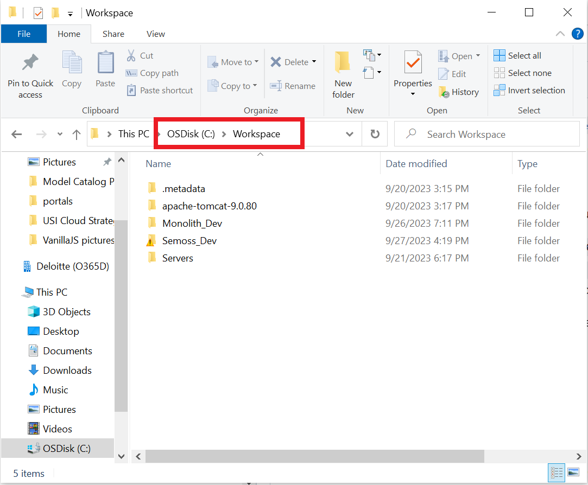
3. Right click on the new `Semoss_Dev` folder and select **SVN Checkout​** from the menu
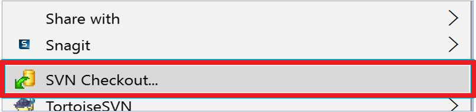
4. Enter the following information in the checkout pop-up, and then ​click “OK”​
  - **URL of Repository**: SVN URL for the Semoss_Dev repository that your administrator provided
  - **Checkout Directory**: `C:\workspace\Semoss_Dev`
    - The checkout directory may already be populated if you right clicked the folder to SVN Checkout​
5. After clicking "OK", a pop-up window will appear asking for username and password. Enter the following:
  - **Username**: the SVN username that your administrator provided
  - **Password**: the SVN password that your administrator provided

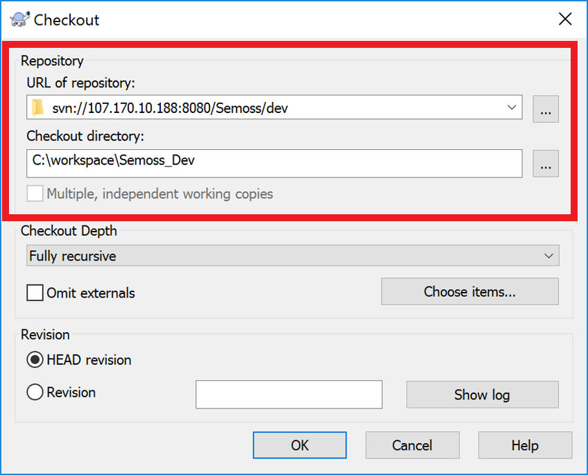

#### Pull `Monolith_Dev`
6. Re-navigate to your `C:\workspace` folder
7. Create a new folder within `C:\workspace` named `Monolith_Dev`
8. Right click on the new `Monolith_Dev` folder and select **SVN Checkout​**​ from the menu

9. Enter the following information in the checkout pop-up, and then ​click “OK”​
  - **URL of Repository**: SVN URL for the Monolith_Dev repository that your administrator provided
  - **Checkout Directory**: `C:\workspace\Monolith_Dev`
    - The checkout directory may already be populated if you right clicked the folder to SVN Checkout​
10. After clicking "OK", a pop-up window will appear asking for username and password. Enter the following:
  - **Username**: the SVN username that your administrator provided
  - **Password**: the SVN password that your administrator provided

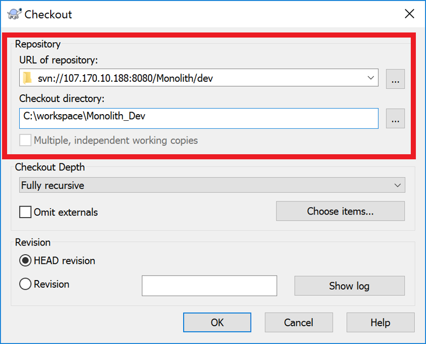

#### Pull `SemossWebAPPUI`
11. Re-navigate to your `C:\workspace` folder. Open up the `apache-tomcat-9.0.##` folder (with ## being the Tomcat version number), then open up the `webapps` folder within it.
12. Create a new folder named `SemossWebAPPUI` within your `webapps` folder.
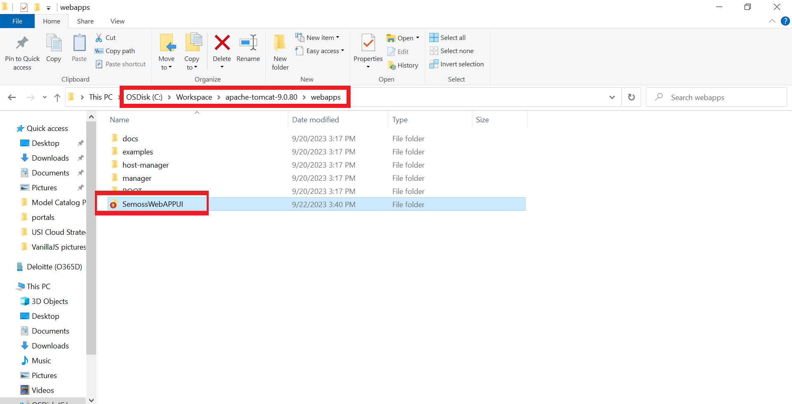​
13. Right click on the new folder and select **SVN Checkout**  
14. Enter the following information in the checkout pop-up, and then ​click “OK”​
  - **URL of Repository**: SVN URL for the SemossWebAPPUI repository that your administrator provided
> **Note**
> If you are a frontend SEMOSS developer who will be directly contributing to the SEMOSS frontend source code, double check with your administrator if you need access to the dev branch of the SemossWebAPPUI repository
  - **Checkout Directory**: `C:\workspace\apache-tomcat-9.0.##\webapps\SemossWebAPPUI`
> **Note**
> Replace the `##` with the Tomcat version number listed in the folder path.  
15. After clicking "OK", a pop-up window will appear asking for username and password. Enter the following:
  - **Username**: the SVN username that your administrator provided
  - **Password**: the SVN password that your administrator provided

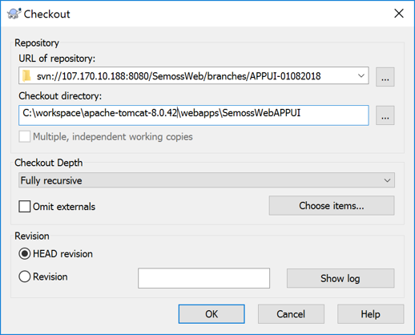

### Update your Configuration Settings
#### Update app.constants.js
1. Open up the `C:\workspace\apache-tomcat-9.0.##\webapps\SemossWebAPPUI` folder after SVN finishes pulling it.
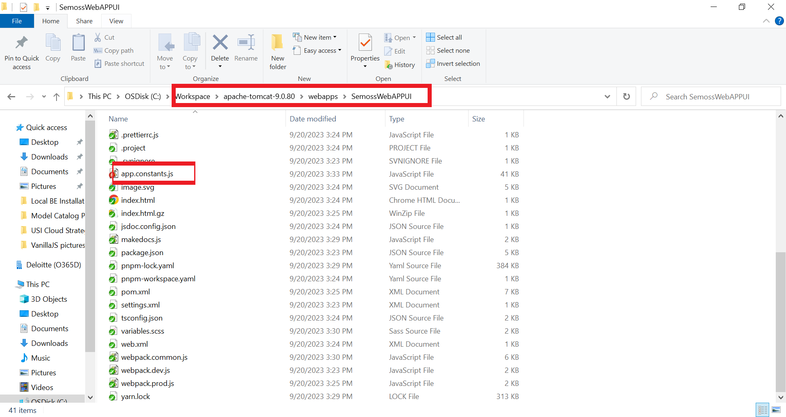
2. Right click on the `app.constants.js` file and click **Edit with Notepad++​**
3. In Notepad++, search for the line of code that says `mod = 'Monolith'` and change it to say `mod = 'Monolith_Dev'`
  - This is usually around line 18-19.
4. Save and close the file.
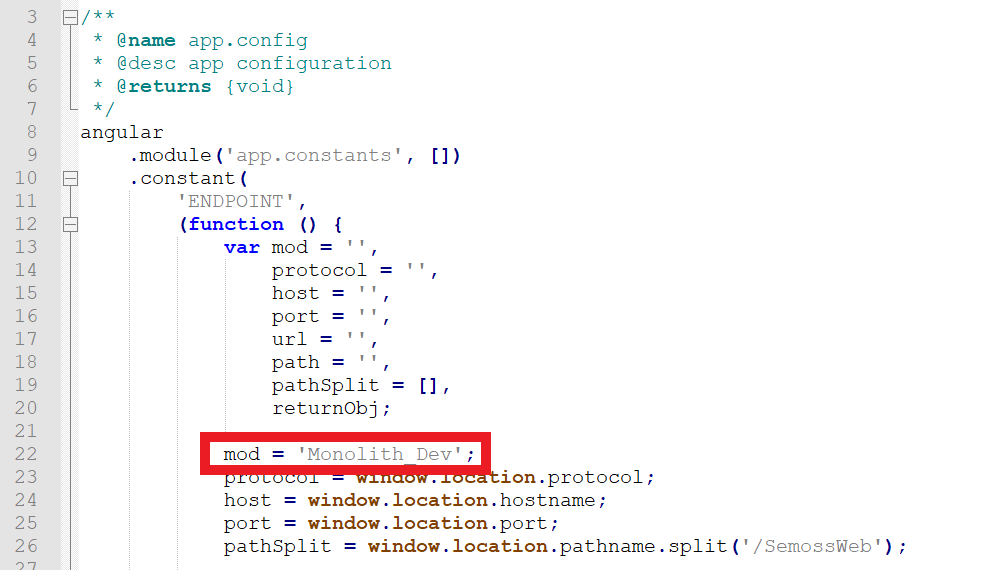

#### Update app.config.js
5. Navigate to the `C:\workspace\apache-tomcat-9.0.##\webapps\SemossWebAPPUI` folder. Open up the `playsheet` folder within it.
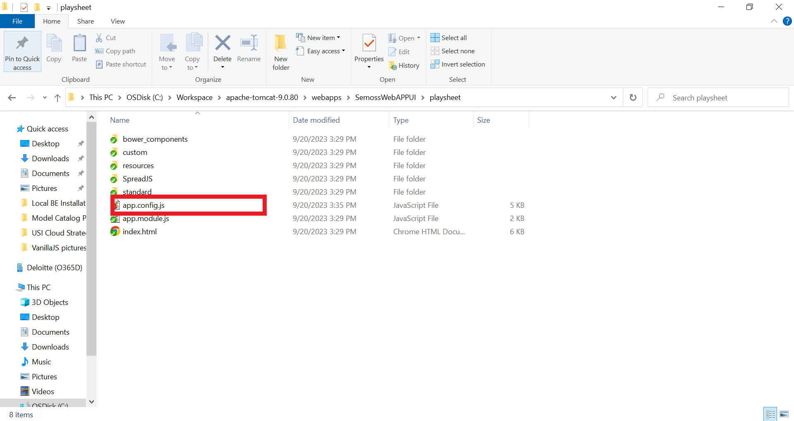
6. Right click on the `app.config.js` file and click **Edit with Notepad++​**
7. In Notepad++, search for the line of code that says `mod += 'Monolith'` and change it to say `mod += 'Monolith_Dev'`
  - This is usually around line 18-19.
8. Save and close the file.
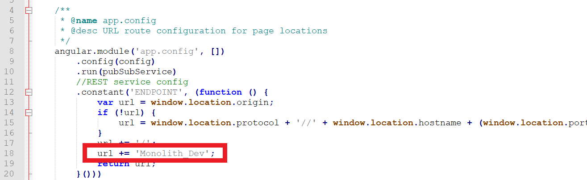

### Set Up Your Eclipse Workspace
#### Import SEMOSS and Monolith into Eclipse
1. Navigate to your Desktop folder, or wherever you downloaded Eclipse to.
2. Open eclipse.exe. In the pop-up **"Workspace Launcher"** window, enter the path of your workspace as `C:\workspace​` instead of the default name that shows up.
3. Click on **File** in the top left hand corner to view the File dropdown menu.
4. Select **Import** to import your `Semoss_Dev` and `Monolith_Dev` projects​.
5. On the Import window that appears, under **Maven**, select **“Existing Maven Projects”**, and click Next.
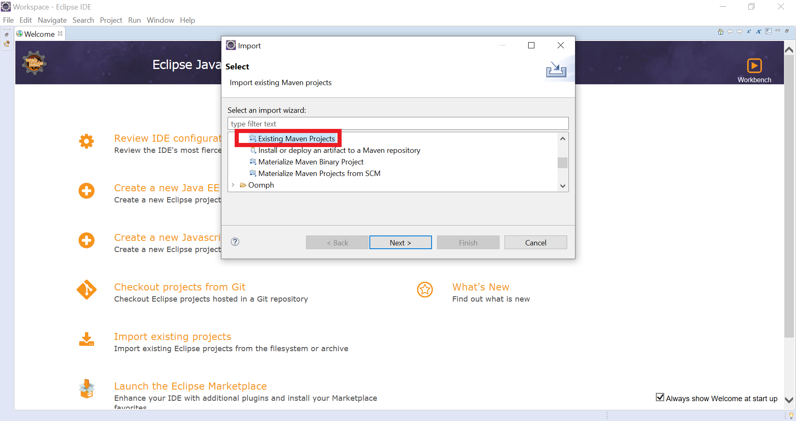
6. In the import box that appears, in the **Root directory** field, browse for your `C:\workspace` folder and  click Ok.
7. Under the **Projects** area, there will be a list of projects that you can select or deselect.
     - Check `Monolith_Dev`
     - Check `Semoss_Dev`
     - Uncheck all others including `SemossWebAPPUI`
8. Then click Finish at the bottom of the import window to import your projects.
#### Import SEMOSS into Monolith
9. On the left hand side of Eclipse, there is a **Project Explorer** tab.
10. Right click on the `Monolith_Dev` project in the **Project Explorer** and select **Build Path > Configure Build Path​**
11. Click on the **Source** tab, then select the `Monolith_Dev/Semosssrc` folder and click Edit.​
12. Under **Linked folder location**, browse for  `C:\workspace\Semoss_Dev\src`
13. On the **Source Folder** screen, update the **Folder Name** field to say: `Semosssrc`. Click Finish. ​
    - A new window will appear while the workspace is being built/updated. This may take a few minutes. Please allow the workspace to update. ​
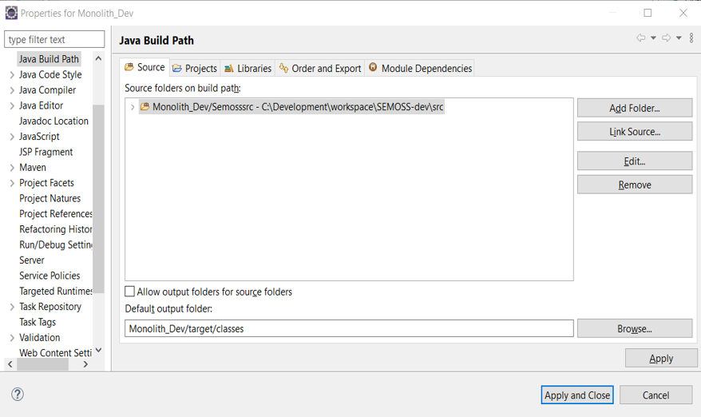
14. When it’s finished, click **Apply and Close**.​
#### Update `RDF_Map.prop`
15. In the **Project Explorer** panel on the left, expand `Semoss_Dev` and scroll down to find the file `RDF_Map.prop​`
16. Double click on `RDF_Map.prop` to open it in Eclipse
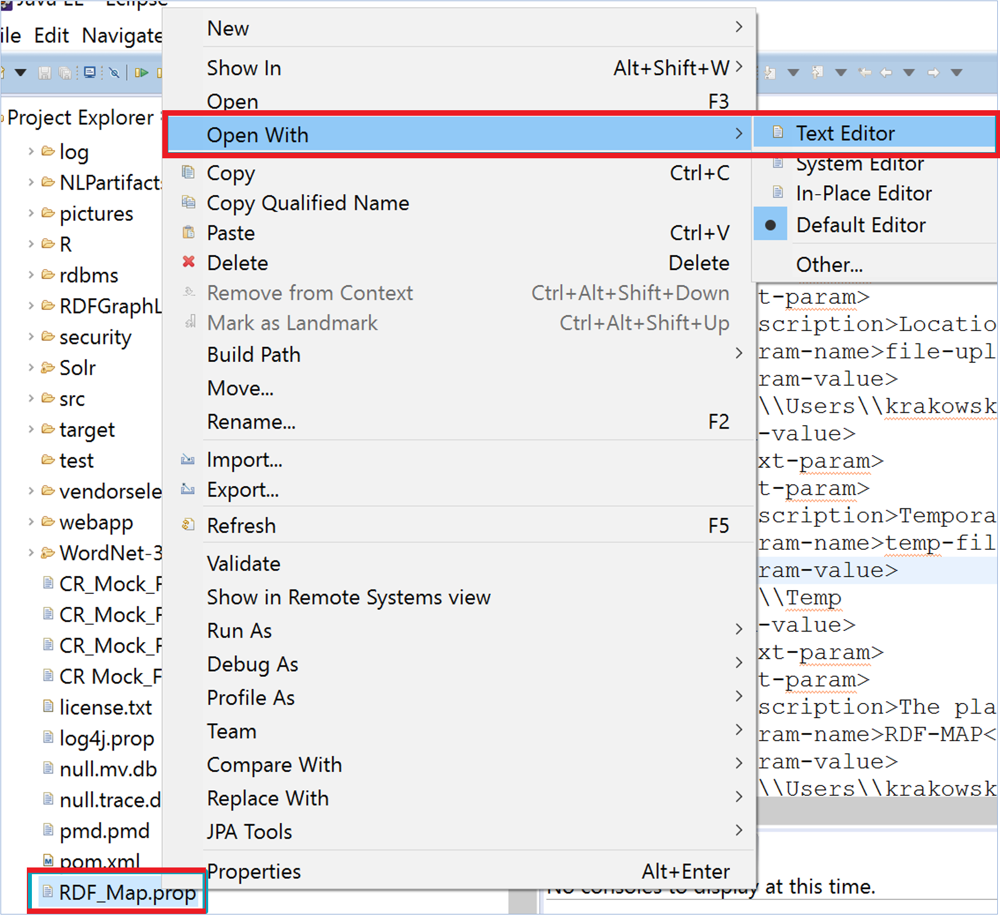
17. Make sure all references to the C drive (i.e `C:\\...`) are the correct file paths.
18. Check that all of your paths begin with `C:\\workspace\\Semoss_Dev\\` or whatever your accurate workspace path is. The last of these should occur on line 21, starting with SOCIAL.​
19. If you make any changes, **save the file** and close it.​

### Set Up Your Tomcat Server
#### Update `social.properties`
1. In the **Project Explorer** panel on the left, expand `Semoss_Dev` and scroll down to find the file `social.properties`
2. Double click on **social.properties** to open it in Eclipse
3. Ensure that every port and folder name matches with how you set up your SEMOSS.​
4. Ports **5353/5355/8080** should be changed to **9090​**
5. `SemossWeb_AppUi` should be changed to `SemossWebAPPUI​`
6. `Monolith` should be replaced with `Monolith_Dev`​
7. Enable the logins that you plan to use (ie. Google, github, etc.)​
    - If you wish to use certain Google APIs, you will need to create an account and project on your own to receive a client_id and secret key at https://console.cloud.google.com/home/​
    
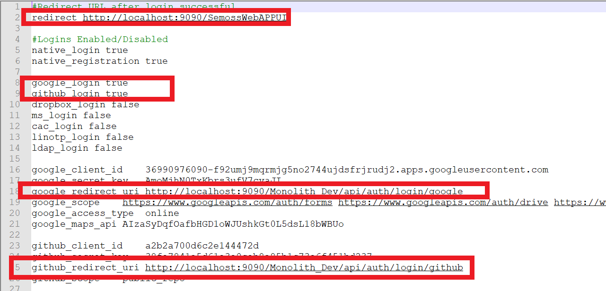

#### Update `server.xml` for Tomcat​
8. Open your Windows **File Explorer** and navigate to the following path: `C:\workspace\apache-tomcat-9.X.##\conf​`
9. Right click on `server.xml` and click **Open With Notepad++​** from the menu
10. Find the line that says `<Connector` followed by a port number
11. Change the port number to **`9090`​**
12. Save and close the file.​

> **Note**
> `X.##` refers to the Tomcat version you have.

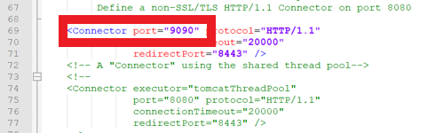

#### Create a Tomcat Server​
13. Return to Eclipse. ​In the top bar of Eclipse, click **Window -> Show View -> Other**.
14. ​Expand the **Server** drop-down, select **Servers**, and click OK.​
15. In the bottom Servers panel, click **“No servers are available. Click this link…”​**
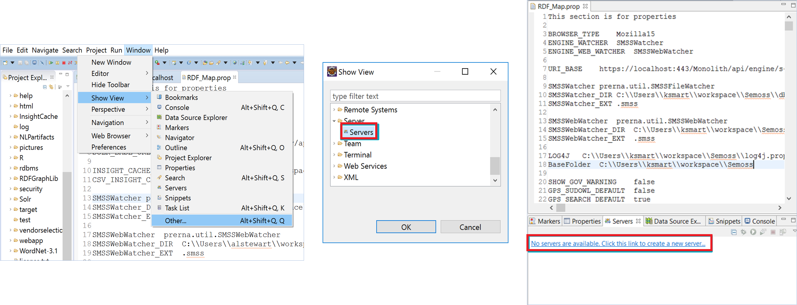

> **Pro Tip**
> If you cannot find or search for Servers in the Show View window, revisit which Java you downloaded at the beginning to ensure you have the IDE for **Enterprise Java Developers.**

16. In the new Server window that appears, expand **Apache**, and select the version of the **Tomcat vX.X Server** you installed and click Next.​
17. Expand **Server**, select **Servers** and click OK.
18. In the **Tomcat installation directory** field, enter the location of your tomcat file: `C:\workspace\apache-tomcat-X.X.##` and click NEXT.

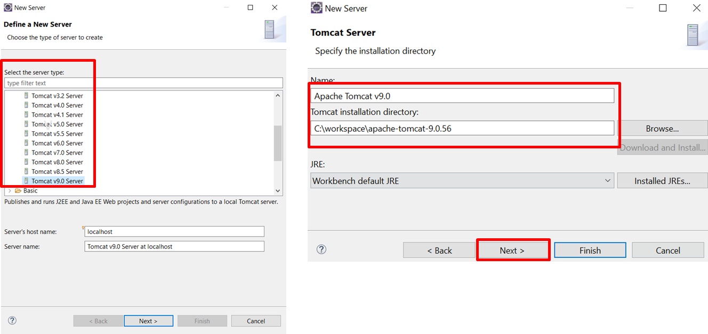

> **Note**
> `​X.X.##` refers to the Tomcat version you have. You may need to expand the pop-up window to view the server options.
19. From the **Add/Remove** window that appears, under **Available**, select `Monolith_Dev`, click **Add** to move it to the **Configured** side, then click the **Finish** button at the bottom. This window will then close.

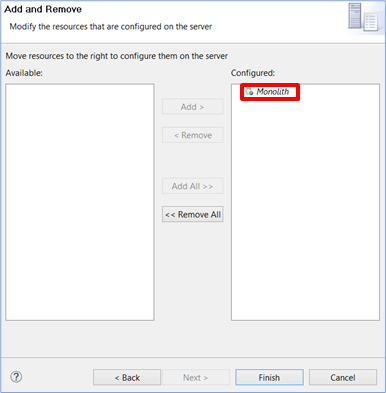

20. Back in Eclipse, in the bottom panel area, on the **Servers** tab, double-click your new server (**Tomcat v9.0 Server at localhost**).

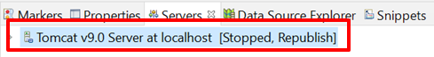

21. In the new window that appears, under **Server Locations**:​
    - Select **“Use Tomcat installation”​**
    - Change the **Deploy path** field to say `webapps` instead of `wtpwebapps`
    - Under **Publishing**, select **Never Publish automatically​**
    - Under **Timeouts**, change start time to **300 seconds**​
    - Under **Ports**, ensure the **HTTP/1.1 Port Number** matches the port number you defined in your server.xml (9090). Leave the other ports as is.
22. Switch from the **Overview** to **Modules** tab (at the bottom of the opened Servers window)

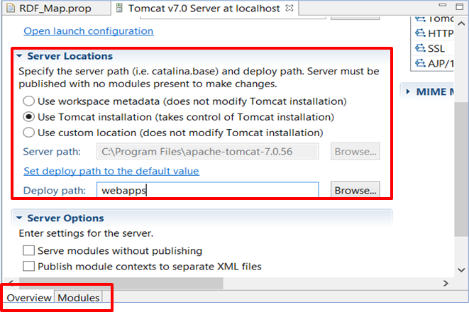

23. Select the **Monolith** Web Module that appears in the table and click **Edit** on the right
24. Make sure the Path accurately reflects what you named your Monolith folder, i.e. `Monolith_Dev`

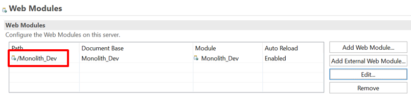

25. Click **Save** in Eclipse.

#### Change Environment Variables​
26. In Windows, from the start menu or search bar, navigate to your Control Panel > System > Advanced system settings.
27. On the **Systems Properties** window that appears, select the  > Environment Variables button.

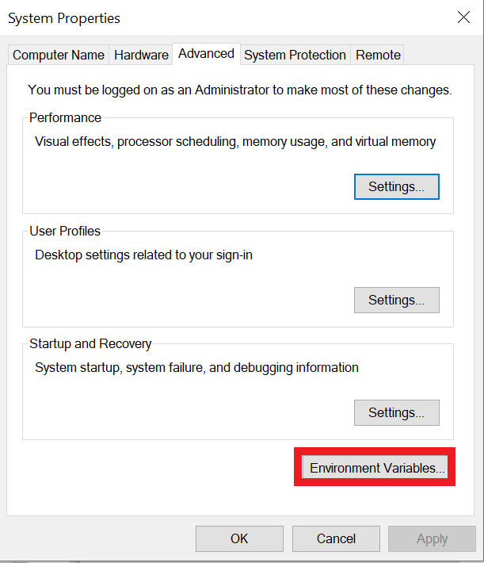

28. Under **system variables**, select “New...”
    - For **Variable name**, type `JAVA_HOME`
    - For **Variable value**, choose **Browse Directory**, go to **Program Files**, go to **Java**, and select the **jdk** folder.
    - For example, `C:\Program Files\Java\jdk1.8.0_###`
    - Click **OK**
29. Next, Under **system variables**, locate the **Path** variable, select it, and click **Edit**
    - In the window that appears, click **New**
    - In the new row that appears, paste `%JAVA_HOME%\bin` without the quotation marks
    - Click **OK**
    - Keep these windows open for the next steps

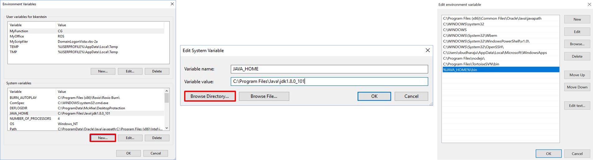

#### Update web.xml for SEMOSS
31. Navigate to `C:\workspace\Monolith_Dev\WebContent\WEB-INF`
32. Right click on **web.xml** and select **Edit in Notepad++**
33. Ensure line 439/440 states `<param-value>C:\\workspace\\Semoss_Dev\\</param-value>`
34. Ensure line 449/450 states  `<param-value>C:\\workspace\\Semoss_Dev\\RDF_Map.prop</param-value>`.
35. If your line numbers are off, CTRL+F for **RDF** to find the correct lines.

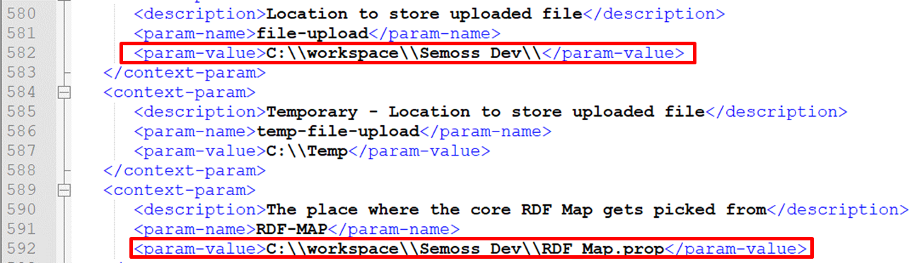
  
> **Pro Tip**:
> This path should match what you changed in RDF map so ensure it matches your correct **Semoss_Dev** path.

#### Adding settings.xml to .m2 (maven) repository
36. Navigate to `C:\Users\YOUR_USERNAME`
    - `YOUR_USERNAME` is your actual username
37. Locate the **.m2** folder (auto created after maven update in eclipse)
38. You may need to create a **.m2** folder if it is not yet there
39. Add the **settings.xml** file in the attached [zip](../../static/assets/BE%20Installation/settings.zip) to **.m2** folder

#### Change Environment Variables
40. Under **system variables**, select **New...**
    - For **Variable name**, type `MVN_HOME`
    - For **Variable value**, choose “Browse Directory”, go to Documents, and select the apache-maven folder.
    - For example, `C:\Users\[your username]\Documents\apache-maven-#.#.#`
    - Click **OK**
41. Next, Under **system variables**, locate the **Path** variable, select it, and click **Edit**
    - In the window that appears, click **New**
    - In the new row that appears, paste `%MVN_HOME%\bin` without the quotation marks
    - Click **OK**

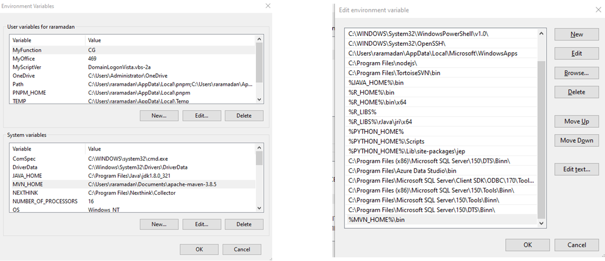

42. Click **Ok** to close the window. Close out the remaining **Systems Properties** windows.

### Manual Maven Install

Start with the **SEMOSS** project first and then the **Monolith** project. Navigate to each project within the command prompt and run a maven install command.
Open your **Eclipse** and do the following:
1. Right-click on the project in the project explorer. Choose **Show In > System Explorer**
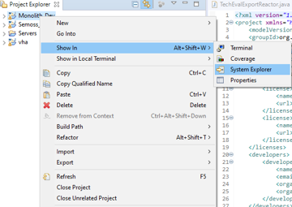
> Project Explorer inside Eclipse
2. Double-click and open the project folder
3. In the **file explorer** window, click the file path at the top, and simply type `cmd` and hit enter. This will open a command prompt at this location
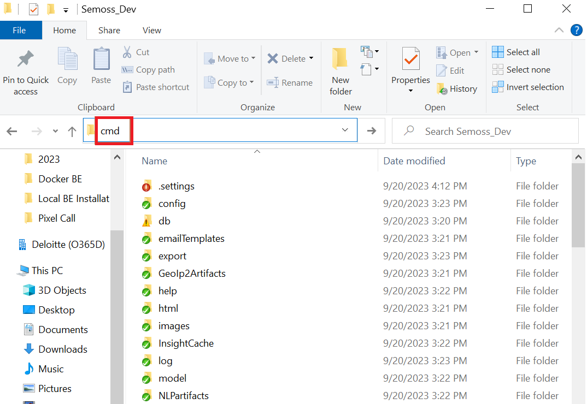

4. Copy and right-click to paste the following line into the **command prompt**, and hit enter:
  `mvn clean install -U -DskipTests=true`
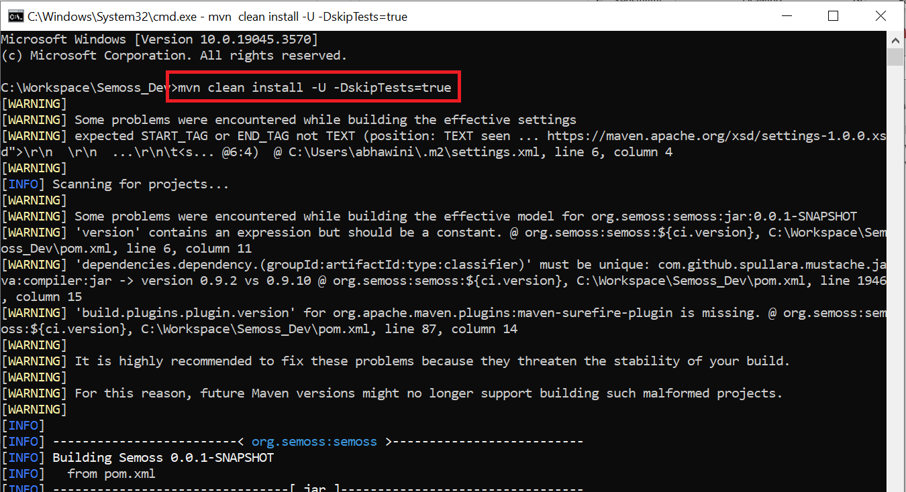

#### Update `catalina.properties`
5. Open `catalina.properties` in **Eclipse** or **Notepad++**. It is located in `C:\workspace\apache-tomcat-9.0.56\conf`, your Severs, Tomcat9 folder
6. Replace line 108 with the following: `tomcat.util.scan.StandardJarScanFilter.jarsToSkip=*.jar,\`
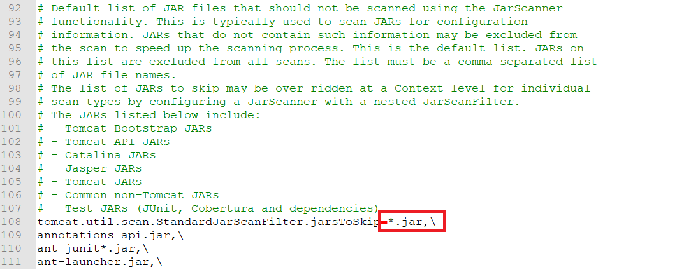

7. **Resave** the file. This will improve the startup time of your server.

#### Update Maven
8. Close **Eclipse** and restart the application. This is necessary any time you make changes to your **Environment variables**
9. Back in **Eclipse**, ensure your **Project Explorer** panel is being displayed (typically on the left-hand side). If you don’t see the **Project Explorer** window, select Window -> Show View -> Project Explorer to show them.
10. Update both **(1) Semoss_Dev** and **(2) Monolith_Dev** (Do this for Semoss_Dev first, then repeat for Monolith)
    - Right-click on the project in the **Project explorer** panel
    - Scroll down to Maven > Update Project
    - Place a checkmark in the **Force Update of Snapshots/Releases** box
    - Click **Ok**
    - The workspace will start updating and you can see the progress in the bottom right corner in **Eclipse**.  This may take some time to build
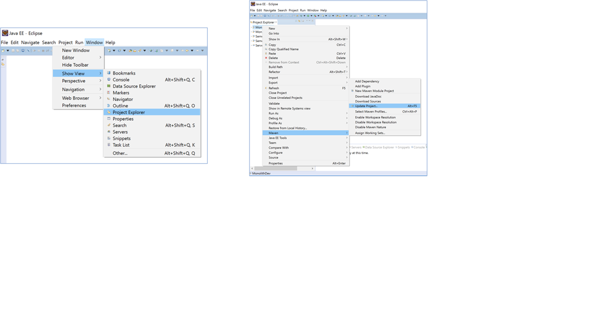

If you get the following error while maven updating, just click ok and let the update proceed.
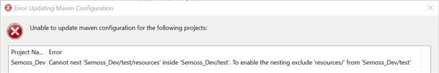

> **Pro Tip**:
> If Maven is throwing other unexpected errors, you may need to clean and refresh your projects!


## [Install R](https://cran.r-project.org/bin/windows/base/old/4.2.3/)
1. Click on the link above and navigate to the website
2. Scroll and click on **R-4.2.3-win.exe** to download it
3. **Execute** the application when download finishes to complete the installation
4. Make sure it is getting placed in your Documents `C:\Users\YOUR_USERNAME\Documents\R\R-4.2.3`
*Note that the path above may not exist yet, as the folder has not yet been created.  Next, create the **R** folder in Documents to match the variable value. 
5. Click next all the way through
6. Download will result in **R** being placed in your **Documents** Folder

#### Change Environment Variables​
7. Search **Environment Variables** in the Windows Search
8. From the window that pops up, click the **Environment Variables** button
9. Under system variables, add or edit the following variables under the **System Variables** section with your correct path:
    - Create new/edit your `R_HOME` variable
    - Variable Name: `R_HOME`
    - Variable value: `C:\Users\**YOUR_USERNAME**\Documents\R\R-4.2.3`
    - Create new/edit your `R_LIBS variable`
    - Variable Name: `R_LIBS`
    - Variable Value: `C:\Users\**YOUR_USERNAME**\Documents\R\win-library\4.1`
    - Change out **YOUR_USERNAME** with your actual username
    - Note that the path above may not exist yet, as the folder has not yet been created
    - Next, create this folder to match the variable value. Change the bolded text to your user name
    - Edit your **Path** variable under System variables. Add the following:
      `%R_HOME%\bin`
      `%R_HOME%\bin\x64`
      `%R_LIBS%`
      `%R_LIBS%\rJava\jri\x64`
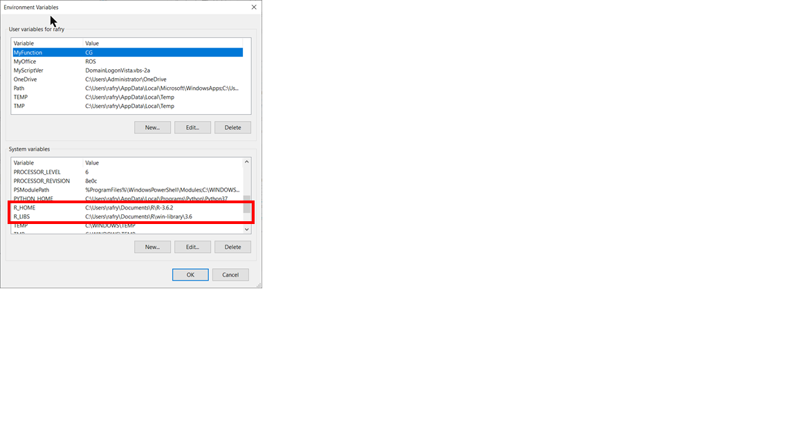

> **Pro Tip**:
> To avoid bringing in hidden special characters, type these out manually instead of copying and pasting.

### Install R Packages – 4.2.3
10. Go to `C:\workspace\Semoss_Dev\R\SemossConfigR\scripts` and find the **Packages.R** file
11. If you installed **Semoss_Dev** in a different folder the path above will need to be updated
12. Open up a `cmd` terminal and type in R to start the **R terminal**
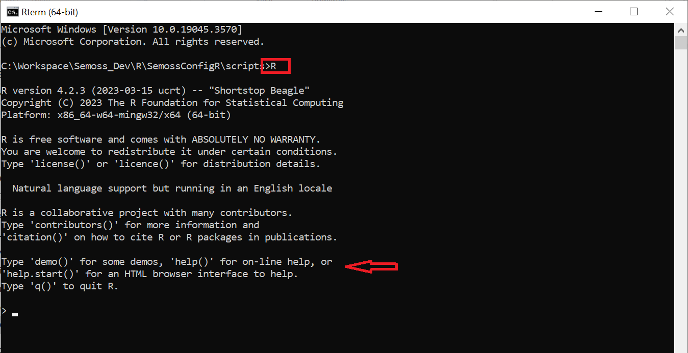

13. Copy and paste different sections of the **Packages.R** script into the R terminal
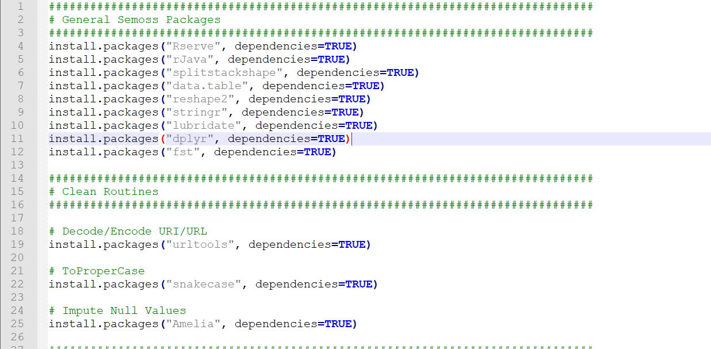

> **Pro Tip:**
> This process will take a while to finish. Only copy/paste small sections of the script to run at a time (~30line chunks)

## Install Python

### [Install Visual Studio Installer](https://visualstudio.microsoft.com/thank-you-downloading-visual-studio/?sku=BuildTools&rel=15)
1. Click on the link above and **download** Microsoft Visual Studio Installer
    - This is needed for a C++ compiler (many Python packages require this)
2. Go to **Downloads**, find the file, right click and *Run as administrator*. You’ll need to enter login credentials at least a few times during installation.

### [Install Python](https://www.python.org/downloads/release/python-31010/)
3. Click on the link above
4. Near the bottom of the page, under **Files**, click the link to download the “Windows installer (64-bit)” executable installer
5. Launch the installer and click **Install Now** to install Python with the default settings
6. Python should now be located in a directory like
   `C:\Users\YOUR_USERNAME \AppData\Local\Programs\Python\Python310`
    - YOUR_USERNAME would be your actual username

### Install Libraries 
7. Open Visual Studio Installer and click “Launch” in the Visual Studio Build Tools window to launch a Visual Studio Command Prompt
8. See **install.sh** (open in Notepad++) to view the latest Python dependencies: `C:\workspace\Semoss_Dev\py\install.sh` if the below list is out of date
9. Type in: `pip3 install jep==3.9.0`
  - If you are unable to run this, try: `python -m pip install jep==3.9.0` or `py -m pip install jep==3.9.0`
10. Now add the following to your **PATH** under System variable: 
  `%PYTHONHOME%\Lib\site-packages\jep`
11. Go back to your **Visual Studio Command Prompt** (or open a new one)
12. Perform the following:
    * `pip install pandas==0.25.3`
    * `pip install numpy`
    * `pip install fuzzywuzzy`
    * `pip install random`
    * `pip install datetime`
    * `pip install pyjarowinkler`
    * `pip install xlrd`
    * `pip3 install matplotlib`
    * `pip3 install sklearn`
    * `pip3 install seaborn`
    * `pip3 install deepdiff`
    * `pip3 install annoy==1.15.2`
    * `pip3 install python-Levenshtein`
    * `pip3 install swifter`
    * `pip3 install pyarrow`

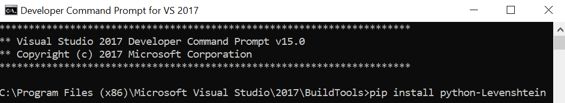

#### Change Environment Variables​
13. Search **Environment Variables** in the Windows Search
14. Click the **Environment Variables** button in the pop-up window
15. Under **system variables**, add or edit the following variables under the System variables section with your correct path:
    - Add/edit your PYTHONHOME variable 
    - Variable Name: `PYTHONHOME`
    - Variable value: `C:\Users\YOUR_USERNAME\AppData\Local\Programs\Python\Python310`
    - Change out YOUR_USERNAME with your actual username
    - Edit your Path variable under System Variables.  Add the following:
      `%PYTHONHOME%`
      `%PYTHONHOME%\Scripts`

> **Pro Tip**:
> To avoid bringing in hidden special characters, type these out manually instead of copying and pasting

#### Update RDF Map
16. Go to `C:\workspace\Semoss_Dev\RDF_Map.prop`
17. Change the line with **USE_PYTHON false** to **USE_PYTHON true**
18. For **LD_LIBRARY_PATH**, insert your Python Home directory where it says "**INPUT_YOUR_PYTHON_HOME**"
19. Use “\\” as the file path delimiter


### Start Tomcat Server
1. Restart Eclipse (so that Eclipse loads the new Environment Variables we’ve added) ​
2. Select the Monolith_Dev project and make sure under Project -> Properties -> Java Build Path, maintain the following order under ‘Order and Export’ tab. You will likely need to select JRE System Library and click “Top” to move it to the top.​

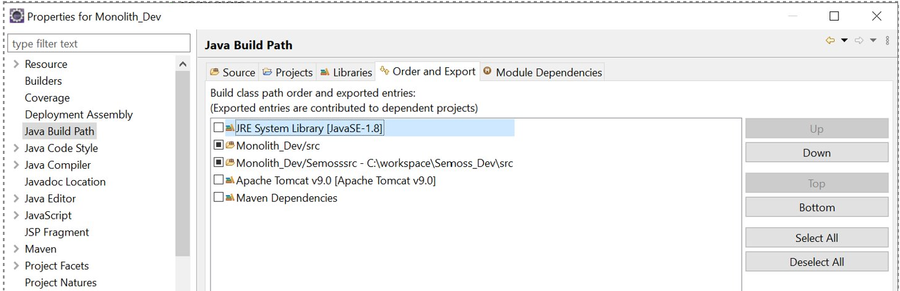

3. Apache Tomcat should not be in 'unbound' state.  If so, then Select Apache to add to the classpath under Libraries tab.​
4. Click Apply and Close once completed​
5. Within Eclipse, in the bottom Servers panel tab, right-click on the Tomcat Server and click Publish​. After republishing, double check your modules path to ensure it accurately reflects what you named your Monolith Folder (e.g. Monolith_Dev) and re-save.​

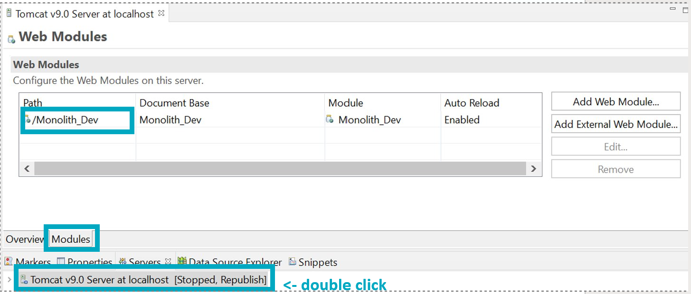

6. Next click Start.​ A progress bar will appear at the bottom of Eclipse.​
7. Open Chrome and enter http://localhost:9090/SemossWebAPPUI/​
8. Congratulations! You’re all set to start using SEMOSS!​​
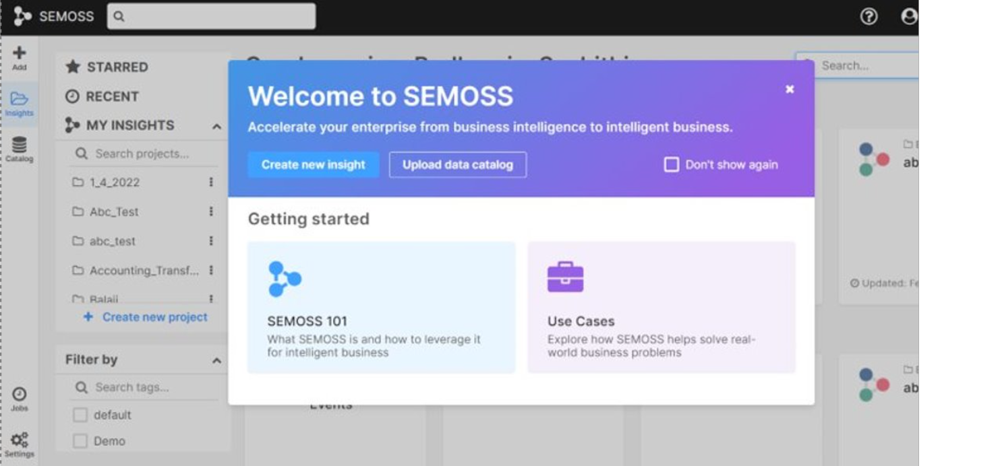
​
## OSX (Mac) Installation Guide
> **Note**
> Throughout this guide, you may be asked to use admin permissions or elevated permissions to execute something (installing a new application, copying files into certain directories). To do so, use the Privileges app (green lock icon)  - this is like running an application in admin mode!​

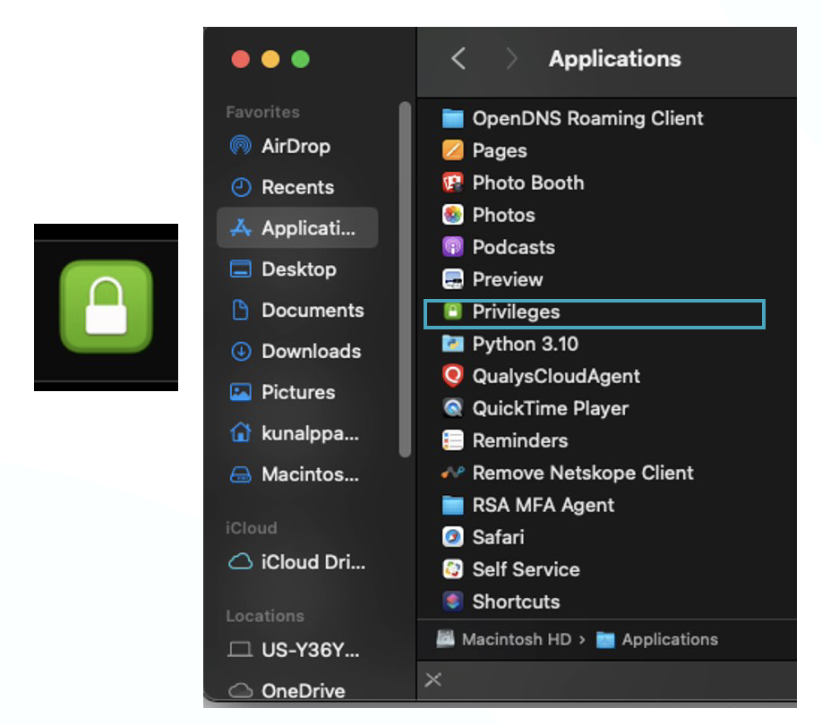

### Set your SEMOSS Directory
1. Create a new folder anywhere on your laptop, name it SEMOSS, and take note of its path. For example, if you created the SEMOSS folder on your Desktop, then the path would be `~/Users/YOUR_USERNAME/Desktop/SEMOSS`
2. Inside of the `SEMOSS` folder, create a new folder called `workspace`.

### Download required software
First,  download the following software:
#### [Java SE Development Kit (JDK)​](https://cdn.azul.com/zulu/bin/zulu8.64.0.19-ca-jdk8.0.345-macosx_aarch64.zip)
1. Click on the above link to open it in a new tab
2. Scroll down to find the latest version of **‘Java SE Development Kit’, Mac ARM 64 bit​**
3. Accept License Agreement and download​
    - You will need to create an Oracle account using your email address​
4. Once it has finished downloading, move the zip file to your `SEMOSS` directory. Open up the zip file then delete the zip.
#### [Eclipse IDE for Enterprise Java and Web Developers](https://www.eclipse.org/downloads/packages) ​
1. Click on the above link to open it in a new tab
2. Click the link under **‘Download Links’** that says **"macOS Arch 64"**
3. Click download and move the downlaoded file to your `SEMOSS` directory​
4. Run the .dmg file that was just downloaded and copy the Eclipse icon into your Applications folder (may need elevated privileges)
#### [Maven​](https://maven.apache.org/download.cgi)
1. Click on the above link to open it in a new tab
2. Click the download link beside **Binary zip archive**, and unzip this to your `Documents` folder​
#### [Node.js​](https://nodejs.org/download/release/v18.16.0/)
1. Click on the above link to open it in a new tab
2. Click **node-v18.16.0-x64.msi** and open it once it finishes downloading. Follow the installation instructions​.
#### [VSCode​](https://code.visualstudio.com/docs/?dv=osx)
1. Click on the above link to open it in a new tab
2. Unzip the download and copy Visual Studio Code into your applications folder (may need elevated privileges)​
#### [Apache Tomcat v9](https://tomcat.apache.org/download-90.cgi​)
1. Click on the above link to open it in a new tab
2. Choose **Binary Distributions, Core, .zip file** under the **latest 9.0 section​**
3. Unzip this to your `SEMOSS/workspace` folder
  - The folder will most likely be named apache-tomcat-9.0.## (with ## being the Tomcat version number!)
#### [Iterm2 (Optional, but recommended as a better alternative to Terminal)](https://iterm2.com/​)
1. Click on the above link to open it in a new tab
2. Download, unzip, and copy iTerm into your Applications folder (may need elevated privileges)

### Install Homebrew
1. Make sure that you have elevated permissions with the yellow unlocked icon in the dock​
2. Open iTerm or the standard mac Terminal​
3. Navigate to https://brew.sh/ and copy the command to install Homebrew​
4. Paste the command you just copied into the terminal​
5. It will ask you for your password several times – type it in each time until the installation is complete​

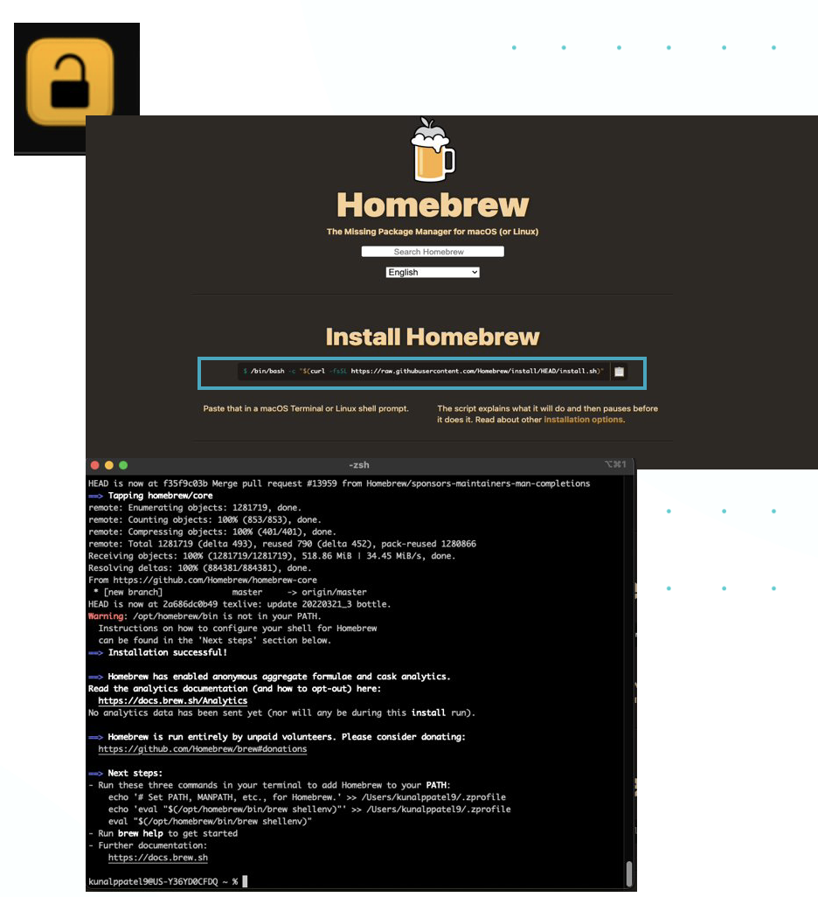

6. Once the installation is done, follow the steps on the terminal to complete setting up the path listed under Next steps​
7. Run `brew help` in the terminal to ensure it is install​ed

### Install Oh-My-Zsh
1. Make sure that you have elevated permissions with the yellow unlocked icon in the dock​
2. Open iTerm or the standard mac Terminal​
3. Navigate to https://ohmyz.sh/#install and copy the command to install oh-my-zsh​
  - `sh -c "$(curl -fsSL https://raw.github.com/ohmyzsh/ohmyzsh/master/tools/install.sh)"​`
5. Paste this into the terminal​
6. Once complete, you should see the screen below

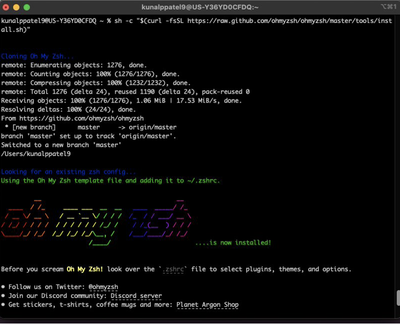​
​
### Install SVN
1. Make sure that you have elevated permissions with the yellow unlocked icon in the dock​
2. Open iTerm or the standard mac Terminal​
3. Run `brew install subversion`
​
### First Steps
1. Once your Eclipse & JDK are installed, open Eclipse and specify the workspace as the `SEMOSS/workspace` folder that you created​
  - Example: `/Users/YOUR_USERNAME/Desktop/SEMOSS/workspace​`
  - Specify this instead of the default folder path that shows up​
2. We recommend that you pin Eclipse to your dock and pin your `workspace` to your Quick access bar​

### Request Access to the Source Code
1. Contact your administrator to ask for access to the SVN repositories containing the source code. You will **not** be able to proceed with the rest of the guide until it you receive access. After approval, you will be provided with the following information:
   - **SVN URLs** for the **Semoss**, **Monolith**, and **SemossWeb** repositories
   - **SVN Username**
   - **SVN Password**


### Checkout the code base
1. Run the following commands in iTerm2 or Terminal to clone the SEMOSS code base:

```
cd ~/Desktop/workspace ​
svn co SVN_SEMOSS_URL \​
--username SVN_USERNAME \​
--password SVN_PASSWORD ​
​
mv dev Semoss_Dev​
```

- Replace `SVN_SEMOSS_URL` with the SVN URL for the Semoss repository provided by your administrator.
- Replace `SVN_USERNAME` with the SVN username provided by your administrator.
- Replace `SVN_PASSWORD` with the SVN password provided by your administrator.

2. Run the following commands in iTerm2 or Terminal to clone the Monolith code base:
```
cd ~/Desktop/workspace ​
​
svn co SVN_MONOLITH_URL \​
--username SVN_USERNAME \​
--password SVN_PASSWORD ​
​
mv dev Monolith_Dev​
```

- Replace `SVN_MONOLITH_URL` with the SVN URL for the Semoss repository provided by your administrator.
- Replace `SVN_USERNAME` with the SVN username provided by your administrator.
- Replace `SVN_PASSWORD` with the SVN password provided by your administrator.

3. Run the following commands in iTerm2 or Terminal to clone the SemossWebAPPUI code base:

```
cd ~/Desktop/workspace/apache-tomcat-9.0.XX/webapps ​
​
svn co SVN_SEMOSSWEB_URL \​
--username SVN_USERNAME \​
--password SVN_PASSWORD ​
​
mv dev SemossWebAPPUI​
```
- Replace `SVN_SEMOSSWEB_URL` with the SVN URL for the Semoss repository provided by your administrator.
- Replace `SVN_USERNAME` with the SVN username provided by your administrator.
- Replace `SVN_PASSWORD` with the SVN password provided by your administrator.
- Replace the `XX` in `apache-tomcat-9.0.XX` with the actual version number of Tomcat you have.

### Update Configuration Files
1. Open the file `app.constants.js` located at `workspace/apache-tomcat-9.0.XX/webapps/SemossWebAPPUI/app.constants.js​` in VSCode or a text editor.
2. Update Line 17 or 18 to say `mod += ‘Monolith_Dev’`;​
   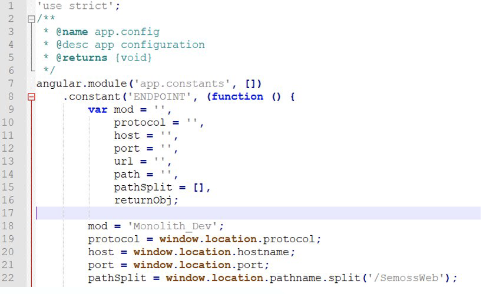​
4. Open the `app.config.js` located at `workspace/apache-tomcat-9.0.XX/webapps/SemossWebAPPUI/playsheet/app.config.js​`
5. Update Line 18 to `url += ‘Monolith_Dev’`;​
  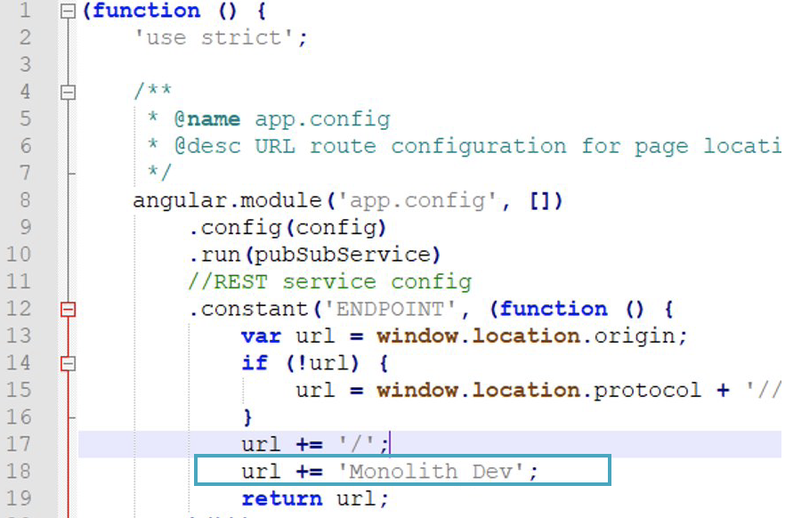​
   

### Import SEMOSS and Monolith Projects into Eclipse
1. Open Eclipse​.
2. From the menu bar, select **“File” > “Import”​**
3. Select **“Maven” > “Existing Maven Project”​**
4. Click “Next”​
5. “Browse” for your `workspace` folder under “Root Directory”​
6. Under projects, check only `/Monolith_Dev/pom.xml` and `/Semoss_Dev/pom.xml`. ​
7. Leave everything else unchecked.​

  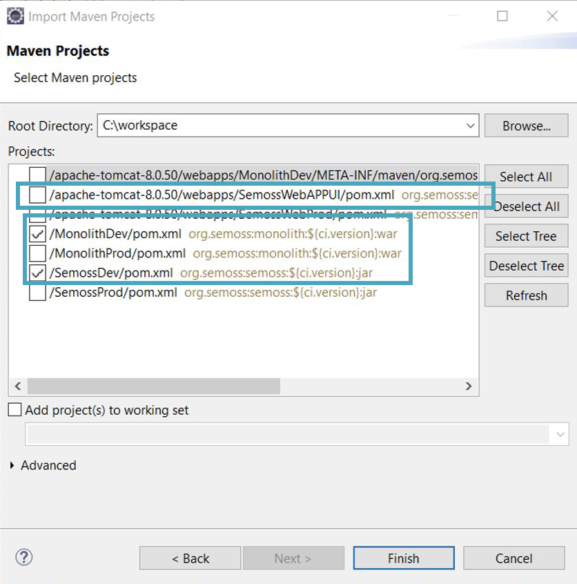​
8. Click “Finish”.​

### Configure Build Path for Monolith Dev
1. Right click on **“Monolith_Dev”** under Project Explorer​
2. Select **“Build Path” > “Configure Build Path”​**
3. Navigate to **“Source”** tab​
4. Under **“Source folders on build path”**, select `Monolith_Dev/Semosssrc`
5. Click “Edit”​
6. Click “Browse” and select `src` directory inside `workspace/Semoss_Dev`​
7. Update “Folder name” to `Semosssrc`
8. Click “Finish”​
9. Click “Apply” and “Close”​

### Update RDF_Map.prop
1. Open `workspace/Semoss_Dev/RDF_Map.prop`​
2. Update all paths to point to the `Semoss_Dev` directory​
3. For example, update Lines 6-21:​
```
INSIGHT_CACHE_DIR /Users/YOUR_USERNAME/Desktop/workspace/Semoss_Dev/InsightCache
CSV_INSIGHT_CACHE_FOLDER CSV_Insights ​
SMSSWebWatcher    prerna.util.SMSSWebWatcher
SMSSWebWatcher_DIR    /Users/YOUR_USERNAME/Desktop/workspace/Semoss_Dev/db
SMSSWebWatcher_EXT    .smss ​
JobSchedulerWatcher prerna.rpa.JobSchedulerWatcher
JobSchedulerWatcher_DIR /Users/YOUR_USERNAME/Desktop/workspace/Semoss_Dev/rpa/json
JobSchedulerWatcher_EXT    .json
rpa.config.directory /Users/YOUR_USERNAME/Desktop/workspace/Semoss_Dev/rpa ​
BaseFolder    /Users/YOUR_USERNAME/Desktop/workspace/Semoss_Dev/
LOG4J    /Users/YOUR_USERNAME/Desktop/workspace/Semoss_Dev/log4j.prop
ADDITIONAL_REACTORS /Users/YOUR_USERNAME/Desktop/workspace/Semoss_Dev/reactors.json
SOCIAL    /Users/YOUR_USERNAME/Desktop/workspace/Semoss_Dev/social.properties​
```
4. Update Line 73:​
```
SMSSWatcher_DIR    /Users/YOUR_USERNAME/Desktop/workspace/Semoss_Dev/db​
```
### Update server.xml for Tomcat
1. Open your Windows File Explorer and navigate to the `conf` folder within your `apache-tomcat-9.0.XX` folder
      - `XX` refers to the version number of Apache Tomcat that you have
2. Open `server.xml` in VSCode or a ​text editor
3. Find the line that says `<Connector` and a port number (should be around line 63)​
4. Change the port to 9090​
  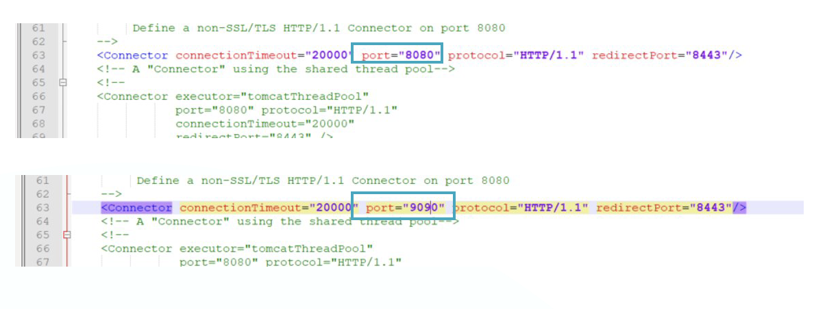​

5. Save and close the file.​
​
### Create Tomcat Server
1. Back in Eclipse, at the bottom, select the "Servers" tab​
2. Click link to create a new Server​
3. Select “Tomcat Server v9.0” under “Apache”​
4. Click “Next”​
5. “Browse” for `apache-tomcat-9.0.XX` directory inside `workspace​`
   - `XX` refers to the version number of Apache Tomcat that you have
7. Click “Next”​
8. Select “Monolith_Dev” and click “Add” to move it to the “Configured” column​
9. Click “Finish”​
​
### Update Tomcat Server Configuration
1. Under “Servers” tab, double-click on **“Tomcat v9.0 Server on localhost”​**
   - A popup should open.​
2. Under **“Server Locations”**, select “Use Tomcat installation” and set “Deploy path” to `webapps​`
3. Under **“Publishing”**, select “Never publish automatically”​
4. Under **“Timeout”**, set “Start” to 300 seconds​
5. Navigate to **“Modules”** tab​
6. Edit module and set “path” as `/Monolith_Dev​`
7. Save configuration.​

### Update `web.xml` and move `settings.xml`
1. Open the `web.xml` file located at `workspace/Monolith_Dev/WebContent/WEB_INF/web.xml​`
2. Update any base path of any file path listed in the `web.xml` to point to `workspace/Semoss_Dev​`
  - Line 226:​ `<param-value>/Users/YOUR_USERNAME/Desktop/workspace/Semoss_Dev</param-value>​`
  - Line 236:​ `<param-value>/Users/YOUR_USERNAME/Desktop/workspace/Semoss_Dev/RDF_Map.prop</param-value>param-value>​`
3. Locate the `settings.xml` file and move it to the `.m2` directory located at your root (`~/.m2`)

### Update `social.properties`
1. Open the `social.properties` file located at `workspace/Semoss_Dev/social.properties​​`
2. In the first line, change the redirect to `http://localhost:9090/SemossWebAPPUI`​
3. Search for any instances of **5353** for the port number and change it to **9090**​

### Update Maven
1. Open Eclipse​
2. Right click on either project under “Project Explorer”​
3. Select **“Maven” > “Update Project”​**
4. A popup opens.​
  - Check both checkboxes under “Available Maven Codebases”​
  - Check “Force Update of Snapshots/Releases”​
  - Click “OK”​
​
### Install R
1. Download here: https://cran.r-project.org/bin/macosx/el-capitan/base/R-3.5.1.pkg​
2. Install R-3.5.1.pkg​
3. Execute the application when download finishes to complete the installation​
4. Make sure it is getting placed in your Documents `/Users/YOUR_USERNAME/Documents/R/R-4.2.3)`
> **Note:** that the path above may not exist yet, as the folder has not yet been created.  Next, create the R folder in Documents to match the variable value. ​
5. Click next all the way through​
6. Download will result in R being placed in your Documents Folder​
​
### Install R Packages
1. Insert the following at the top of `workspace/Semoss_Dev/R/SemossConfigR/scripts/Packages.R` script:​
```
r = getOption("repos")​
r["CRAN"] = “https://cloud.r-project.org/”​
options(repos = r)​
```
2. Edit line 190 to:​ `httr::set_config( httr::config( ssl_verifypeer = 0L ) )​`.
3. From the terminal, run the scripts​
```
cd /Users/YOUR_USERNAME/Desktop/workspace/Semoss_Dev/R/SemossConfigR/scripts​
Rscript Packages.R​
Rscript Rserve.R​
```
### Install Python, pip, and packages
1. Download Python here: https://www.python.org/ftp/python/3.7.2/python-3.7.2-macosx10.9.pkg​
2. After Python is downloaded, open a terminal. Run the following:
```
sudo curl https://bootstrap.pypa.io/get-pip.py -o get-pip.py​
python3 get-pip.py​
pip install jep==3.7.1​
pip install pandas​
```

### Set Environment Variables
1. In a terminal, run the following command to create a `.profile` file using Vim: `vi ~/.profile​`
2. Set the following environment variables:​
```
alias python='python3’​
export JAVA_HOME=/Library/Java/JavaVirtualMachines/jdk1.8.0_241.jdk/Contents/Home                                                       export PATH=$JAVA_HOME/bin:$PATH ​
export R_HOME=$(R RHOME)
export R_LIBS=/Library/Frameworks/R.framework/Resources/library
export PATH=$R_HOME/bin:$R_LIBS:$R_LIBS/rJava/jri:$PATH ​
export PYTHON_HOME=/Library/Frameworks/Python.framework/Versions/3.7
export PATH=$PYTHON_HOME/lib/python3.7/site-packages/jep:$PATH​
```

### Set Run Configurations
1. Open Eclipse​. From the menu bar, select “Run” > “Run Configurations”​. A popup opens.​
2. Select “Apache Tomcat” > “Tomcat v9.0 Server at localhost” in the sidebar​
3. Under “Arguments” tab, add to the end of “VM arguments”: ​

   `-Djava.library.path=/Library/Frameworks/R.framework/Resources/library/rJava/jri/​`
4. Under “Environment” tab, click “New” to add the following variables:​
  - `PATH=/Library/Frameworks/R.framework/Resources/bin R_DOC_DIR=/Library/Frameworks/R.framework/Resources/doc`
  - `R_HOME=/Library/Frameworks/R.framework/Resources R_INCLUDE_DIR=/Library/Frameworks/R.framework/Resources/include`
  - `R_SHARE_DIR=/Library/Frameworks/R.framework/Resources/share `
5. Click “Apply” and then “Close”​
​
### Update RDF_Map.prop for Python
1. Open `workspace/Semoss_Dev/RDF_Map.prop​`
2. Edit Line 23:​ `USE_PYTHON true​`
3. Edit Line 25: for the `LD_LIBRARY_PATH`, insert your Python Home directory where it says 'INPUT_YOUR_PYTHON_HOME' Remember to take out the braces (i.e. `LD_LIBRARY_PATH` must point to a valid path)​
- If you do not know what your Python home directory is, you can check by running `echo $PYTHON_HOME` in a terminal.

### Start Server
1. Right click “Tomcat v9.0 Server at localhost” under the “Servers” tab​
2. Select “Start”​
3. Open up a new browser window and navigate to http://localhost:9090/SemossWebAPPUI to view the SEMOSS landing page!

## What's Next?
Finished with this guide? 
Head over to the **[Frontend Installation Guide](Frontend%20Installation.md)** to finish setting up your local CFG AI instance.

If you've already completed the local frontend installation, check out one of the **App Use Case Quick Start guides** linked below to get a hands-on tutorial with your preferred frontend framework!
   - [React Quick Start Guide](../How%20To/App%20Creation%20Guides/React%20App%20Quickstart%20Guide.md)
   - [Using React Locally](../How%20To/App%20Creation%20Guides/React%20App%20In-Depth%20Guide.md)
   - [Sample VanillaJS Use Case](../How%20To/App%20Creation%20Guides/VanillaJS%20App%20Quickstart%20Guide.md)
   - [Sample Streamlit Use Case](../How%20To/App%20Creation%20Guides/Streamlit%20App%20Quickstart%20Guide.md)
