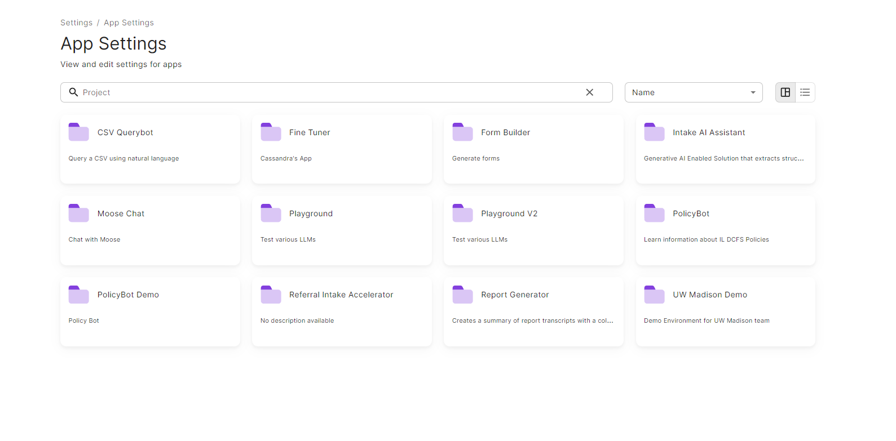
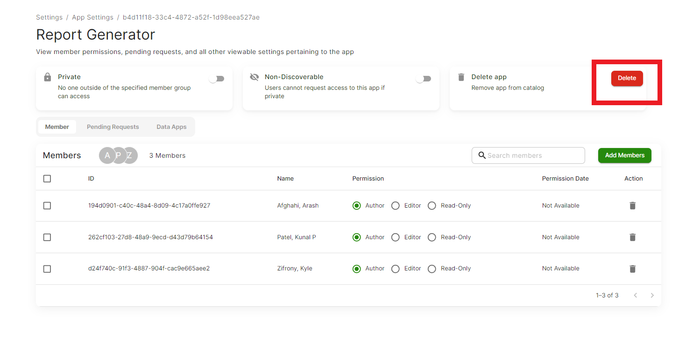

# Settings
You can find the Settings icon at the bottom left corner of the platform.

In the Settings section, you have give or revoke access of any App, Model, Function, Database, Vector, or Storage of which you are an author.
You can even edit the type of access given to other practisioners, like changing the access from author to an editor or just a viewer.

## App Settings

When you click on the App Settings tab, you will see all the apps that are housed under the 'My Apps' section in your platform.

To change the access settings of any App, click on it. You will have to be an author of the app to edit the access settigs. If you are an author, you can either add members, revoke access from any existing members, or edit the access type.

### Pending Request

You can also see if there are any Pending requests from any practisioners. If there are any requests, you can either approve or reject them. You can even control the type of access given (author, editor, or viewer).

### Data Apps

> To be added

## Removing an App from SEMOSS

If you ever want to remove an App from your SEMOSS server, the first thing that you should do is navigate to your settings sections (the gear).

> _The settings tool_

Inside Settings, you should see a screen that has a settings sections for each of the resources you have in SEMOSS. Click on App Settings.

> _This will house all the Gen AI apps that you have in your App Catalog_

Here you will see each of your apps listed individually. Click on the app that you would like to delete.

> _All of your Apps displayed_

Once inside an app, you can easily delete it by clicking the delete button.

> _Delete Button_

> **Warning**:
> This will **delete** the App for all users!

This process can be replicated for all other resource types (databases, models, storage catalogs, etc) in SEMOSS!

<ReactPlayer controls url={RemovingApp} />

## Model, Function, Database, Vector, Storage Setting

Settings for all the resources works in the same way as it is for App Settings. The only difference is that in these 5 resource settings you will not find the 'Data Apps' tab. Apart from this, all features and functuality remains the same.

