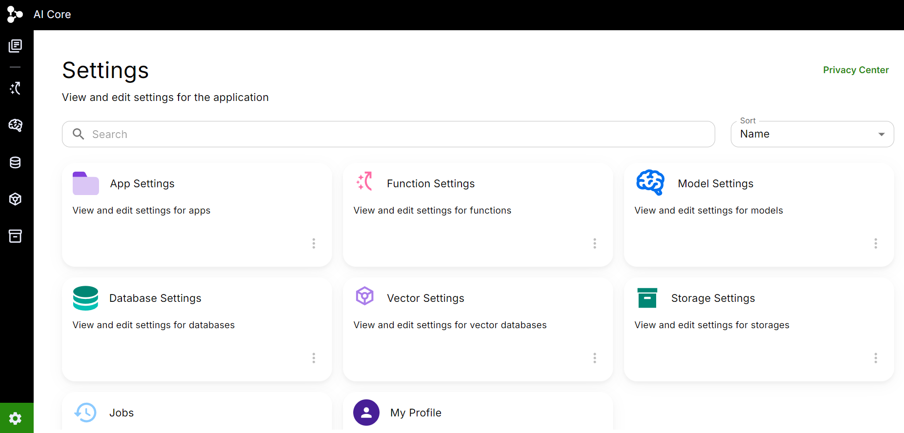
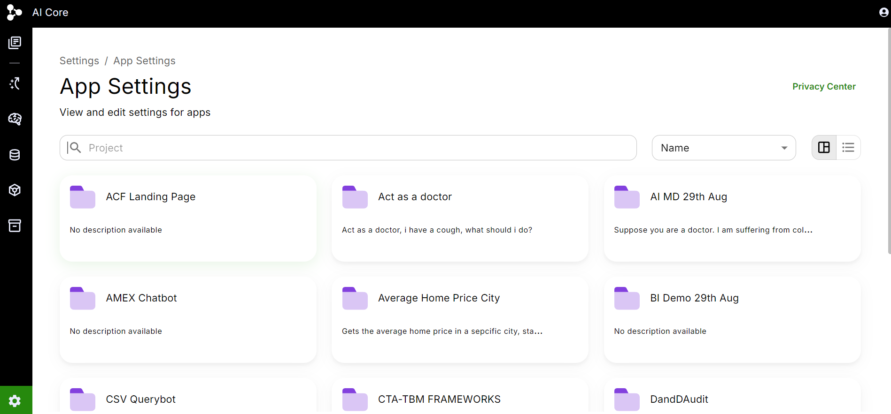
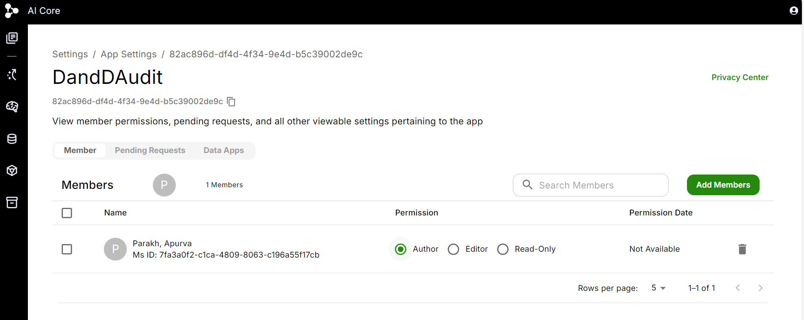
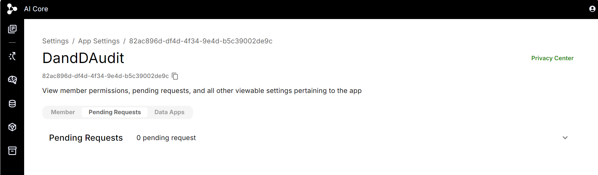

# Settings
You can find the Settings icon at the bottom left corner of the platform.

In the Settings section, you have give or revoke access of any App, Model, Function, Database, Vector, or Storage of which you are an author.
You can even edit the type of access given to other practisioners, like changing the access from author to an editor or just a viewer.

## App Settings

When you click on the App Settings tab, you will see all the apps that are housed under the 'My Apps' section in your platform.

To change the access settings of any App, click on it. You will see the following UI,

### Pending Request

You can also see if there are any Pending requests from any practisioners. If there are any requests, you can either approve or reject them. You can even control the type of access given (author, editor, or viewer).

### Data Apps

