# SEMOSS Apps
There are several Gen AI applications and tool in App Library. BI tool is used to analyze and visualize App data and some commonly used Apps are there which can provide understanding on how user can interact with Apps in platform.

## Using the BI Tool 

### Overview
BI tool is a data analytics and visualization platform where you can create projects, build insights and dashboards, and share them to users.

* To access the BI tool, login to the [SEMOSS](https://workshop.cfg.deloitte.com/cfg-ai-demo/SemossWeb/packages/client/dist/#/) platform
* Once you're in the App Library, you will see two system apps on the top - **BI** and **Terminal**.
* Click on **BI**.

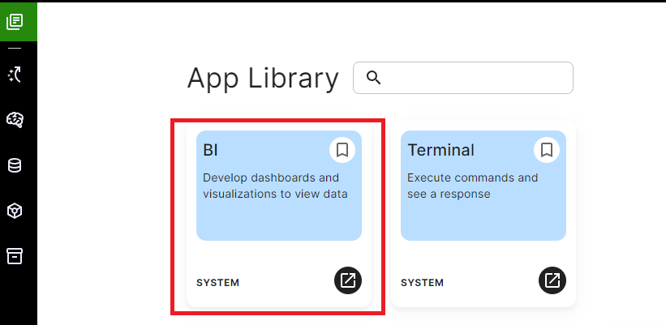
> App Library Home Page

* Here you will find options to create Projects, Insights, and Visualizations.

### Creating a Project

* Click on **+ New Project** under **My Insights**.
* Fill in the details and click on **Save**.

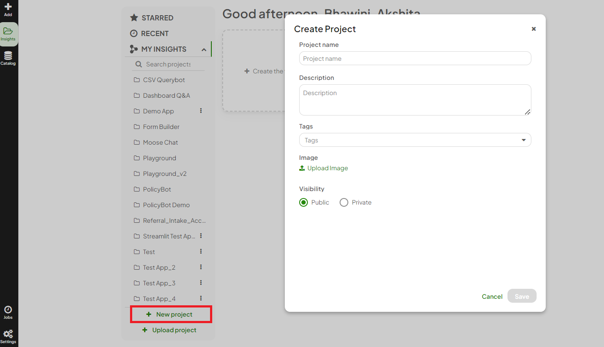
> Create a new project

* You can now create insights and dashboards inside of your project

### Creating an Insight

* Click on the **+Create Insight** icon on the page.

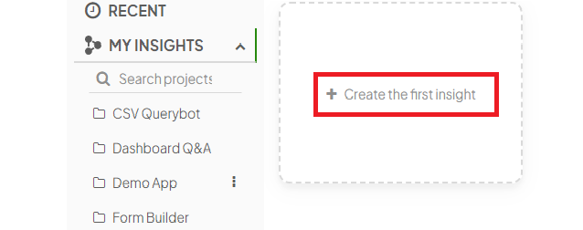
> Create a new insight

* Choose the option from where you want to import data. You can also connect to an existing database using CSV, Excel, or any file type that is listed.

> Import data from a chosen source

* Add all or select a few columns that you want in your insight from the data source.

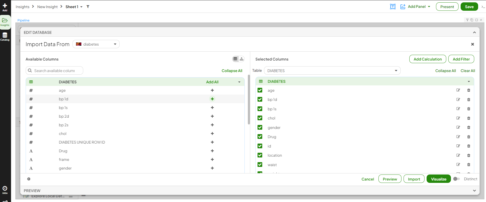
> Select the columns you want to add to your insight

* You can now see your data frame on the window. Click on **Save**.
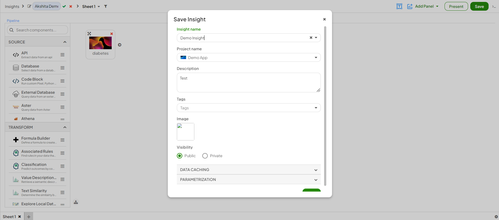

* You can preview or read your data in the **code block** window that appears.

* You can also connect to **Query** to get/retrieve data. First select the database, then write the query.

### Creating Visualizations

* Click on the bottom-left icon that you see in your data frame.
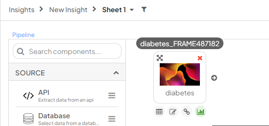

* Choose how you want to visualize your data from the multiple options available on the **Visual** panel in the left.

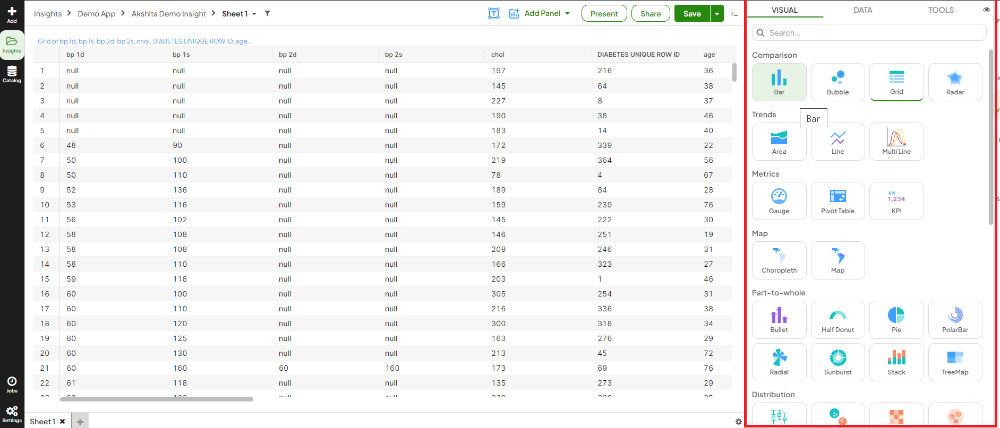

* You can then select the data you want to represent in your visualization from the **Data** tab.

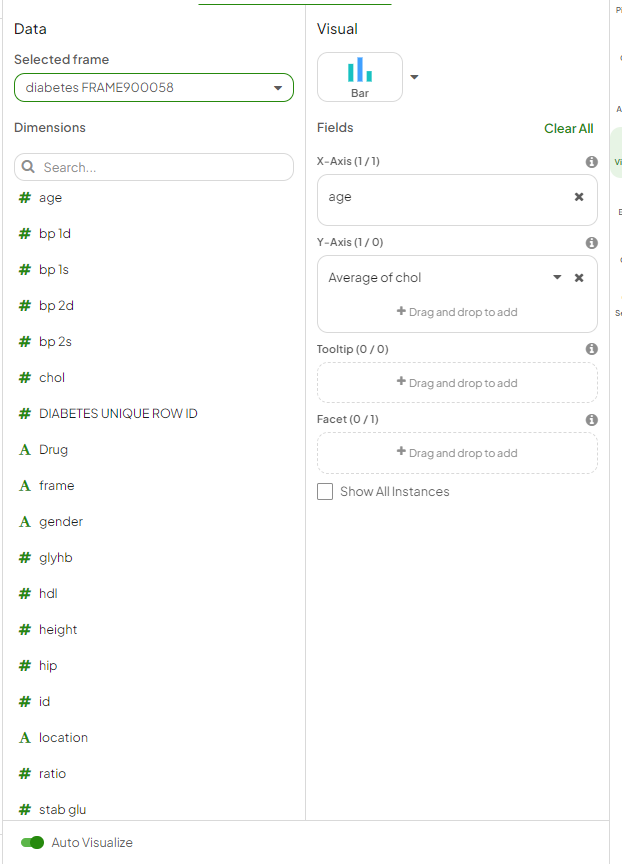

* You can also customize the layout of your visuals using the **Tools** tab.

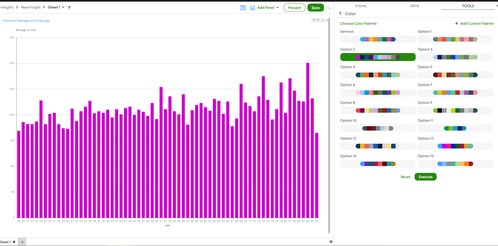
> Using the tools to change the color of the bar chart

* You can also create additional panels to add more datasets from the same or multiple sources to your insights and perform various operations on those datasets like **Join**, **Concatenate** etc.

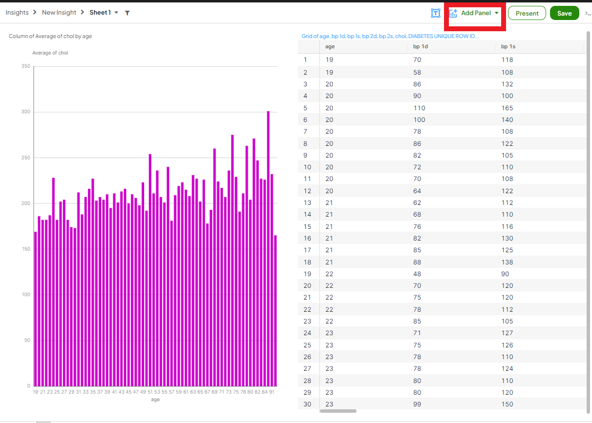
> Here we added a second panel which shows our data

* For dashboarding, you can move around / drag and drop your panels and visuals in a manner that you like and click on **Present** to share it within your SEMOSS environment.

> Now we are presenting the data, which takes away the tooling for a more professional look

* Click on **Export** to share your dashboard externally.
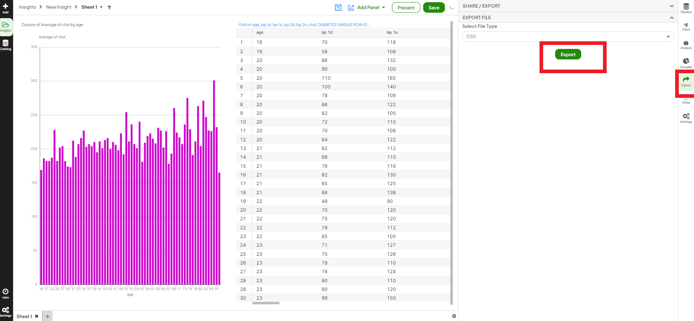
> By going into export, we can make this into a shareable file.

<ReactPlayer controls url={BIToolDemo} />

## Commonly Used Apps

### 1. Text2SQL App
It is one of the most basic apps hosted on the platform. Its functionality is uploading a csv file and then asking a question which is converted into a SQL query and runs through the uploded file to get the desired response. Questions should include keywords related to data present in the file to run the query successfully. You can also run an outlier to analyze the process of running the App. It is a VanillaJS App and is coded in Node.js/HTML/CSS.

> Text2SQL App response based on uploaded file and question asked

<ReactPlayer controls url={Text2SQLAppDemo} />

### 2. Policy Vector Engine
It assists case-workers in answering complex policy, operational procedure, and system questions. This engine takes data such as policy manuals, system documents, process maps data from vector databases as inputs, and uses LLM models to provide answers. The "Policy Vector Engine" is a React App and is coded in Node.js

> Policy Vector Engine response to a question

<ReactPlayer controls url={PolicyVectorEngineDemo} />

### 3. Playground
This App is used to test various prompts with different AI models using chats. You can select type of model from drop down based on type of prompt that will be used and check if its working correctly. If a model dosn't support a particular prompt, it will provide that information in response. Its Front-end is a React App and backend is connected SEMOSS without any code. You can click on settings icon highlighted below to edit LLM parameters like temperature, token length etc.

> Playground App response to a prompt using text supported Model

### 4. Report Generator
This app can be used to create and view summary and reports from meeting transcripts. You can upload the meeting transcript as an input, select a persona from which you want to view the report, choose a model of your choice and generate the summary report. It will also give you status of the items discussed in the meeting as well. You can also download the report if you're satisfied with the results.

> Report Generator App response to a meetring transcript as a prompt

<ReactPlayer controls url={ReportGeneratorApp} />

## Access and Download Apps Locally
To access all SEMOSS Apps or download them in your local environment, we can use below mentioned ways -

### Download Apps folder using command prompt
To use command prompt for having Apps folder locally, click on cfgai-apps. In the folder, click on code and copy the link as shown below.

> Apps folder link

Now open the folder in your local environment where you want to download these Apps and run the windows terminal.

> Github Folder where Apps folder will be downloaded

After terminal is started write **"git clone"** , paste the link copied above and run the command. It will ask you to login for authentication as below

> Authenticate the Signing in

After signing in, it will run next set of tasks and will successfully download the folder with all Apps in it.

> Apps are successfully cloned locally

You can see below, cfgai-apps folder with other Apps in the folder.

> Apps in the Github Folder

### Download zip file locally and then unzip
In this method, go to cfgai-apps and click on code. After that, click on download and a zip file will be downloaded in the local folder you want.

> Downloaded Zip File

Now unzip the file in the same folder and it will return cfgai-apps folder which will consist of all Apps in the folder.

> Downloaded Apps after unzipping the Folder

### Configure SMSS File
SMSS file allows CFG to use resources of many different types, and allows users to configure certain properties of those resources being used. It is a file that sets the properties for resources like CFG Engine, Project, Insight, Model, etc. It contains a list of key value pairs that set the context for CFG objects.

For example, an engine's smss file may contain the ID in the CFG database, the alias for the engine, JDBC connection, the location of the database file, username, password, etc. This allows CFG to know how to connect to the object that the SMSS file references.

## Commonly Asked Questions

* **How is the Policy Vector Engine App different than performing a Q&A directly on the same Database?**

    The Policy Vector Engine allows users to select multiple models and vector databases.
