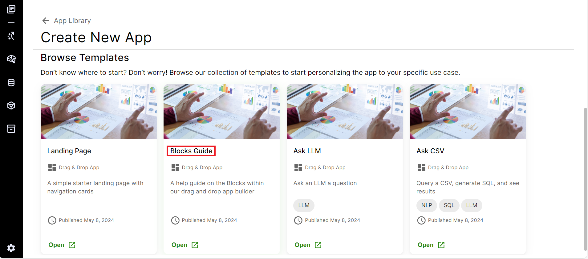
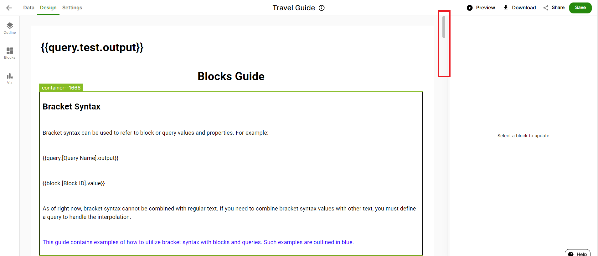
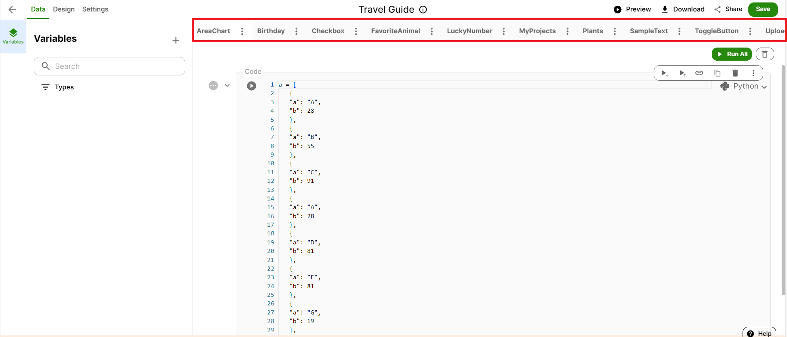
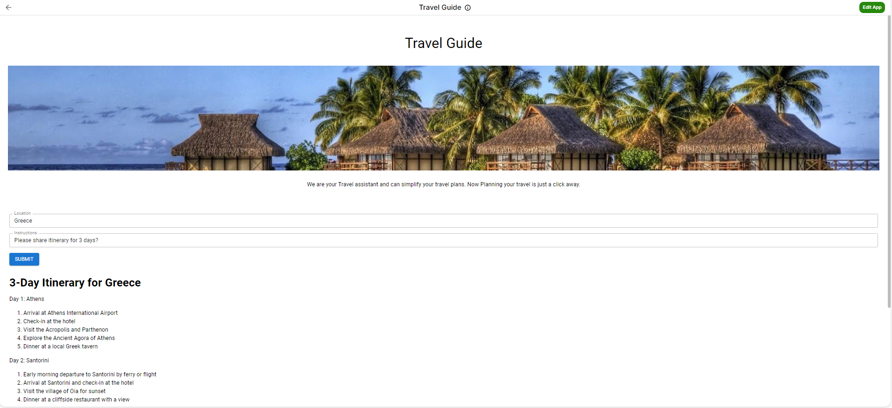
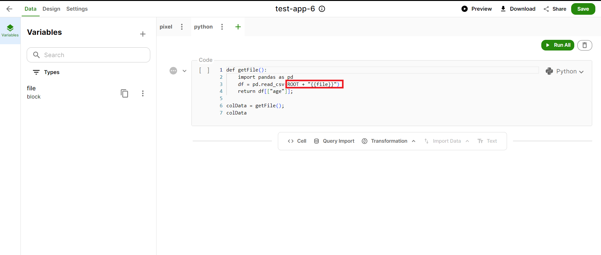
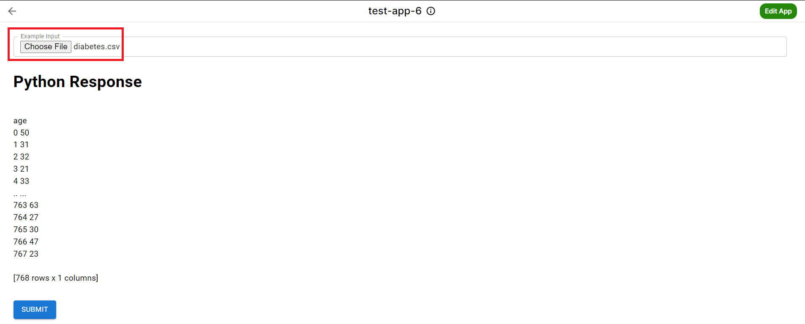

# Drag and Drop Blocks to Build UI for your new App

To build UI for a new app, we can Drag and Drop UI components to customize the app's design as per our requirement. We have different building blocks to design the app and add data to it.

Before starting let us first have a top level understanding of the app creation process. The overall process can be divided in 3 tabs- **UI**, **Notebook**, and **Variables**.
**UI tab**- Here, we drag and drop the UI elements to build our app design. This section defines how our app will look and what features and elements will it have for the user.
**Notebook tab**- Here we create requests to be made from the multiple app resources we have at our peril
**Variables tab**- Here connect the **UI tab** with the **Notebook tab**. Variables tab empowers us to enter an input (and hit a command) and the App will run through a relevant data repository and provide an output.

**Notebook** and **Variables** tabs combine to form the **Data tab**.

To use this feature, click on **Create New App** and then click on **Get Started** in Drag and Drop as shown below.

Enter name of the new app. It will then go to the page where we can start building UI for our app. In the leftmost column we can see **UI**, **Data**, **Dev**, and **Settings** tabs. Click on **UI** and then on **Block tab** on the left side of the page as highlighted below.

You will be able to see the various blocks that can be used to build the UI. The different blocks and information about their usage are listed below.

## Design

### Element

Here we can add basic elements in the app like HTML, IFrame or an image block. **HTML** block is added to the App for inclusion of a web page. We can either generate HTML page using AI or can write a customized HTML code. **IFrame** block can be used when we want to add a web page into the App interface.

We can add images using the **Image block**. After adding an Image block (by drag and drop), we can click on **Block Settings tab** (on the left side of the page) and put url of the image we want to insert along with also mentioning its position in the block and setting the dimension details.

### Input

This category will enable to add Input placeholder to the page using Audio Player, Button, Checkbox, Select, Input, Toggle Button, or Upload. **Button** is added to the page so that we can click on it to execute an action or get the output of App. **Checkbox** is added to the page to check & un-check any condition in the App.

**Select** is added to the page to provide us with drop-down options as input which we can select to get our output. After adding a Select block (by drag and drop), we can click on **Block Settings tab** (on the left side of the page) and customize the input values and even add a query to it if required. **Input** is similar to **Select** but here input can be entered from the user instead of choosing from drop down. **Toggle Button** gives the option to switch on/off any feature or condition in the App. **Upload** is added to the page to provide an option to the user to upload any file which can be used in the App.

### Layout and Progress

This category will enable to build UI layout using Containers and Query. **Container Block** is a block in which we can enter other blocks like Element, Input or Text. Using the Block Settings tab, we can customize the specifications of the container from Layout to Border. **Progress** block is added to display progress of any feature/element in the App.

### Text

This category will enable to add Text to the page using Link, Logs, Markdown or Text blocks. **Link** is added to the page to provide a link within App to another page or a file (details of the link can added by clicking on Block setting and selecting the **link block**). **Logs** are embedded in the App to track App performance and user activities. **Markdown** is a block in which we can put text formatted as headers, lists, bold, italics, etc. for web pages (Block Settings tab can be used to customize the specifications). **Text** is a block in which we can put plain text as required by the App on its UI (to format it, we can click on Block Settings, select the Text block and use the customization section).

**Layers tab** on the left as shown below will list all the blocks that are layered in a App.

## Data

**Data tab** in the leftmost cloumn enables users to connect the CFG platform resources like Model, Database, Storage, etc. with the App.

In the **Notebook tab**, we can add a query and enter an ID to it and it will take us to a cell where we can enter our code in Pixel, Python or R.

Here it is important to understand difference between query and query cell. Query or Notebook consists of query cells. A query can have multiple cells. We can also create multiple queries (or notebooks) in the **Notebook tab**. A query is generally a complete set of action contributing to the operation of the App. For example consider payment feature in an app, so the entering payment details, hitting enter, talking to the bank server, everything can together form a Payment queries. And these entering payment details, hitting enter, etc. will the different cells within the query.

Sometimes these cells functions maybe required in some other queries as well. For example, talking to a bank server may even be required when authenticating the user. So some other query (like User autentication in our example) may also use 'talking to the bank server' query cell which is defined in the 'payment query'. Thus we see that we can even connect cells which are part of different queries or notebooks.

Under cells, we can choose either of **Code** cell (represented by **\<\> cell**) or **Query Import** cell and then write a code or query to access CFG resources as per app requirement.

In case we choose **Code** cell, we can go to the CFG resource (Model, Database, Storage, Vector Database, etc.) which we want to connect with the app and click on the usage tab within the resource. We can copy the code based on scripting language we have chosen for the cell and paste it in the Notebook query cell. We can also modify this code or write a customized code altogether.

In **Query Import** cell, we can write a database query and select Database from the list of Databases we have access to.

Query import cell differs from Code cell in how it represents data. Using query import cell we can get data in tabular form (or Data Frame). As shown below, we have queried data from **diabetes** Database and got the data in a tabular form as a response below the cell.

We can also transform data presented in the colums of the table using **Transformation** option. Some of the transformations possible include converting smallcase to capitals, etc. To transform any column's data, click on **Transformation** and choose type of transformation mnentioned among the list.

After that a new cell for selected transformation will appear below and in that choose the Frame in which we want to transform data. Then select required details as per the transformation type chosen and run the query. We can then see modified/updated data in the Frame compared to previously shown data as displayed in below screenshot.

### Creating and using variables

Now finally we will connect the UI with our created queries. For this, we click on the **Variables tab**, then on **add(+)** on the left side of the panel and define the variable by adding details as shown below. In the UI tab, we have add different types of blocks (like image, text, button, etc.), thus we can define our variable as the type of the block we want to connect it with.

After defining variables, write the code and replace constants in it with variables that we have just created as highlighted in the screenshot below.

Now our code is ready to use and we can click on **Run all** to check that it is running correctly or not. If there is some error, please make sure code language chosen is correct and variables are defined accurately.

Below mentioned are elements different blocks have to connect itself with data,

To link query in Notebook with Button block we can click on **"New Action"** on the right hand side under **ONCLICK** and enter query type and query ID as shown below.

To connect a query that automatically runs when an App page is opened, select **page** block that embeds all other blocks and click on **New Action** on the right hand side under **ON PAGE LOAD** and enter query type and query ID as shown in below screenshot.We can add multiple queries to the Page and they will automatically run whenever someone opens the App Page.

Click on **Settings** to set accessibility of App and Delete the App as shown below.

After making all the changes, we can Preview the App before saving and can Save it thereafter. We can also share the link of the App with other members or users as required.

Now we can go into App Library and click on the App we have created. We can see the UI of the App we have created as seen below.

<ReactPlayer controls url={DragandDrop} />

# Use pre-built templates

Developers and business users can use these pre-built templates to create and customize apps. This makes the devopment process quicker and accelerates time to delivery.

## Work with blocks in UI builder

To use different blocks that we have discussed above, there is a **Block Guide**. It is a template that allow users to experiment with each of the blocks in the UI builder. We can leverage all blocks in the template or remove some blocks as required in the app. We can also connect our own data to this app and customize queries that will run the app.

To create new app using **Block Guide**, click on **Create New App** and then click on **open** in Block Guide within browse template section as shown below.

Enter the name we want to give to the App and then click on **Create**. After entering the template, we can browse from top to bottom to see through all the blocks present in the App.

Each block consist of a description which will provide information to user related to the function of that block.

Now if we wish to remove some blocks from the App, select those blocks and **Delete** to remove them from the App as seen below.

We can modify configuration of blocks as required by the App by changing details on the right side of a block.

To create and modify queries for connecting data to blocks in **Design** tab, go to **Data** tab and work around queries/code as per App requirement as we have discussed in the Data(Notebook) section above. Data tab of block guide is shown below.

Once we connect queries in data tab to blocks and update configurations of these blocks, we can save the App and now its ready to use.

<ReactPlayer controls url={BlockGuideDemo} />

## Landing Page Guide

Use this template to create a landing page for your app. You can customize it as per your needs using the design and data tab.

Go to App Library Home Page and click on **Create New App**.

Scroll down to **Browse Templates** and go to **Landing Page** and click Open.

Enter a name and then click on Create.

You’ll find a sample landing page template ready for use.

Use the design tab to modify the UI. Click on each block to customize the landing page as per your requirements.

## Ask LLM Guide

Use this template to create a basic sample LLM app. You can customize it as per your needs using the design and data tab.

Go to App Library Home Page and click on **Create New App**.

Scroll down to **Browse Templates** and go to **Ask LLM** and click Open.

Enter a name and then click on Create.

click on the input block that has the label **Question** inside it. Type in your question inside **Value** box in the **Design** tab that open up on the right side.

Now go to **Ask** button and click on **Run Query** under the editing options on the right hand side.

You will have your answer in the response box once the query runs successfully.

You might get an error in case you do not have access to the model that this app is using. Request access to that LLM or swap it with any other model in your model catalog that you already have access to.

Save your app when you finalize the changes and share with other users.

<ReactPlayer controls url={AskLLMTemplateDemo} />

## Ask CSV Guide

Use this template to create a basic app that lets you generate an SQL query to read data from an SQL file. You can upload a csv file and type in the question for the data you need. The app will return a CSV query in response.

Go to App Library Home Page and click on **Create New App**.

Scroll down to **Browse Templates** and go to **Ask CSV** and click Open.

Enter a name and then click on Create.

You will see a template ready to use. Click on the **Upload** block and choose the file you want to run the query on.

After the file is uploaded, type in the question for which you want to generate the CSV query in the **Question** block as an input.

Now, click on **Ask** button and then on the right, click on **Run Query** to generate results.

Once it runs successfully, it will return the SQL query you need to retrieve the data for the question you asked earlier.

Save your app when you finalize the changes and share with other users.

<ReactPlayer controls url={AskCSVTemplateDemo} />

# Commonly Asked Questions

## Using Upload Block

When using **Upload Block** in the App and using **Python** as scripting language in code/query, we should use **"ROOT + "file"** in code as shown below, for calling the **file** instead of just using **"file"** as in case of **Pixel.**

After making this tweak in the query code, we can run the App seemlessly. As shown below, after uploading a csv file, we can run the App without any hiccups.

