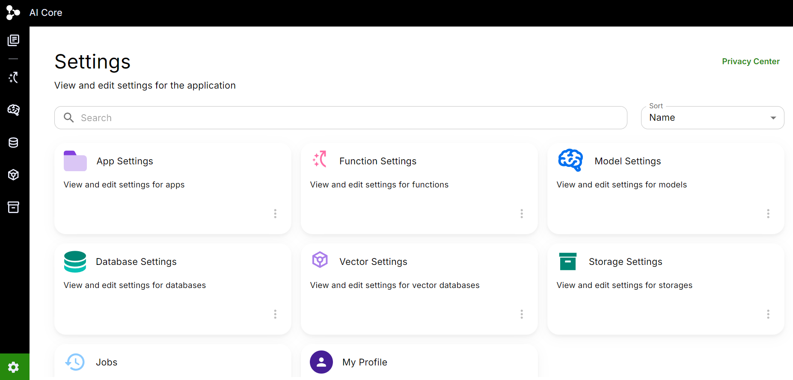

# Platform Navigation
CFG AI is a platform that enables developers to create Gen AI (Generative AI) applications at the client level and deploy within the enterprise. It manages logging, monitoring, metering, and access management so that developers can focus on business problems. It consists of App Library, Functions, Models, Database, Vector, and Storage.

In this section we are going to see how to navigate through the platform and its different resources and what all the platform has to offer. When you login to the Cfg.Ai Platform, you arrive at its homepage as illustrated in the picture below.

Here, on the leftmost side you will see your App Library along with the 5 platform resources. These are briefly described below,
1. App Library - Repository of all the Apps you create and have access to use
2. Function - 
3. Model - We connect our Apps to Models which are LLMs 
4. Database -
5. Vector -
6. Storage -

