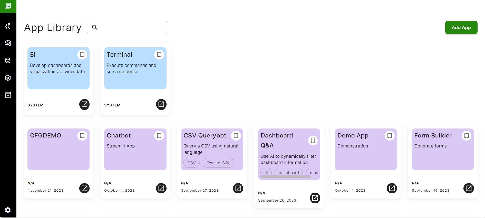
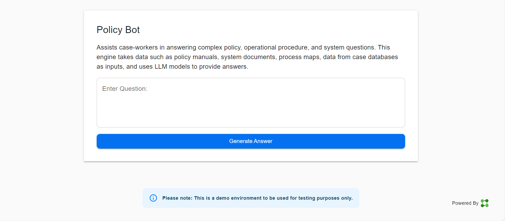
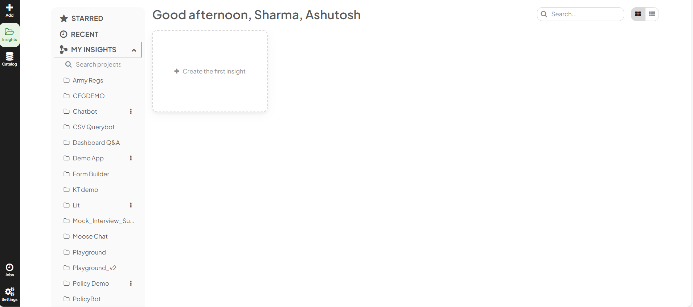

# Key Concepts

## Overview
SEMOSS is a platform that enables developers to create Generative AI (GenAI) applications at the client level and deploy within the enterprise. It manages logging, monitoring, metering, and access management so that developers can focus on the business problem. 

## Key Concepts
This overview will cover the following topics: 

*    [What is a GenAI App?](#what-is-a-genai-app)
*    [What is an Insight?](#what-is-an-insight)
*    [What is a Pixel?](#what-is-a-pixel)
*    [What is a Reactor?](#what-is-a-reactor)
*    [Anatomy of GenAI Apps](#anatomy-of-genai-apps)

> _The SEMOSS App Library Homepage_

### What is a GenAI App? 

A GenAI app consists of three key components: 
1. **A user interface:**

   The user interface (UI) is the visual layer that end users can interact with onscreen. It is usually created using modern JavaScript/HTML frameworks such as React and Angular.

2. **An integration component**

   The integration component provides the ability to get data from a storage source or a database, and put data into storage or a database by way of Python or Java. 
   
3. **A data science component**

   The data science component is comprised of analytics and custom algorithms that can be connected to different Generative AI models. 

> _Policy Bot, an example of a GenAI app hosted on SEMOSS_

In practice, these three work together in a unified workflow: 
1. The end user enters input into the UI. Based on the user's input, the UI will make calls to the middleware code.
2. The middleware, or integration component, implements some business logic to assimilate structured data, storage data, and vector data. Once it finishes, it will pass it on to the data science portion.
3. The data science component will either make a call to a Large Language Model (LLM) or run an embedded Python routine in order to give a response back so that it may be returned and displayed on the UI to the end user. 

### What is an Insight? 

Throughout this documentation we will be using the term **'Insight'**, so it behooves us to take a moment and explain what that is. In SEMOSS, an **Insight** is best described as a temporary space that allows you to create what you want. Put simply, it is a hosted workspace where you are able to upload your app and access your hosted data. 

One of the key components for integrating your data app with the greater SEMOSS environment is the **InsightProvider** that is built into the SEMOSS SDK. The main purpose of this InsightProvider is to give your app access to all of your hosted data, and to create the Insight that is going to host your app. To perform actions in an **Insight** we must use a pixel command.

### What is a Pixel?

A **pixel** is a SEMOSS specific term that references a backend call. It is similar to a standardized API call, though it does not require you to specify the type of API call (i.e POST/PUT/GET/DELETE). The pixel call generally specifies a **reactor** that is being called, and then any input variables that the reactor needs. When discussing pixel calls in this documentation we will also include a sample of the pixel string structure required. 

### What is a Reactor?

A **reactor** is a business logic unit of **pixel** which performs the desired operation for the user. At its core, a reactor is just a Java class file. A reactor file is put inside a java folder within the App folder when custom backend code is required. It can directly interact with the SEMOSS server.

### Anatomy of GenAI Apps

Generally, the anatomy of an app will follow the file structure seen below:
  

1. **client** - houses frontend code, which can be a React application or any other desired framework
    * _**Not supported** - Streamlit_
2. **java** - a conglomerate of Java classes (what we call "reactors") that can directly interact with the SEMOSS Server
    * It is not necessary to have a Java folder unless custom backend code is required 
3. **classes** - contains the compiled reactors within the Java folder
4. **portals** - bundled version of frontend code (static HTML/CSS/JavaScript version of your frontend code)  
5. **py** - series of Python scripts/modules that are called into Python 

## Commonly Asked Questions

* **How can we use Pixel with JavaScript SDK?**

    Pixel is particularly useful if you prefer not to write an intermediate Java component in your applications. More details and training on Pixel are available below.

## Additional Resources 

[Pixel Guide](https://semoss.org/SemossDocumentation/#scripting-understanding-pixel)

[Demo App](https://github.com/Deloitte-Default/cfgai-apps/tree/main/demo)

[Policy App](https://github.com/Deloitte-Default/cfgai-apps/tree/main/policy)

> **Note**
> These are in a protected GitHub, if you do not have access or are not signed in to your GitHub you will get a 404 error. 
