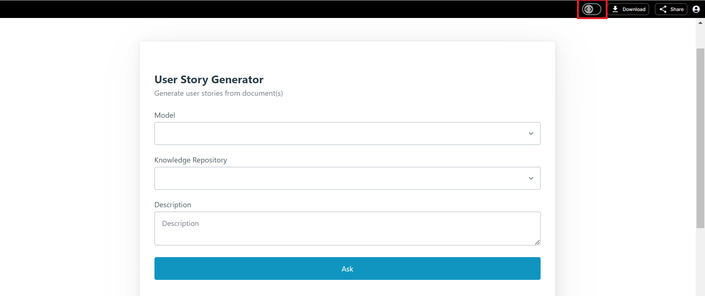
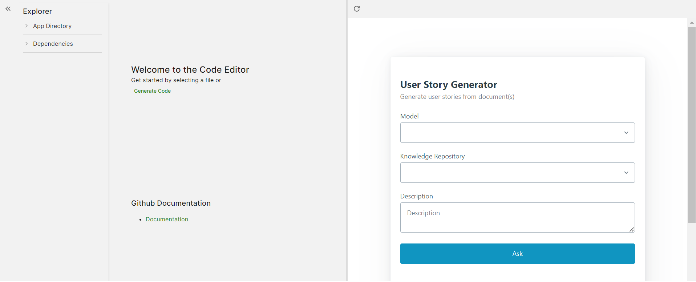
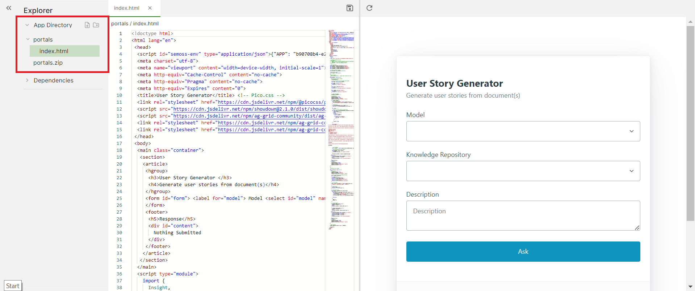
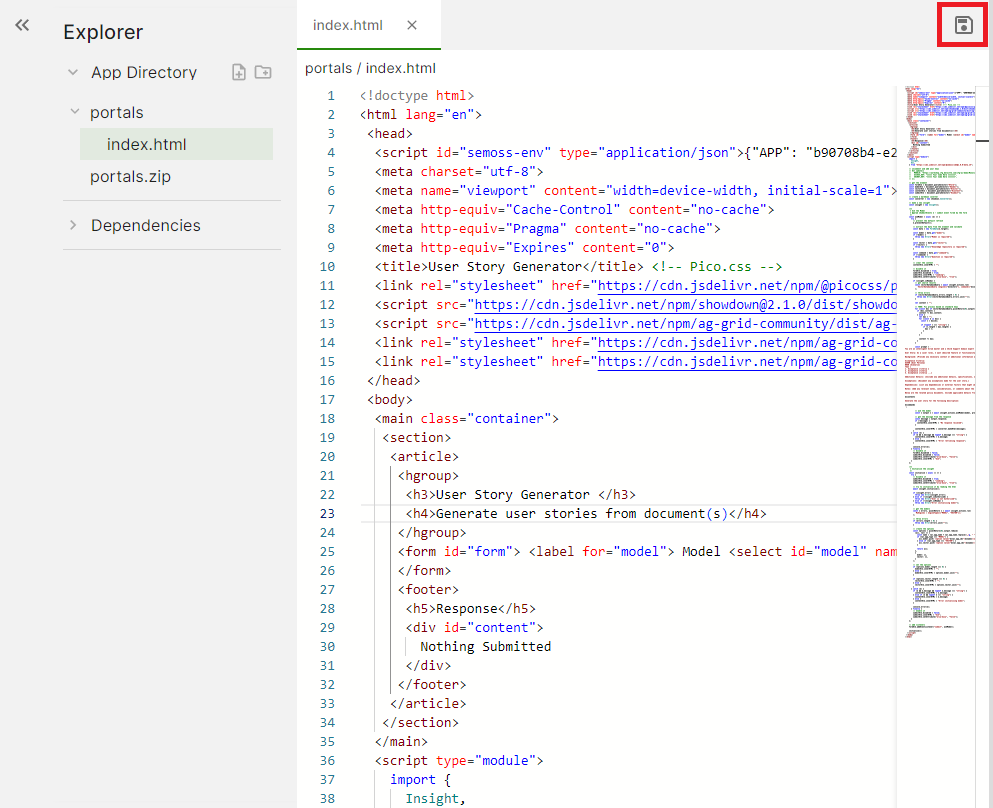
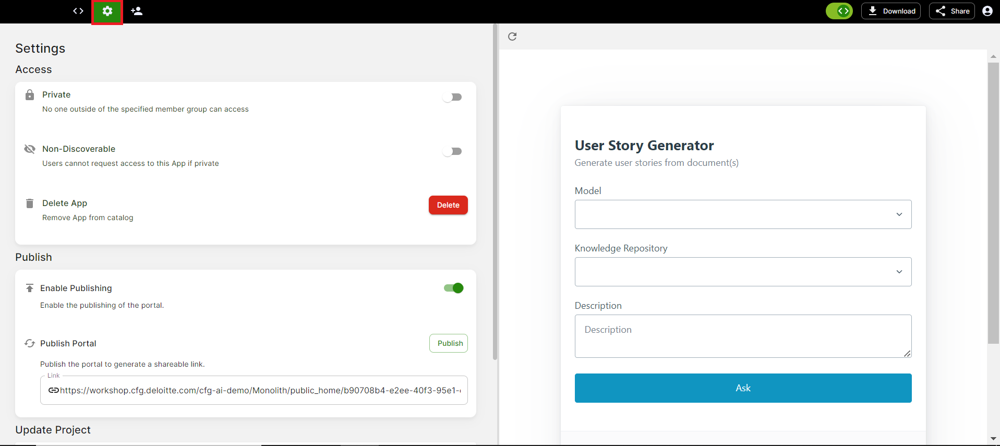
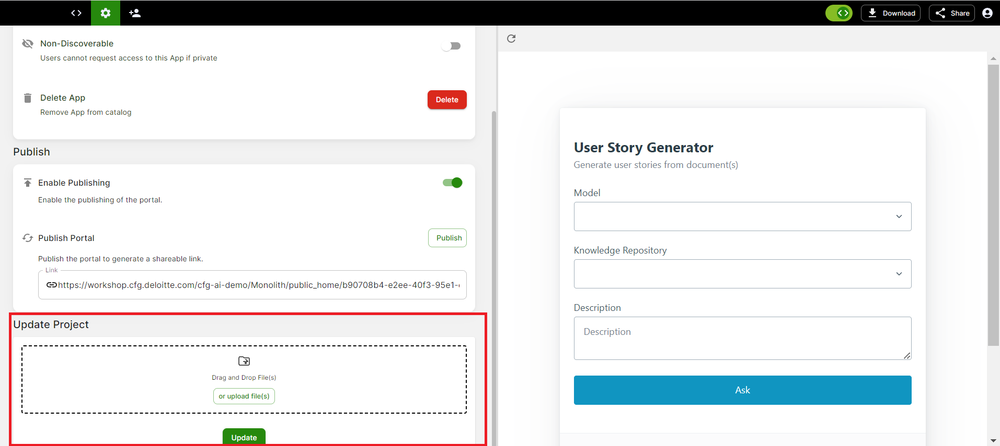
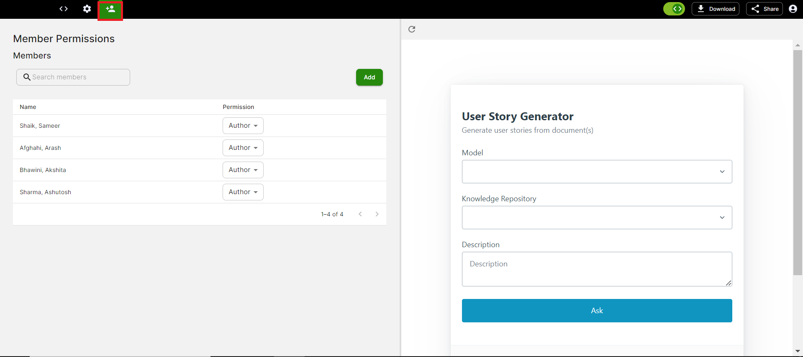

# Using the Code Editor

## Overview
Code editor can be used to make minor changes in any chosen app using the UI. There are a few other features available in the code editor like user access, sharing permissions and few more that we will discuss in this document.

## Editing the code

Go to your [App Library](https://workshop.cfg.deloitte.com/cfg-ai-demo/SemossWeb/packages/client/dist/#/).

Select the app you want to make changes to and click on the icon next to Download on the top to open **Code Editor**.

You will see the Code Editor window appear on the left half of the screen.

> You can also see the App UI on the right side

Now to make changes to the code of this app, go on **App Directory** > **Portals** on the left under the **Explorer** section. Open the file that has the code where you want to make edits.

> You can locate your code files under the Portals folder usually

You can make changes to the code and click on **Save** icon on the top right to save your edits.

> You should be able to see your changes to the app UI on the right side

## Additional Features

You can modify your app further by going to **Settings** page. You can change access setting, publish or even delete the app.

You can also add new code to the app or update it by uploading .zip files.

You can add or remove members from your app and choose whether you want to give **Author**, **Editor** or **Read Only** permission to any given member.

