## Table of Contents

*    [Semoss Installation for Windows](#Semoss-Installation-for-Windows)
*    [Semoss Installation for Mac Silicon](#Semoss-Installation-for-Mac-Silicon)
*    [Semoss Tips and Tricks and Troubleshooting](#Semoss-Tips-and-Tricks-and-Troubleshooting)

## Semoss Installation for Windows

To carry development process around SEMOSS platform, we need to install Semoss and other tools in our local environment. Below documentation serves as a comprehensive guide to assist developers in setting up local environment with essential tools required for the work.

It provides clear, step by step instructions that cater to both beginner and experienced developers. Whether you are setting up a new environment or reconfiguring your existing setup, this guide will ensure that you have all the tools you need to develop, test and deploy product features effectively.

## Prerequisites

Download softwares and tools from below links to be able to install Semoss.

### Create Workspace Folder
Create a folder 'workspace' in C drive of your File Explorer

### Java SE Development Kit (JDK)
Click on [Java SE Development Kit](http://www.oracle.com/technetwork/java/javase/downloads/jdk8-downloads-2133151.html)
- Scroll down to find ‘Java SE Development Kit 8u391’, Windows x64 for 64 bit
  - Accept License Agreement and download
  - You will need to create an Oracle account using your Deloitte email address
      - If you do not receive a confirmation email within 10-15 minutes, contact a training team member, who will provide 
         a backup email.
- Select next, next, next, all the way through; will go to your Program Files but you won’t have to direct it there
  - If running into an issue, right click the download, and choose Run as Administrator to proceed
  
### Eclipse IDE for Enterprise Java Developers (Version 4.16) 
Click on [Eclipse IDE](https://www.eclipse.org/downloads/packages/release/2019-09/r/eclipse-ide-enterprise-java-developers)
- Do not download a newer package
- Select the link under ‘Download Links’ -> 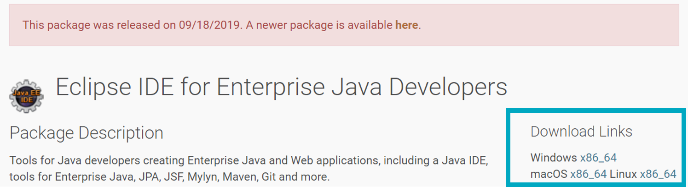
- Windows 64-bit
- Unzip this to Desktop or Default location
> **Note**
> Be sure to download the version released in September 2019 and NOT the latest package

Once your Eclipse & JDK are installed, open Eclipse and specify where you want your workspace to be
   - Specify **C:\workspace** instead of the default name that shows up
- We recommend that you pin eclipse to your taskbar and pin your workspace to your Quick access bar
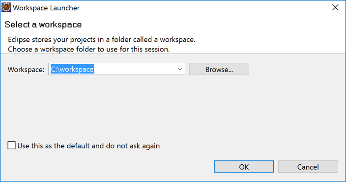

### Apache Tomcat (v9)
Click on [Apache Tomacat](https://tomcat.apache.org/download-90.cgi)
- Choose Binary Distributions, Core, 64 bit Windows .zip file under the latest 9.0 section
- Unzip the apache-tomcat folder into your workspace
- The folder will most likely be named apache-tomcat-9.0.## (with ## being the version number!)
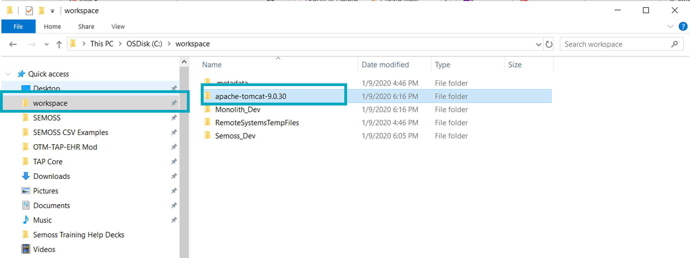

### Git
Download [Git](https://git-scm.com/downloads)

### Notepad++
Choose [Notepad++ Installer](https://notepad-plus-plus.org/downloads/v7.8.2/)

> Note: Please download the 64-bit x64 installer version (not the zip file)

### node.js
Click on [node.js](https://nodejs.org/download/release/v18.16.0/)
- Click node-v18.16.0-x64.msi and follow the installation instructions

- To check whether node.js has been successfully installed,
  - Go to terminal
  - Type 'node -v' and hit enter
  - This should return the version of the node installed

### maven
Click on [Maven](https://maven.apache.org/download.cgi)
- Click the download link beside Binary zip archive, and unzip this to your Documents folder

- To check whether node.js has been successfully installed,
  - Go to terminal
  - Type 'mvn --version' and hit enter
  - This should return the version of the node installed

> **Note**
> Use Google Chrome for all downloads. Then you can quickly navigate to the downloads folder, right click, and Run as Administrator.

## Installation Steps

### Add Monolith and Semoss Folders in Workspace
- Go to the [Monolith repo](https://github.com/SEMOSS/Monolith) , click on code and copy the link
- Navigate to your workspace in File Explorer, and type 'cmd' in the filepath
- After terminal is started, type "git clone" and paste the link copied above and hit enter. It might ask you to log onto GitHub for authentication
- After signing in, it will run next set of tasks and will successfully clone the repo​
- Repeat the same steps for Semoss at [Semoss repo](https://github.com/SEMOSS/Semoss)

### Git clone Semoss-ui code in Apache Tomcat Webapps folder 
- Navigate to your Apache Tomcat webapps folder
  - Since we placed the tomcat folder in the workspace, the path is: C:\workspace\apache-tomcat 9.0.##\webapps
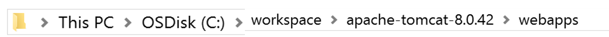

- Open terminal at this location and run **Git clone** the semoss-ui folder from [semoss-ui](https://github.com/Deloitte-Default/cfgai-ui) to your local
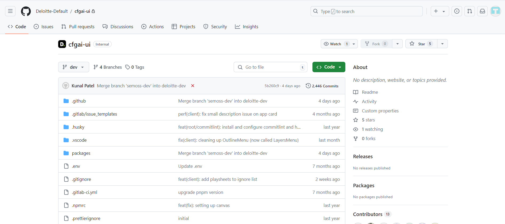
- Ensure you are on dev branch
- Rename semoss-ui folder as SemossWeb
  - In the SemossWeb folder create a new file named “.env.local”, and copy the following contents (without the inverted commas) into that folder ():

"ENDPOINT=../../..
MODULE=/Monolith

THEME_TITLE=SEMOSS
THEME_FAVICON=./src/assets/favicon.svg

NODE_ENV=development"
- Navigate to the following path in your command prompt/terminal:
C:/workspace/apache-tomcat 9.0.##/webapps/SemossWeb (this is your root directory)
- In the terminal type in: “pnpm install"
  
> **Note**
> These next couple steps are going to require node.js version 18 or greater and pnpm

- Then navigate to the following path in your command prompt/terminal: C:/workspace/apache-tomcat 9.0.##/webapps/SemossWeb/packages/ui and type the command “pnpm run build"
- Upon completion, navigate back to root directory, open terminal and run the command "pnpm run dev:client"


### Update app.constant.js
- Navigate to your Apache Tomcat webapps folder
  - Since we placed the tomcat folder in the workspace, the path is: C:\workspace\apache-tomcat 9.0.##\webapps


- Click on **semoss-ui**
- Go to Packages, then go to Legacy
- Right click the **app.constants.js** file and click Edit with Notepad++
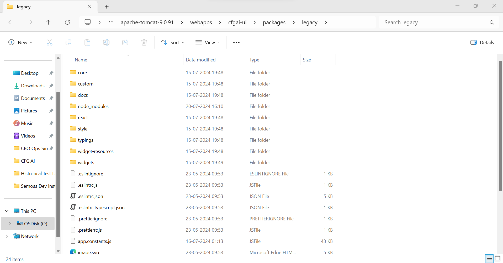
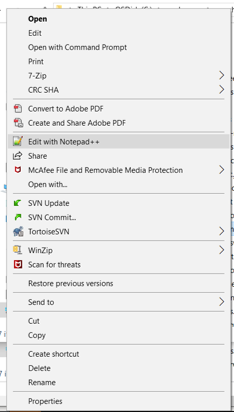

- Locate this section of code, and update the following values, if necessary:
  - Change pictured line starting with “mod” to mod = ‘Monolith’ (This will likely be near line 18-19)
  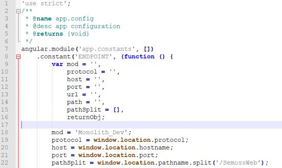

- When complete, save and close

### Import Semoss and Monolith into Eclipse

**In the Import Box that appears**
- Open eclipse and go to **Import** in **File** tab, then find **Maven**, click on the dropdown and select **Existing Maven Projects**
- It will start searching existing project and might take some time
- For **Root Directory**: Browse for your workspace and click Okay. This should reflect where you saved your workspace folder i.e. "C:\workspace"
  


- For **Projects**:
   1) Check "Monolith"
   2) Check "Semoss"
   3) Uncheck all others including "SemossWeb"
 
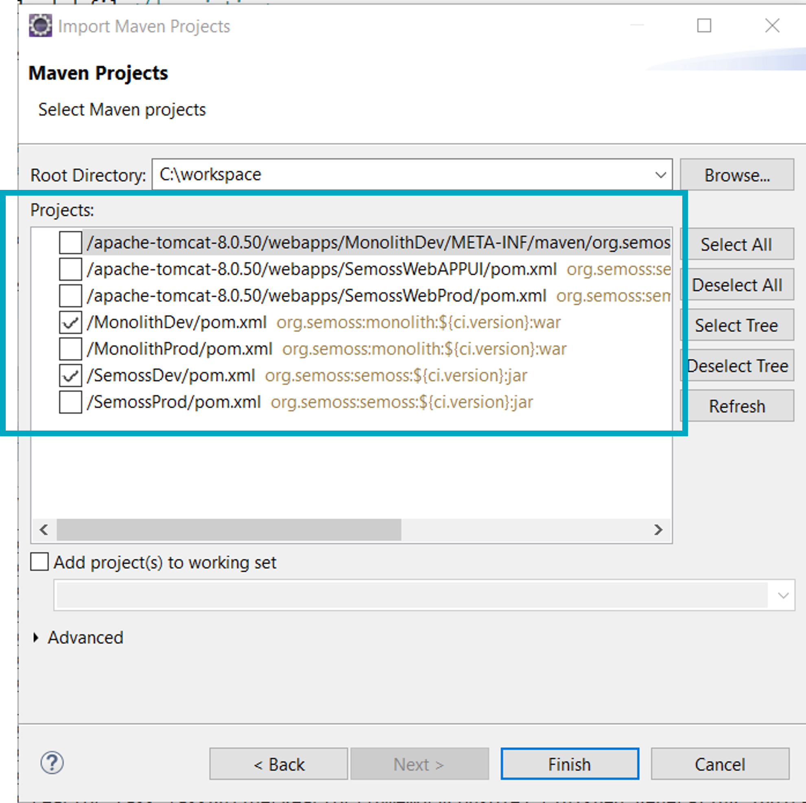

- At the bottom of the import window, click Finish to import your projects

### Import Semoss into Monolith
- In eclipse, click on **Windows** tab and then click on **Show view** and then click on **Others**
- Now go to General and then go to **Project Explorer**
- Right click on the **Monolith** project under the **Project Explorer** Tab and select **Build Path > Configure Build Path**

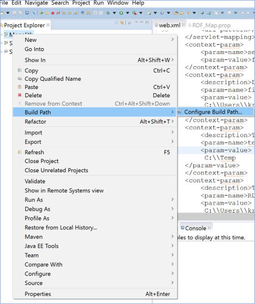

- Click on the Source tab, Select the **Monolith/src** folder and click Edit.
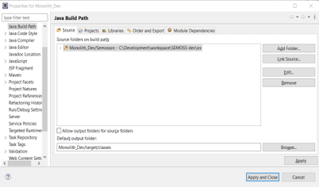

- Browse for the correct workspace location under **Linked folder location**: **C:\workspace\Semoss\src**
- Then, on the Source Folder screen update the Folder Name field to say: “Semosssrc”. Click **Finish** >> **Apply and Close**
- This may take a few minutes. Please allow the workspace to update.
  
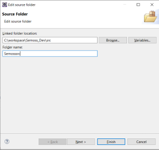


### Update RDF Map for Semoss
- In the **Project Explorer** panel on the left, expand Semoss and scroll down to find File.
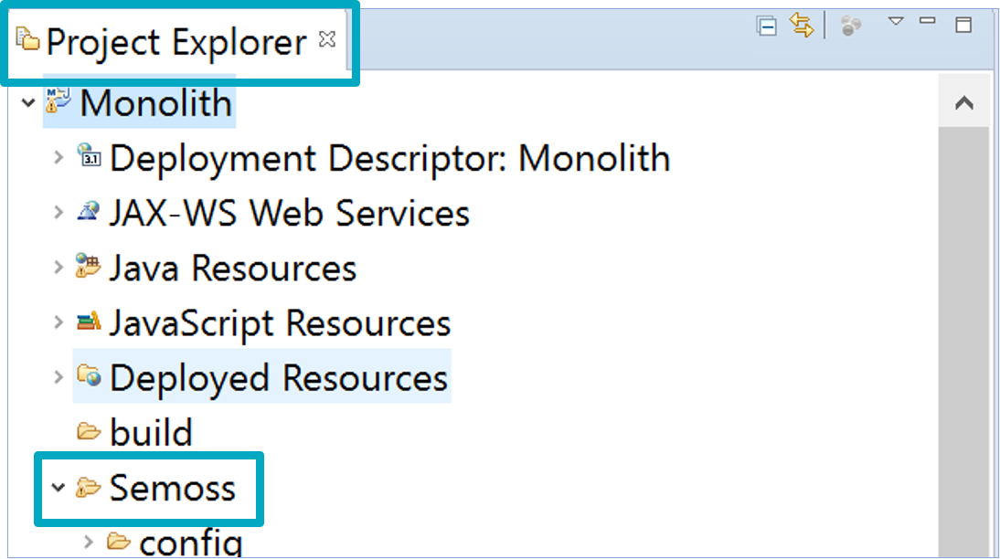

- Right click on **RDF_Map.prop** and Open With Notepad++ or double click and just open in Eclipse
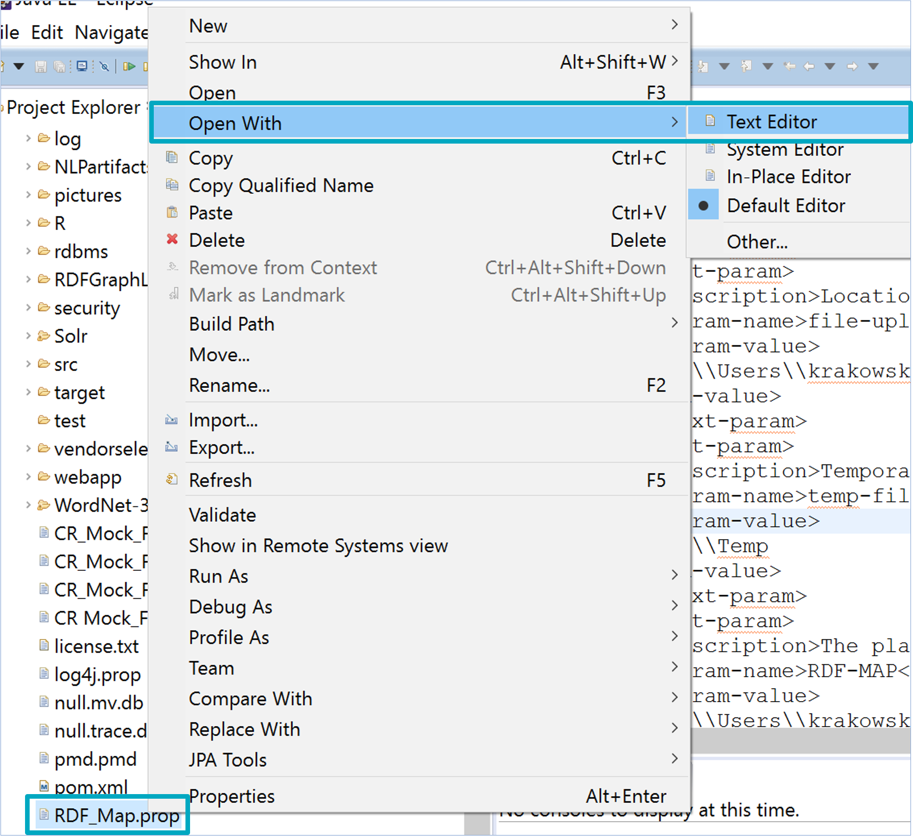

-Make sure all references to the C drive (i.e. "C:\\...") is the correct file path.
- Check that all of your paths begin with **C:\\workspace\\Semoss\\** or whatever your accurate workspace path is. The last of these should occur on line 21, starting with SOCIAL.
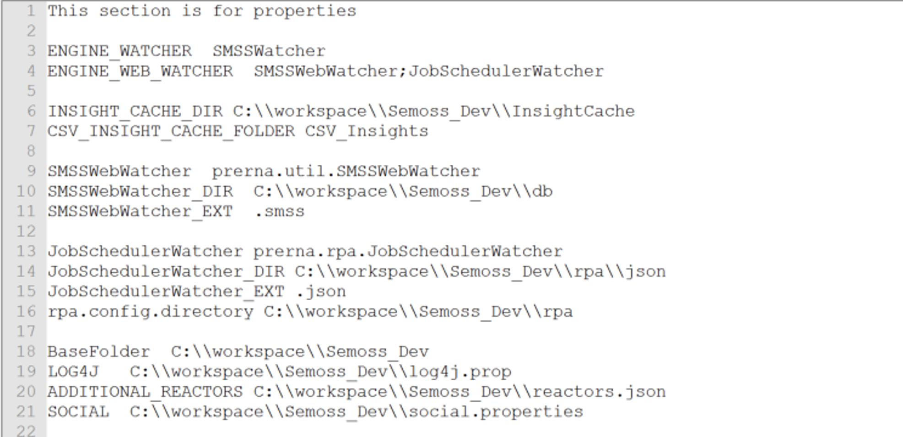

- If you make any changes, save the file and close it.

### Update social.properties for Semoss

- Navigate to your social.properties file. This can be found directly in the **Semoss** folder.
- Right click on **social.properties** and Open With **Notepad++** or in Eclipse
- Ensure that every port and folder name matches with how you set up your SEMOSS.
  - Ports 5353/5355/8080 should be changed to 9090
  - SemossWeb_AppUi should be changed to SemossWeb
  - Monolith should match what you called your Monolith folder
- Enable the logins that you plan to use (ie. Google, github, etc.)
- If you wish to use certain Google APIs, you will need to create an account and project on your own to receive a client_id and secret key (https://console.cloud.google.com/home/)
> **Note**
> You can set up the logins and APIs at a later time as needed

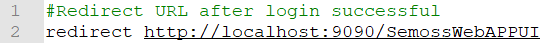
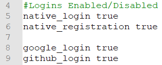

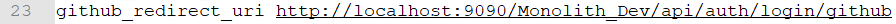

### Update server.xml for Tomcat

- Open your Windows File Explorer and navigate to the following path: **C:\workspace\apache-tomcat-9.0.30\conf**
- Right click on **server.xml** and Open With **Notepad++**
- Find the line that says **<Connector and the port number** (should be around line 69)
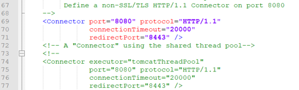

- Change the port to 9090
- Save and close the file

### Create a Tomcat Server
- In the top bar of Eclipse, click **Window -> Show View -> Other**
- Expand the Server drop-down, select **Servers**, and click **OK**
- In the bottom Servers panel, click **No servers are available. Click this link to create a new server**
> **Note**
> If you cannot find or search for Servers in the Show View window, revisit which Java you downloaded at the beginning to ensure you have the IDE for Enterprise Java Developers.

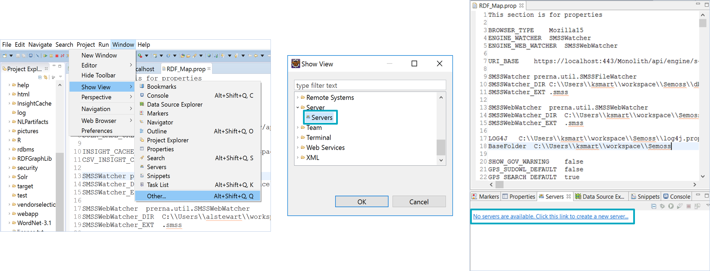

- In the New Server window that appears, expand Apache, and select the version of the **Tomcat vX.X Server** you installed and click **Next**.
> **Note**
> You may need to expand the pop-up window to view the server options.

- Expand Server, select Servers and click OK.

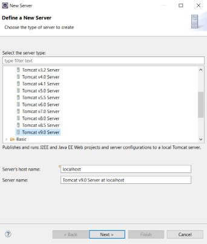

- In the **Tomcat installation directory** field, enter (the location of your tomcat file): **C:\workspace\apache-tomcat-X.X.##** and click **NEXT**.

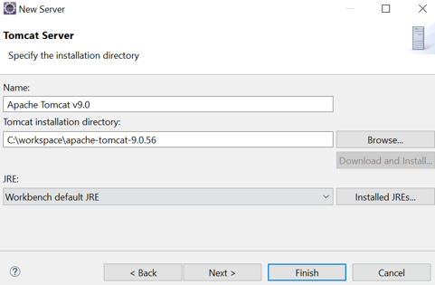

- From the Add/Remove window that appears, under Available, select Monolith, click **Add** to move it to the configured side, then click the **Finish** button at the bottom. This window will then close.
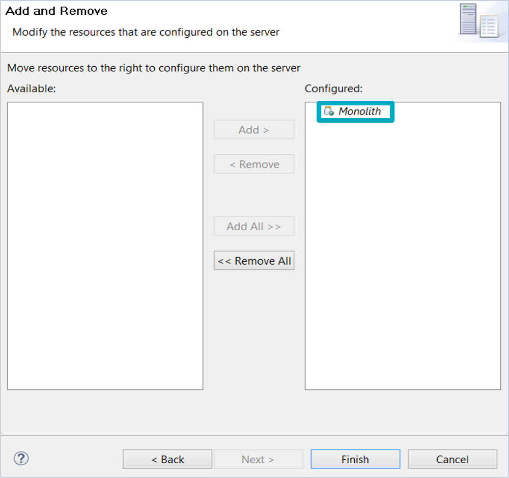

- Back in Eclipse, in the bottom panel area, on the Servers tab, double-click your new server (Tomcat v9.0 Server at localhost).
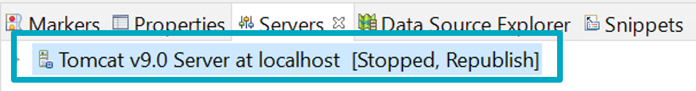

- In the new window that appears, under Server Locations:
  - Select “Use Tomcat installation”
  - Change Deploy path field to reads “webapps”. (Just delete the first “wtp” characters)
- Under Publishing, select “Never Publish automatically”
- Under Timeouts, change start time to “300 seconds”
- Under Ports, ensure the HTTP/1.1 Port Number matches the port number you defined in your server.xml (likely 9090). Leave the other ports as is. Change admin port to 8105.
- Switch from Overview to Modules tab (at the bottom of the opened window)
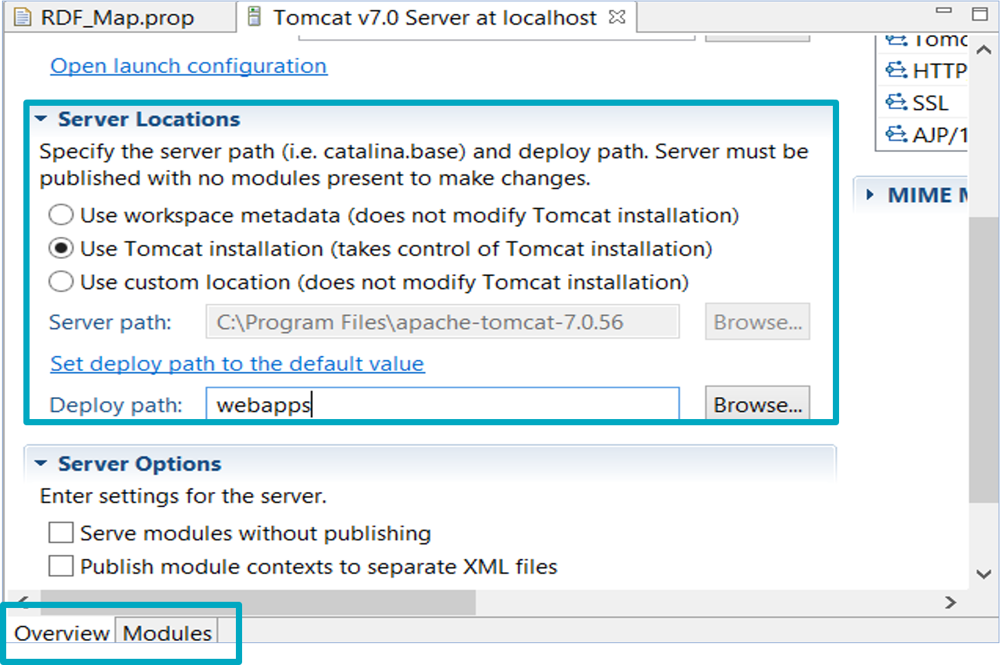

- Select the Monolith Web Module that appears in the table and click Edit on the right
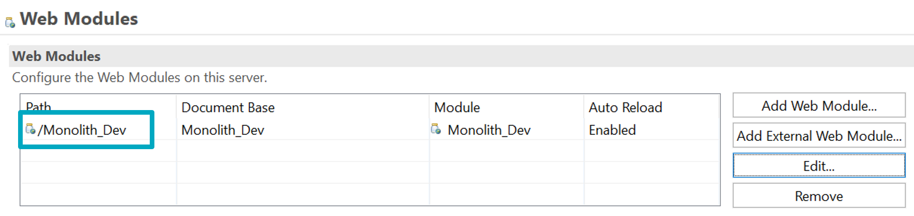

- Make sure the Path accurately reflects what you named your Monolith Folder 
  - E.g. “/Monolith”
- Click **Save** in Eclipse

### Change Environment Variables
- In Windows, from your start menu/search bar, navigate to your Control Panel > **System and Security** > System > Advanced system settings.
- On the Systems Properties window that appears, select **Environment Variables**
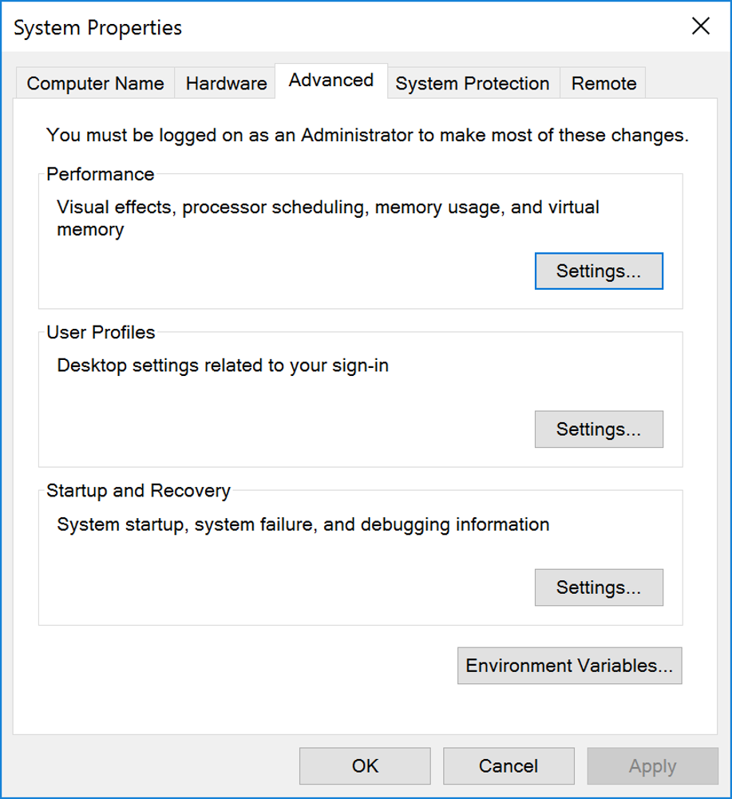
- Under system variables (bottom section), select **New...**
  - For variable name, type **JAVA_HOME**
  - For variable value, choose **Browse Directory**, go to Program Files, go to Java, and select the jdk folder.
    - For example, **C:\Program Files\Java\jdk1.8.0_###**
      
> Note: Environment variables are case-sensitive

- Click OK
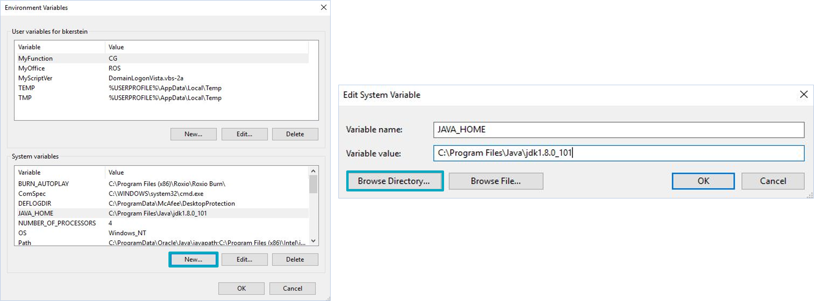

- Next, Under system variables (bottom section), locate the **Path** variable, select it, and click Edit
  - In the window that appears, click New
  - In the new row that appears, paste **%JAVA_HOME%\bin** without the quotation marks
  - Click OK

> Note: Environment variables are case-sensitive
   
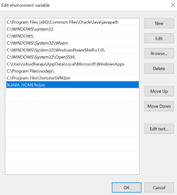

- Keep these windows open for the next steps
- Under system variables (bottom section), select **New...**
  - For variable name, type **MVN_HOME**
  - For variable value, choose **Browse Directory**, go to Documents, and select the apache-maven folder.
    - For example, **C:\Users\[your username]\Documents\apache-maven-#.#.#**
      
> Note: Environment variables are case-sensitive
   - Click OK
    
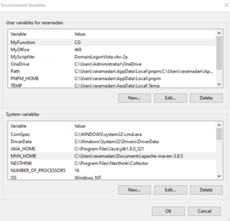

- Next, Under system variables (bottom section), locate the **Path** variable, select it, and click Edit
  - In the window that appears, click New
  - In the new row that appears, paste **%MVN_HOME%\bin** without the quotation marks
  - Click OK

  > Note: Environment variables are case-sensitive
    
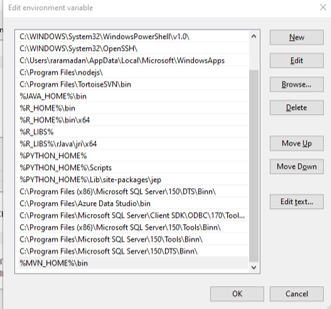

- Click Ok to close the window. Close out the remaining Systems Properties windows.

### Update web.xml for Semoss
- Navigate to **C:\workspace\Monolith\WebContent\WEB-INF**
- Right click on **web.xml** and select **Edit** in Notepad++ 
- Ensure line 660 states **<param-value>C:\\workspace\\Semoss\\</param-value>**
- Ensure line 670 states  **<param-value>C:\\workspace\\Semoss\\RDF_Map.prop</param-value>**
  - If your line numbers are off, CTRL+F for **RDF** to find the correct lines
> **Note**
> This path should match what you changed in RDF map so ensure it matches your correct Semoss path.

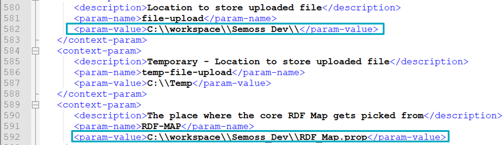

### Adding settings.xml to .m2 (maven) repository
- Navigate to **C:\Users\YOUR_USERNAME**
  - YOUR_USERNAME is your actual username
- Locate the .m2 folder (auto created after maven update in eclipse)
  - You may need to create a .m2 folder if it is not yet there
- Add the settings.xml file (from [settings.xml.zip](https://github.com/user-attachments/files/17323149/settings.xml.zip)) to .m2 folder

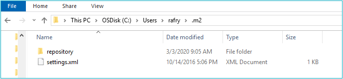

### Importing security certificates
- Navigate to your Symantec security install location in Program Files
- Go to **C:\Program Files\Symantec\WSS Agent**
  - **If you do not have this folder on your PC, you may skip this section.**
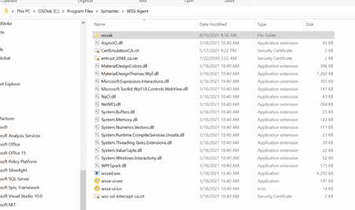

- Click the file path at the top, and copy it to your clipboard
- Click the Windows start button and type **CMD**. Select **Run as Administrator** from the menu on the right. You may need to enter your Deloitte password to continue

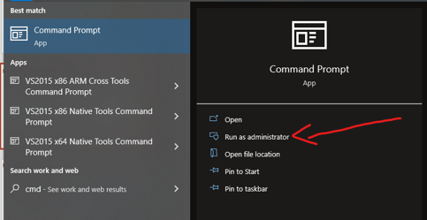

- In the command prompt, type: cd
- Then type a space, a quotation mark: **, right-click to paste the path, another quotation mark:**, and then hit Enter
**Note:** Do not hit "CRTL+V" to paste the path. Right click instead.
- Copy and paste (by right-clicking) the following line into the command prompt:
  - keytool -importcert -noprompt -trustcacerts -keystore **%JAVA_HOME%/jre/lib/security/cacerts** -file CertEmulationCA.crt -alias CertEmulationCA -storepass changeit
- Hit Enter
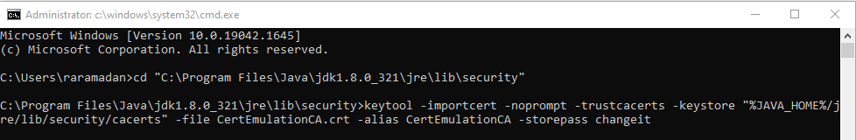

- Do the same for this line:
  - keytool -importcert -noprompt -trustcacerts -keystore **%JAVA_HOME%/jre/lib/security/cacerts** -file wss-ssl-intercept-ca.crt -alias wss-ssl-intercept-ca -storepass changeit
- Hit Enter

### Manual Maven Install
We now need to navigate to each project within the command prompt and run a maven install command
- In Eclipse, first for **Semoss project** and then **Monolith project**, do the following:
  - Right-click the project in the project explorer. Choose **Show In > System Explorer**
    
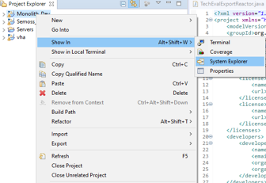

  - Double-click and open the project folder 
  - In the file explorer window, click the file path at the top, and simply type “cmd” and hit enter
    - This will open a command prompt at this location
    
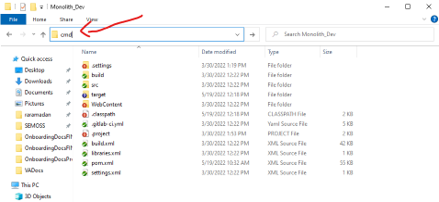

  - Copy and right-click to paste the following line into the command prompt, and hit enter:
    - mvn clean install -U -DskipTests=true
    
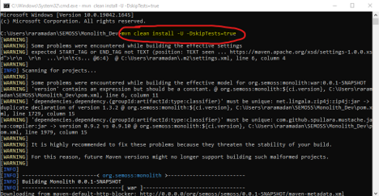

### Update Catalina.properties
- Open catalina.properties in eclipse or Notepad++. It is located in **C:\workspace\apache-tomcat-9.0.56\conf**, your Severs, Tomcat9 folder.
- Replace line 108 with the following: **tomcat.util.scan.StandardJarScanFilter.jarsToSkip=*.jar,\
- Resave the file. This will improve the startup time of your server.

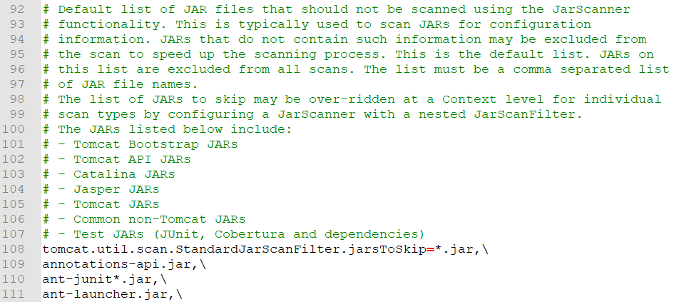

### Update Maven
- First close out of eclipse and restart the application. This is necessary any time you make changes to your Environment variables
- Back in Eclipse, ensure your Project Explorer panel is being displayed (typically on the left-hand side).
  - If you don’t see the “Project Explorer” window, select **Window -> Show View -> Project Explorer** to show them.
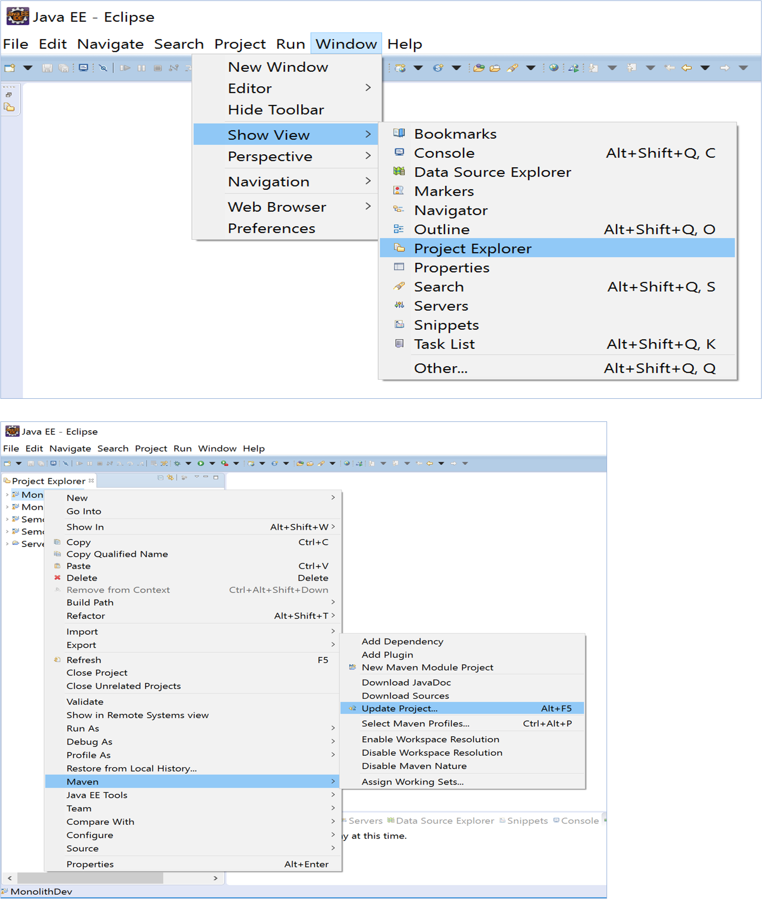

- Update each project **(first do this for Semoss, then repeat for Monolith)**
  - Right-click on the project in the project explorer panel
  - Scroll down to Maven > Update Project
  - Place a checkmark in the “Force Update of Snapshots/Releases” box. Click Ok.
  - The workspace will start updating and you can see the progress in the bottom right corner in Eclipse.  This may take some time to build.**[click on the bottom right icon to see background progress]**

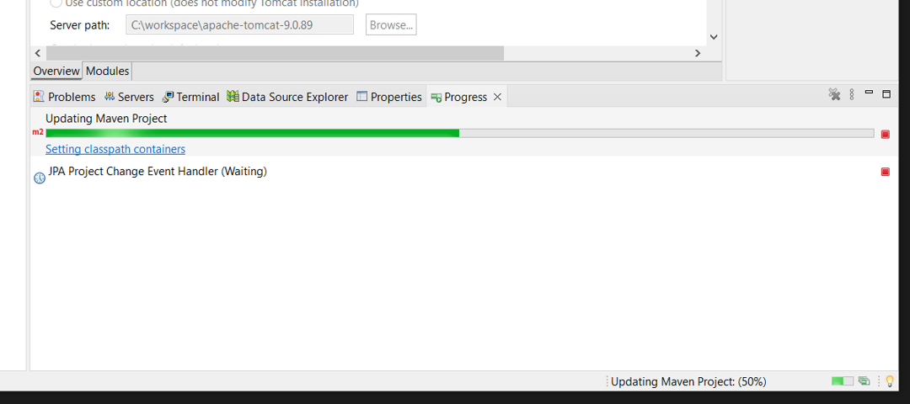

  - If you get the following error while maven updating, just click ok and let the update proceed.


> **Note**
> - If you run into issues of Maven not downloading the dependencies, please see the Tips & Tricks section for downloading a new .m2 folder
> - If Maven is throwing other unexpected errors, you may need to clean and refresh your projects.

## R Install
- Navigate to this website: **https://cran.r-project.org/bin/windows/base/old/4.2.3/**
- Click the link to Download R-4.2.3-win.exe
- Execute the application when download finishes to complete the installation
  - Make sure it is getting placed in your Documents (C:\Users\"Your_Username"\Documents\R\R-4.2.3)**(The path above may not exist yet, as the folder has not yet been created)**
   - Next, create the R folder in Documents to match the variable value. 
   - Click next all the way through
  
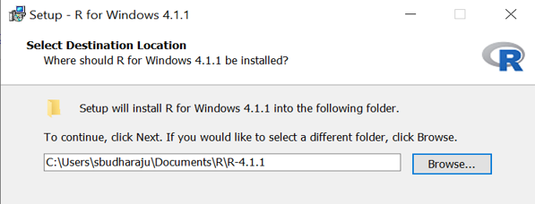

- Download will result in R being placed in your Documents Folder

### Setting up your CRAN - Optional
- Cran is where R will download the packages from. If you want to set a default CRAN you can do so just by using the RProfile.site file. Located in the ~R Installation Dir / etc/RProfile.site
- You can either uncomment the lines and put the following for CRAN or just copy paste the lines below
- #set a CRAN mirror
  local({r <- getOption("repos")
  
  r["CRAN"] <- "https://cloud.r-project.org/"
  
  options(repos=r)})

### Edit your Environment Variables
- Search **Environment Variables** in the Windows Search
- From the window that pops up, click the **Environment Variables** button
- Under system variables, add or edit the following variables under the System variables section with your correct path:
  - Create new/edit your R_HOME variable 
  - Variable Name: R_HOME
    - Variable value: **C:\Users\YOUR_USERNAME\Documents\R\R-4.2.3**
  - Create new/edit your R_LIBS variable
    - Variable Name: R_LIBS
    - Variable Value: **C:\Users\YOUR_USERNAME\Documents\R\win-library\4.1**
      - Change out YOUR_USERNAME with your actual username **(Note that the path above may not exist yet, as the folder has not yet been created. Create this folder to match the variable value. Change the red text to your user name.)**
        
> Note: Environment variables are case-sensitive

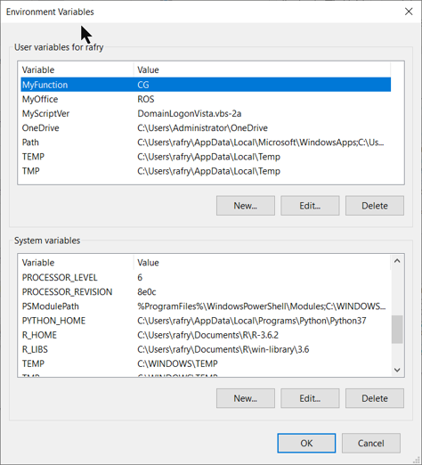

- Edit your Path variable under System variables.  Add the following:
  - %R_HOME%\bin
  - %R_HOME%\bin\x64
  - %R_LIBS%
  - %R_LIBS%\rJava\jri\x64
> **NOTE**
> To avoid bringing in hidden special characters, type these out manually instead of copying+pasting
> Environment variables are case-sensitive

### Install R Packages - 4.2.3
- Go to  and find the **C:\workspace\Semoss\R\SemossConfigR\scripts\Packages.R file**
  - If you installed Semoss in a different folder the path in red will need to be updated
- Open up a terminal and type in **R** to start the R terminal
- Copy and paste different sections of the Packages.R script (use Notepad++ to open it) into the R terminal
>**Note**
> This process will take a while to finish
> Only copy paste small sections of the script to run at a time (~30 lines chunk)

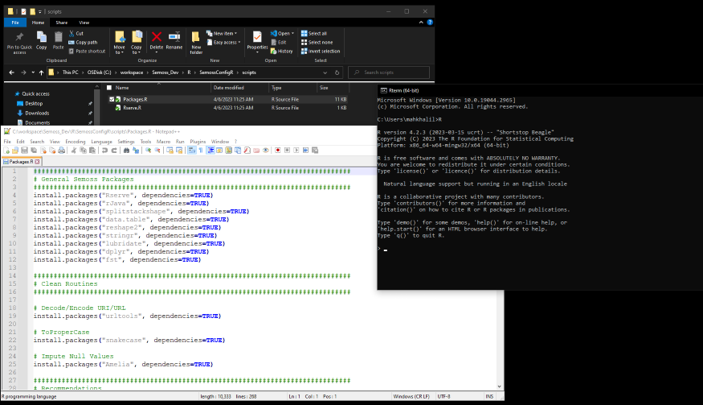

**Testing to See if rJava is installed properly**

- Open your rconsole and copy paste the following code:

```
library(rJava)
.jinit()
s <- .jnew("java/lang/String", "Hello World")
.jcall(s, "I", "length")
```

This should return 11 and this means that rJava is working

## Python Install

### Install visual studio installer
- Download Microsoft Visual Studio Installer from this link: **https://visualstudio.microsoft.com/thank-you-downloading-visual-studio/?sku=BuildTools&rel=15**
  - We need to Install the 2022 (latest) community version
  - Visual Studio Installer is needed for a C++ compiler (many Python packages require this)
- To install, find the installation file (likely in your Downloads folder), right click and **Run as administrator**. You’ll need to enter login credentials at least a few times during installation.

### Install Python
- Navigate to this website: https://www.python.org/downloads/release/python-31010/
> **Note**
> Although it is not compulsory to install this version of Python but its recommended
- Near the **bottom of the page**, under Files, then under Version, click the link to download the **Windows installer (64-bit)** installer
- Click the link in the Version column to automatically install Python with the default settings
- Python should now be located in a directory like **C:\Users\YOUR_USERNAME\AppData\Local\Programs\Python\Python310**
  - YOUR_USERNAME would be your actual username
> **Note**
> You might have to login multiple times

### Configure Python in your RDF_Map.prop
- Using Notepad++ or any other text editor open the file **C:\workspace\Semoss\RDF_Map.prop**
- Copy paste your python path from above and add it to the RDF_Map.prop along with the below mentioned properties. Use Ctrl + F to search for the keys. If they aren’t there then add them just after #FORCE_PORT 9999:
```
PYTHONHOME C:\\Users\\YOUR_USERNAME\\AppData\\Local\\Programs\\Python\\Python310
TCP_WORKER prerna.tcp.SocketServer
TCP_CLIENT prerna.tcp.client.NativePySocketClient
NATIVE_PY_SERVER true
```
Additionally make sure the following are also enabled, they are just below above lines:
```
USE_PYTHON true
NETTY_R false
NETTY_PYTHON true
```

### Install libraries
- Open a command prompt as administrator
- Type in: **py --version** (to make sure Python is installed)
- Depending on what you are using SEMOSS/CFG for, install the packages in order:
  - SEMOSS:
  ```
  py -m pip install --upgrade -r https://raw.githubusercontent.com/SEMOSS/docker-r-python/R4.2.1-debian11/semoss_requirements.txt
  ```
  - SEMOSS: 
  ```
  py -m pip install --upgrade -r https://raw.githubusercontent.com/SEMOSS/docker-r-python/cuda12-R4.2.1/cfgai_requirements.txt
  ```
  - Users Who Have A  Computer With a GPU: 
  ```
  py -m pip install --upgrade -r https://raw.githubusercontent.com/SEMOSS/docker-r-python/cuda12-R4.2.1/gpu_requirements.txt
  ```
> **Note**
> To make this step easier, use the up arrow on your last keyboard to copy the last command

### Edit your Environment Variables
- Search **Environment Variables** in the Windows Search
- From the window that pops up, click the **Environment Variables** button
- Under system variables, add or edit the following variables under the System variables section with your correct path:
  - Add/edit your PYTHON_HOME variable 
  - Variable Name: PYTHON_HOME
    - Variable value: **C:\Users\YOUR_USERNAME\AppData\Local\Programs\Python\Python310**
    - Change YOUR_USERNAME with your actual username
- Edit your Path variable under System Variables. Add the following:
  - %PYTHON_HOME%
  - %PYTHON_HOME%\Scripts
> **Note**
> To avoid bringing in hidden special characters, type these out manually instead of copying+pasting
> Environment variables are case-sensitive

### Install Optional Libraries
- Open Visual Studio Installer; from there, install the **Visual C++ build tools** component
- Once the Visual C++ build tools component is installed, modify it to include all the optional libraries and click Install near the bottom right of your window: 
  - You may need to enter your credentials throughout this process as well
  - You may need to restart your device at the end of this install
  - Expect this process to take about an hour
> **Note**
> Skill builder can have different names as per version (for eg- C++ tools for desktop)
 
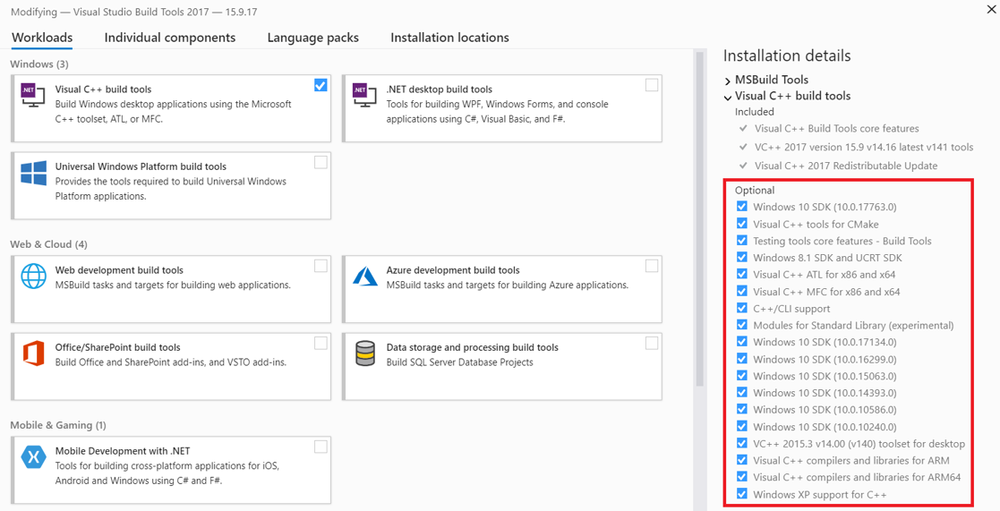

### Update RDF_Map
Once everything is installed successfully, go to **C:\workspace\Semoss\RDF_Map.prop** and change the line with **USE_PYTHON false** to **USE_PYTHON true**

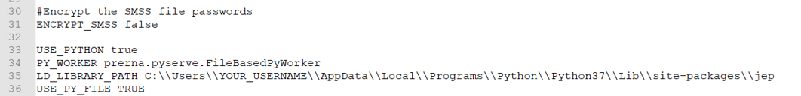

### Test if Python is installed correctly
- Open command prompt and then type **py** and enter
- It will open python terminal
- Now try 2+2 and see if it gives the correct response of 4
  
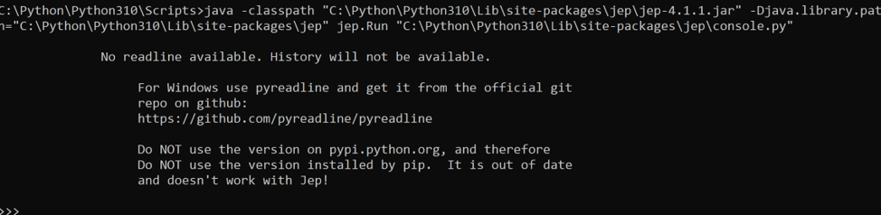


## Frontend Dev Setup
Only follow these steps if you’re a front end dev, if not skip to the next section.

### Prequisite
- We would require the Node v.18.16.0 and npm v.9.5.1, any higher version of Node might create issues.
- So insure the node and npm version with following command –
	- node --version
	- npm --version
 
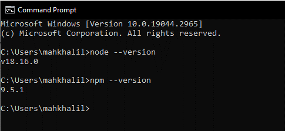

- If you have any other (higher or lower version) version, please uninstall and use below URL to download the correct version (node-v18.16.0-x64.msi) **https://nodejs.org/download/release/v18.16.0/**
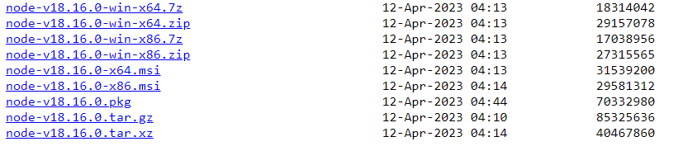

### Setup

- Make sure you checked out the dev branch of SemossWeb **(svn://107.170.10.188:8080/SemossWeb/branches/dev)**
- From the command line, run **npm install –g pnpm**
- From the command line, navigate to your SemossWeb directory **(e.g. C:\workspace\apache-tomcat-9.0.XX\webapps\SemossWeb)**, and run **pnpm install** (this will install all necessary dependencies)
- Run **pnpm start** to continuously build the project as you develop
- The following are recommended for Front End Development:
  - Visual Studio Code **(https://code.visualstudio.com/download)**
  - Eslint (simply run ‘npm install –g eslint’ from the command line)

## Final Steps

### Start Semoss Web
- Restart Eclipse (so that Eclipse loads the new Environment Variables we’ve added) 
- Select the Monolith project and make sure under **Project -> Properties -> Java Build Path**, maintain the following order under **Order and Export** tab. You will likely need to select JRE System Library and click **Top** to move it to the top.
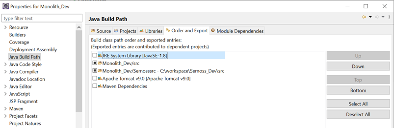

- Apache Tomcat should not be in [unbound] state.  If so, then Select Apache to add to the classpath under Libraries tab.
- Once completed, click Apply and Close
- Within Eclipse, in the bottom Servers panel tab, right-click on the **Tomcat Server** and click **Publish**
  - After republishing, double check your modules path to ensure it accurately reflects what you named your Monolith Folder and re-save
    - E.g. “/Monolith” in the screenshot below
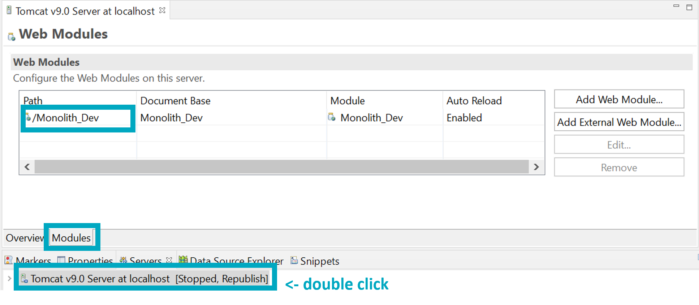
  - Double click on the server to open the Overview folder. Find the Port tab and next to the "Tomcat admin port", change the port number to 8105.

- Next, click **Start**
  - A progress bar will appear at the bottom of Eclipse.
    
> **Note**
> If you have run into any errors that might prevent your server from starting correctly, verify your server Web Module Path is /Monolith

> In a command prompt navigate to C:/workspace/apache-tomcat 9.0.##/webapps/SemossWeb
- Run “pnpm run dev:client” in the command prompt/terminal to build the front end
- If done correctly, the last line should be something about "webpack compiled successfully"
  
> Once the previous step has completed, navigate to http://localhost:9090/SemossWeb/
 - If all everything is working properly this should redirect you to a set admin page
 - Type in the username you want to register with

> Then go back to http://localhost:9090/SemossWeb/ , and at the bottom of the page, hit register new user.
 - Fill out the required fields
 - Make sure the username you register is the same as the one typed into the admin page

> Once the new user is registered, you can sign in using the same information.
 
- Congratulations! You’re all set to start using SEMOSS!

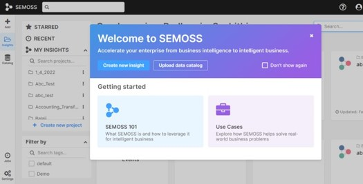

> To ensure the backend is running correctly,
 - Navigate to http://localhost:9090/Monolith/api/config
 - A json file should appear here

> If there is error when you click on start due to Port 8005, please change it to 8006 or some other port
- Now open terminal in cfgai.ui folder and enter pnpm run dev:client to run the front end if its not already running
- Open Chrome and enter **http://localhost:9090/SemossWeb/packages/client/dist/#/login**


## Semoss Installation for Mac Silicon

> Note: This section is undergoing updates and is not in its final form.

### Elevating Permissions

Whenever you need admin level permissions to execute something (installing a new application, copying files into certain directories), use the Privileges app (green lock icon)  - this is like running an application in admin mode!


### Set Up your SEMOSS Dev Directory

Open Documents, create a new folder called SEMOSS or open your terminal and run mkdir ~/Documents/SEMOSS
- This directory will house your workspace, Java, and other installation pieces
- This can be anywhere, but placing it in Documents is the best option

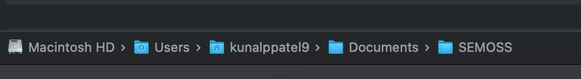

## Prerequisites

Download softwares and tools from below links to be able to install Semoss.

### Create Semoss and workspace Folders
Create a folder 'Semoss' in Documents and then create a folder 'workspace' inside the Semoss folder

### Download Visual Studio Code
- Click on [Visual Studio](https://code.visualstudio.com/download)
- Select Mac
- Download and install Visual Studio Code

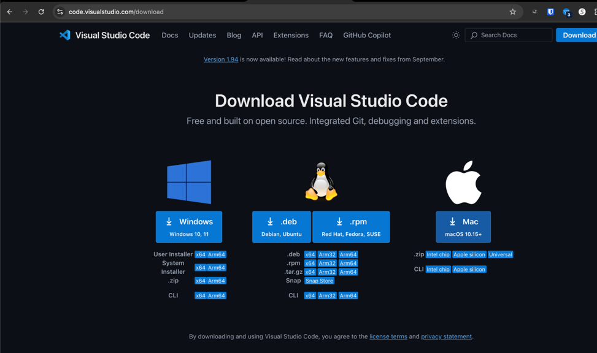

### Install Homebrew- Option 1/2
- Open the Self Service App through Launchpad or your Applications
- Go to Homebrew
- Install Homebrew and follow the instructions on the screen
- Once installation is done open terminal or iTerm
- Run brew help in the terminal to ensure it is installed

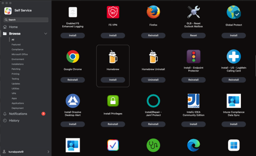

### Install Homebrew- Option 2/2
- Before procedding, make sure that you have elevated permissions with the yellow unlocked icon in the dock
- Open iTerm or the standard mac Terminal
- Navigate to [Brew](https://brew.sh/) and copy the command to install Homebrew
- Paste this into the terminal
- It will ask you for your password several times – continue to type it in until the installation is complete
- Once the installation is done, make sure to read and follow the steps on the terminal to complete setting up the path listed under Next steps
- Run brew help in the terminal to ensure it is installed

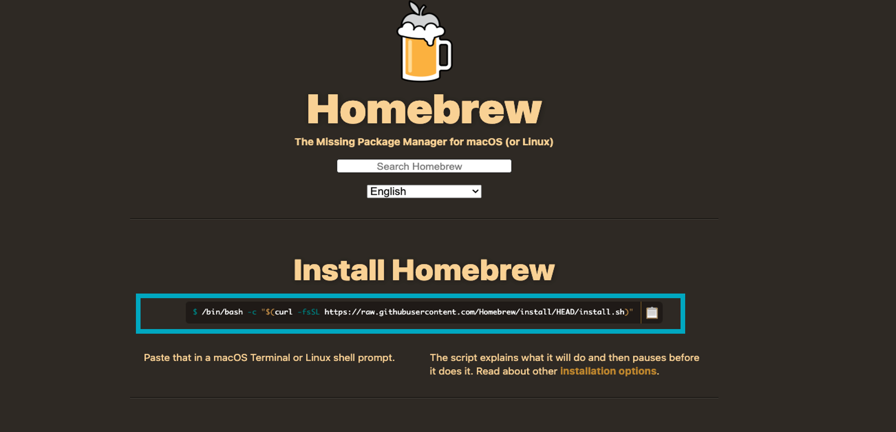

### iTerm + Git
iTerm installation is optional but is recommended as it will improve any command line experience
Click on [iTerm2](https://iterm2.com/)
- Select Download
- Install iTerm
  
- Open iTerm (or regular terminal if skipped)
- Install git via Homebrew by typing: brew install git
- Once installed, verify git is working by typing into the terminal: git -v

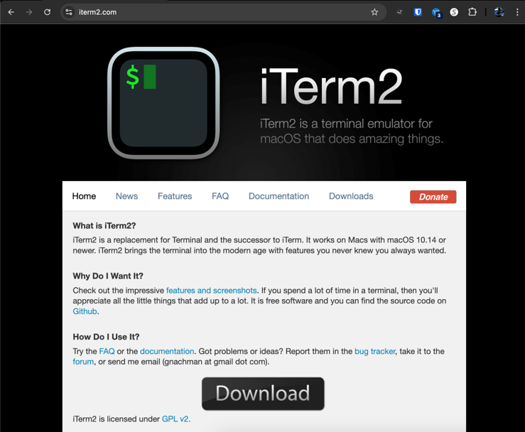

### .zshenv
- .zshenv will be the file used to maintain all environment variables
- This is located at ~/.zshenv under your user profile
- This file may not exist if nothing has used .zshenv before
- Check if it exists by opening Finder and selecting your home profile
- Enable viewing hidden files (such as .zshenv) through the shortcut of command + shift + . (dot)
- If the file does not exist, open VS code and select command + N, or go to File >> New text file
- Save the file as .zshenv under your home directory of /Users/<username>

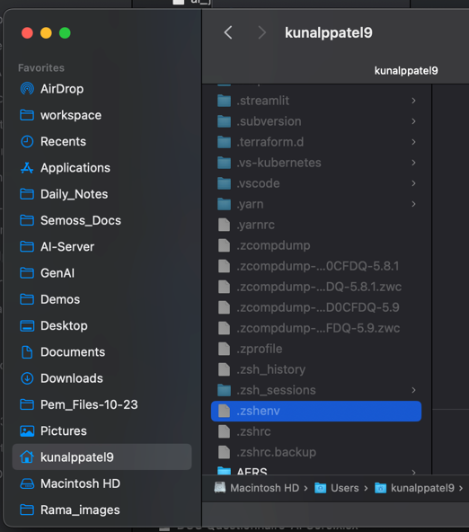

### Install pynev
- pynev is a python version management tool for macOS
- Click on https://github.com/pyenv/pyenv
- Open iTerm (or regular Terminal if skipped)
- Run: 
brew update
brew install pyenv

- Edit ~/.zshenv (this can be done through nano/vim on command line or VS code)
- At the bottom of the file, add: 
alias brew='env PATH="${PATH//$(pyenv root)\/shims:/}" brew’

- Open a new iTerm window or terminal window
- Run: pyenv install 3.11
- Once installed, open a new terminal window and type python --version

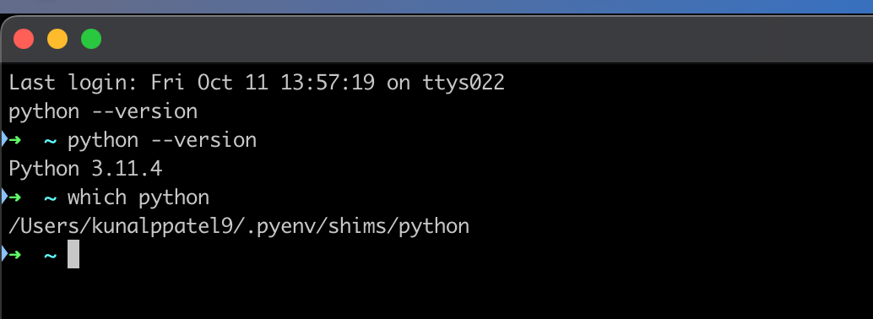

### Install nvm
- nvm is a node version management tool for macOS
- Go to https://github.com/nvm-sh/nvm
- Open iTerm (or regular Terminal if skipped)
- Run:
curl -o- https://raw.githubusercontent.com/nvm-sh/nvm/v0.40.1/install.sh | bash

- Edit ~/.zshenv (this can be done through nano/vim on command line or VS code
- At the bottom of the file, add: 
export NVM_DIR="$([ -z "${XDG_CONFIG_HOME-}" ] && printf %s "${HOME}/.nvm" || printf %s "${XDG_CONFIG_HOME}/nvm")"
[ -s "$NVM_DIR/nvm.sh" ] && \. "$NVM_DIR/nvm.sh" #
- This loads nvm
- Open a new iTerm window or terminal window
- Run: nvm install 18
- Once installed, open a new terminal window and type node –version
- Install pnpm via:  npm install –g pnpm

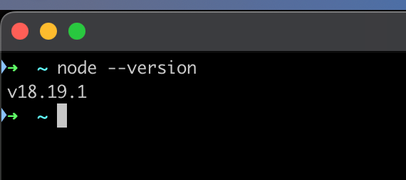

### Download Java
- Download a Java 8 JDS – We use Azul Zulu Builds of OpenJDK
- Navigate to https://www.azul.com/downloads/?version=java-8-lts&os=macos&architecture=arm-64-bit&package=jdk-fx#zulu
- Scroll down to see all options
- Choose these filters:
  - Java Version : Java 8 LTS
  - Operating System : macOS
  - Architecture : ARM 64 bit
  - Java Package : JDK FX
- Select Download and choose Zip
- Download the zip to your ~/Documents/SEMOSS folder
- Unzip the folder

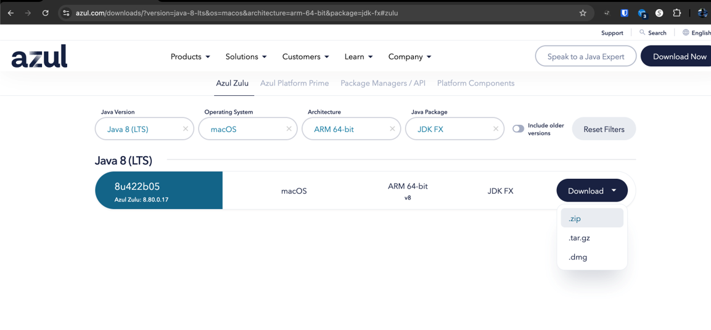

### Set Java Home
- Edit ~/.zshenv
  - This can be done through nano/vim on command line or VS code
- At the **top of the file**  add the JAVA_HOME to be the folder you just unzipped for zulu JDK (see example below and update for username and filepath/version)
  - export JAVA_HOME=/Users/kunalppatel9/Documents/SEMOSS/zulu8.64.0.19-ca-jdk8.0.345-macosx_aarch64
  - export PATH=$JAVA_HOME/bin:$PATH

### Eclipse IDE for Enterprise Java and Web Developers
Click on [Eclipse Download](https://www.eclipse.org/downloads/packages)
- Under Eclipse IDE for Enterprise Java and Web Developers, select **macOS AArch64**
- Download the dmg
- Open the downloaded dmg and either copy Eclipse into your Applications or into your SEMOSS folder
- Launch Eclipse
- Choose /o

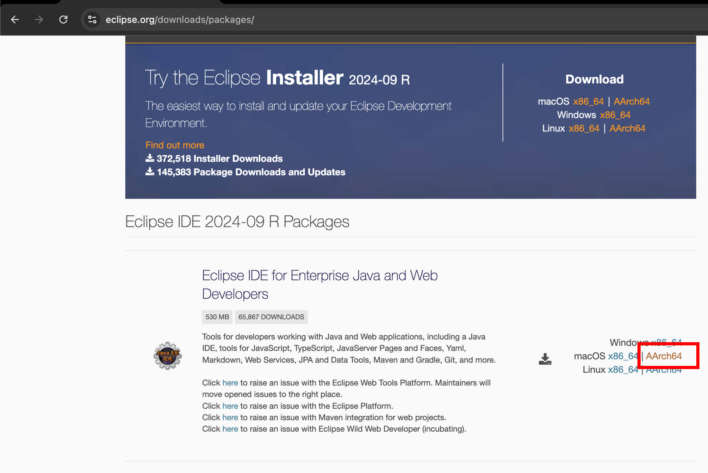

Once your Eclipse & JDK are installed, open Eclipse and specify where you want your workspace to be
   - Specify **/Users/Your Username/Documents/SEMOSS/workspace** instead of the default name that shows up
- We recommend that you pin eclipse to your taskbar and pin your workspace to your Quick access bar

### Apache Tomcat 9
Click on [Apache Tomcat](https://tomcat.apache.org/download-90.cgi)
- Choose Binary Distributions, Core,  zip file under the latest 9.0 section
- Download this to your Documents/SEMOSS/workspace folder
- Unzip the folder
 
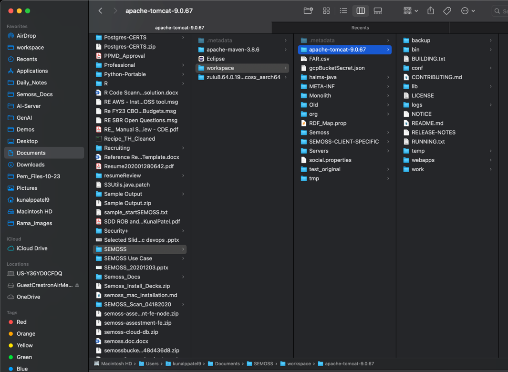


## Installation Steps

### Git Clone Semoss, Monolith & SemossWeb
- Open iTerm (or regular Terminal if skipped)
- Run: cd ~/Documents/SEMOSS/workspace
- Run: git clone https://github.com/SEMOSS/Semoss.git

- After SEMOSS is done git cloning, clone Monolith
- Run: git clone https://github.com/SEMOSS/Monolith.git

- Once Monolith is done cloning, clone SemossWeb
- Navigate to your tomcat webapps folder. This can be done by running: cd ~/Documents/SEMOSS/workspace/apache-tomcat-9.*/webapps/
- Run: git clone https://github.com/SEMOSS/semoss-ui.git
- Once the folder is done cloning, rename it through finder or through this command in the terminal: mv semoss-ui SemossWeb

### Import Semoss & Monolith into Eclipse
- Open Eclipse
- From the menu bar, select File >> Import
- Select Maven >> Existing Maven Project >> Next
- “Browse” for your workspace under “Root Directory”
- Under projects, check only “/Monolith/pom.xml” and “/Semoss/pom.xml”
- Leave everything else unchecked
- Click “Finish”

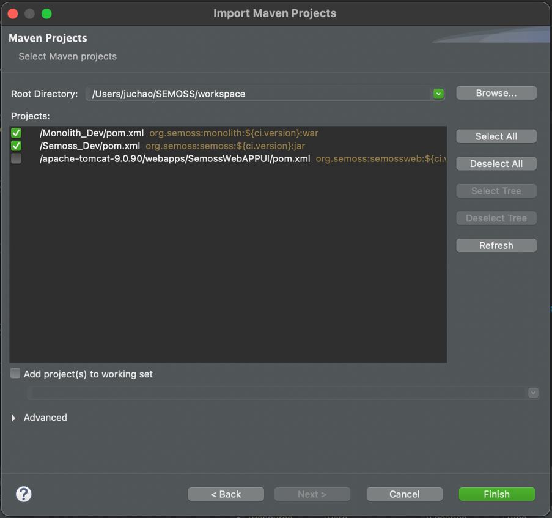

### Configure Build Path for Monolith
- Right click on “Monolith” under Project Explorer
- Select Build Path >> Configure Build Path
- Navigate to “Source” tab
- Under “Source folders on build path”, select “Monolith/Semosssrc”
- Click Edit
- Click Browse and select “src” directory inside “workspace/Semoss”
- Update “Folder name” to “Semosssrc”
- Click Finish
- Click "Apply and Close"

> Note:
> Make sure you are selecting workspace/Semoss/src and not workspace/Monolith/src


### Update RDF_Map.prop
- Open workspace/Semoss/RDF_Map.prop
- Update all paths to point to the Semoss directory
- For example:
  - Open Find and Replace and replace all instances of C:\\workspace\\Semoss with your path to your Semoss folder you clone – ex. /Users/User name/Documents/SEMOSS/workspace/Semoss

> Note: User name is your actual user name

- Additionally, ensure you adjust the following property as well: 
BaseFolder C:\\workspace\\Semoss to your Semoss folder
(eg. BaseFolder /Users/User name/Documents/SEMOSS/workspace/Semoss)

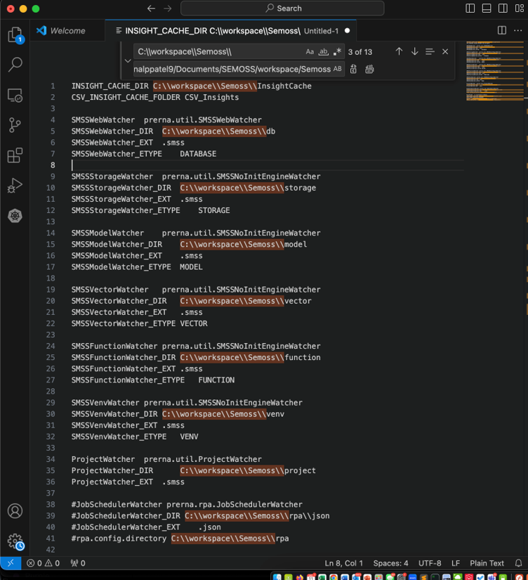

### Update server.xml for Tomcat
- Open Finder and navigate to the following path: /Users/.../workspace/apache-tomcat-9..XX\conf
- Right click on server.xml and Open With TextEdit (or your text editor of choice)
- Find the line that says "Connector and the port number" (should be around line 63)
- Change the port to 9090
- Save and close the file

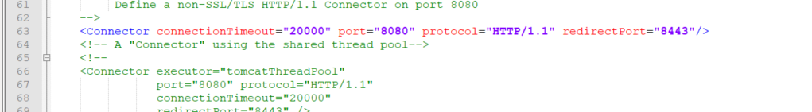

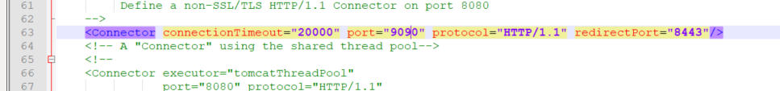

### Create a Tomcat Server
- Back in Eclipse, at the bottom, select “Servers” tab
- Click "link to create a new Server"
- Select “Tomcat Server vX.X” under “Apache” (your version maybe different)
- Click Next
- “Browse” for “apache-tomcat-X.X.XX” directory inside workspace
- Click “Next”
- Select “Monolith” and click Add to move it to the “Configured” column
- Click Finish

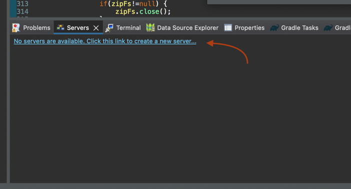

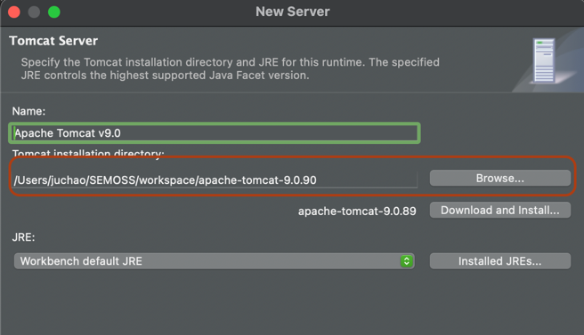

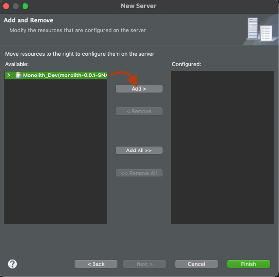

### Update Tomcat Server Configuration
- Under “Servers” tab, double-click on “Tomcat v9.X Server on localhost”
- Popup should open	
- Under “Server Locations”, select “Use Tomcat installation” and set “Deploy path” to webapps
- Under “Publishing”, select “Never publish automatically”
- Under “Timeout”, set “Start” to 300 seconds
- Navigate to “Modules” tab
- Edit module and set “Path” /Monolith
- Save configuration

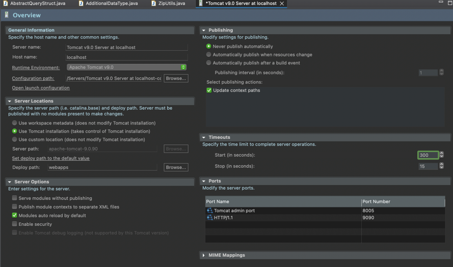

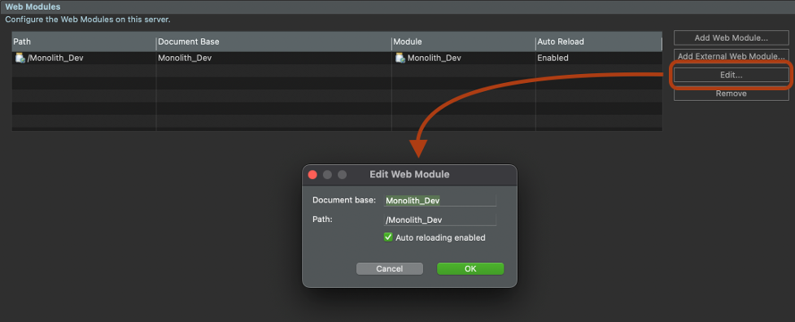

### Update web.xml
- Open Eclipse
- Type Command + Shift + R
- Search for web.xml and select the web.xml under Monolith
- Find and replace for: C:\\workspace\\Semoss\\ to your semoss folder
   - Eg. /Users/User name /Documents/SEMOSS/workspace/Semoss
- Find and replace for C:/workspace/Semoss and replace with your semoss folder
  - Eg. /Users/User name/Documents/SEMOSS/workspace/Semoss
- Find and replace for C:\\Temp and replace with /tmp

> Note: User name is your actual user name

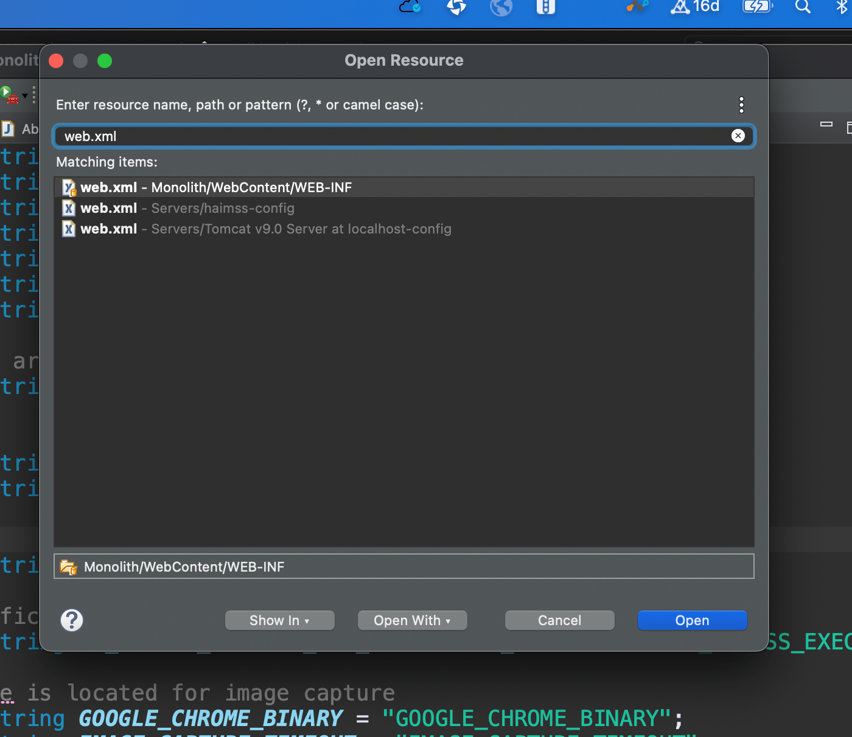


### Create settings.xml
- Add a settings.xml into your ~/.m2 directory
  - If you do not see this folder in your finder, open finder and use command+shift+. (dot) to see hidden files/folders
- Save the below into a file named settings.xml in ~/.m2  (under you user home)
<settings xmlns="http://maven.apache.org/SETTINGS/1.0.0"
  xmlns:xsi="http://www.w3.org/2001/XMLSchema-instance"
  xsi:schemaLocation="http://maven.apache.org/SETTINGS/1.0.0
                      https://maven.apache.org/xsd/settings-1.0.0.xsd">
  ...
  <servers>
    <server>
      <id>3rdPartyJARs</id>
      <username>semossdevuser</username>
      <password>foxhole</password>
      <configuration></configuration>
    </server>
  </servers>
  ...
</settings>

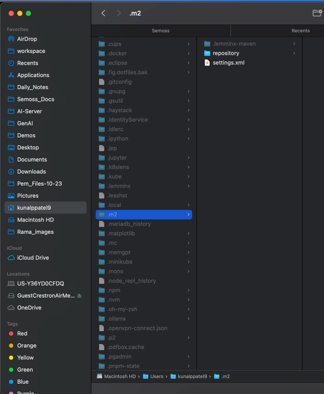

### Update Maven
- Open Eclipse
- Right click on either project under “Project Explorer”
- Select “Maven” > “Update Project” (popup opens)
- Check both checkboxes under “Available Maven Codebases”
- Check “Force Update of Snapshots/Releases”
- Click “OK"

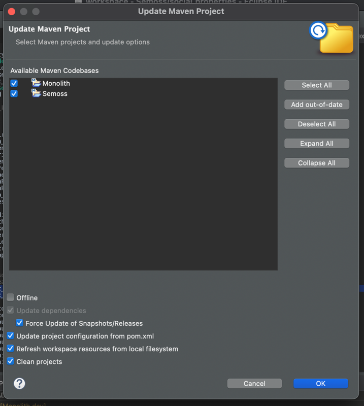


## Install R

### Initial Steps
Click here [RProject](https://cloud.r-project.org/bin/macosx/)

- Install the latest ARM64 version for Apple silicon (if you have M1 or newer)
- Execute the application when download finishes to complete the installation
- Make sure it is getting placed in your Documents (C:\Users\Your Username\Documents\R\R-4.2.3)

> Note:
> The path above may not exist yet, as the folder has not yet been created
> Your Username is your actual username

- Next, create the R folder in Documents to match the variable value
- Click Next all the way through
- Download will result in R being placed in your Documents Folder

### Install R Packages
- Add the following to the top of workspace/Semoss/R/SemossConfigR/scripts/Packages.R script (open in text editor),

r = getOption("repos")
r["CRAN"] = “https://cloud.r-project.org/”
options(repos = r)

- Edit line 190 to: httr::set_config( httr::config( ssl_verifypeer = 0L ) )

- From the terminal, run the scripts

cd /Users/brihill/Desktop/workspace/Semoss/R/SemossConfigR/scripts
Rscript Packages.R
Rscript Rserve.R


## Install Python

### Install Python 3.10.10
- Brew install pyenv
- Pyenv install 3.10.10
- Pyenv global 3.10.10

> Note:
> You may use "pyenv local 3.x.x" or Anaconda if you know what you're doing
> However, using pyenv to install globally is easy and works

### Install pip
> Note:
> This step is not necessary if you used pyenv. Pyenv will automatically install pip (the python3 version), and alias python3 and pip3 automatically to python/pip for you. How nice!

- sudo curl https://bootstrap.pypa.io/get-pip.py -o get-pip.py
python3 get-pip.py

### Set Environment Variables
- Figure out your java path by running: /usr/libexec/java_home –V
- Set JAVA_HOME in your path to the location specified under Java SE 8 in the output of the above command
- vim ~/.zshrc or append to path

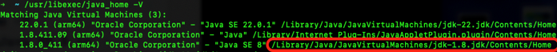
  
- Set the following environment variables:

Export JAVA_HOME=/Library/Java/JavaVirtualMachines/jdk1.8.0_241.jdk/Contents/Home        
export PATH=$JAVA_HOME/bin:$PATH 
export R_HOME=$(R RHOME)                                              
export R_LIBS=/Library/Frameworks/R.framework/Resources/library
export PATH=$R_HOME/bin:$R_LIBS:$R_LIBS/rJava/jri:$PATH 
export PYTHON_HOME=/Library/Frameworks/Python.framework/Versions/3.7
export PATH=$PYTHON_HOME/lib/python3.7/site-packages/jep:$PATH

### Install jep and pandas

pip install jep
pip install pandas

> Note:
> If you have python set up correctly, pip should pull the correct version of these to go alongside your version of python

### Set Run Configurations
- Open Eclipse
- From the menu bar, select “Run” > “Run Configurations” (popup opens)
- Select “Apache Tomcat” > “Tomcat v8.5 Server at localhost”
- Under “Arguments” tab:
   - Add to the end of “VM arguments”: 

Djava.library.path=/Library/Frameworks/R.framework/Resources/library/rJava/jri/

- Under “Environment” tab:
  - Click “Add” to add the following variables one by one:

PATH=/Library/Frameworks/R.framework/Resources/bin R_DOC_DIR=/Library/Frameworks/R.framework/Resources/doc R_HOME=/Library/Frameworks/R.framework/Resources R_INCLUDE_DIR=/Library/Frameworks/R.framework/Resources/include R_SHARE_DIR=/Library/Frameworks/R.framework/Resources/share

- Click “Apply” and then “Close”

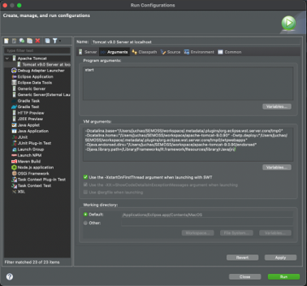

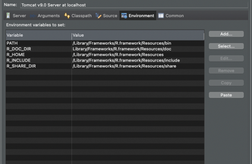

### Update RDF_Map
- Open workspace/Semoss/RDF_Map.prop
- Edit Line 23: USE_PYTHON true
- Edit Line starting with LD_LIBRARY_PATH:
  - For LD_LIBRARY_PATH, insert your Python Home directory where it says “{{INPUT_YOUR_PYTHON_HOME}}”
  - Remember to take out the braces (i.e. LD_LIBRARY_PATH must point to a valid path)

 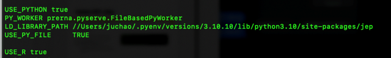
 
### Start Tomcat Server
- Right click “Tomcat v8.5 Server at localhost” under the “Servers” tab
- Select “Start”


## Semoss Tips and Tricks and Troubleshooting

### Regarding Semoss Update

> When to Update
- If you need a stable build >> wait till you are told to update
- If you’ve had a bug >> update once your bug is fixed
- If you’re testing for the DEV team >> update hourly or by the day

- Updating Instructions
	- Enter SEMOSS "workspace" folder
	- Right Click "Monolith"
	- Click "SVN Update"
	- Go back to your "workspace" folder
	- Right Click "Semoss"
	- Click "SVN Update"
	- Go back to your "workspace" folder
	- Enter the "apache-tomcat-X.X.XX" folder
	- Enter the "webapps" folder
	- Right Click "SemossWeb"
	- Click "SVN Update"
	- Start Eclipse
	- Refresh each project in Eclipse
	- If there were pom.xml changes, Select both "Monolith" and "Semoss" and right click one of them and hold cursor over "Maven" and click "Update Project"
	- Update both "Maven" Profiles by checking the box next to "Semoss" and "Monolith"
	- Wait until workspace is completely built
	- Start your tomcat server

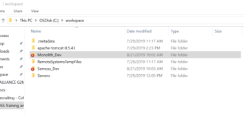

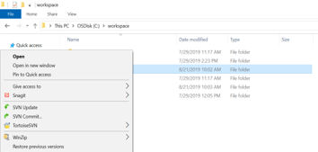

**When You Update you can choose to view the logs**
- You may want to use the logs to know which specific files were changed in a revision, if a fix has come through for a bug you are tracking, or to see other changes in the build

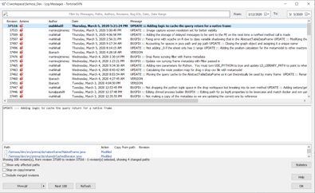

- Instructions:
	- Enter SEMOSS "workspace" folder
 	- Right Click "Monolith"
 	- Click “Tortoise SVN"
 	- Click “Show log”
	- Repeat for Semoss and SemossWeb as you choose
 	- Additionally, after you update (see previous section), you can click "Show Log" in the bottom right

  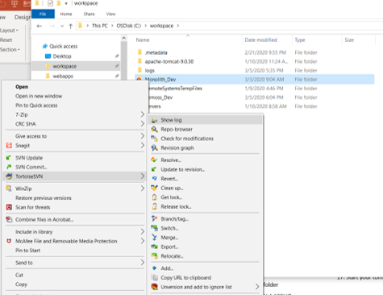

  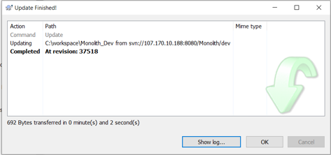


**Issues while Updating**
- The following section talks through some common occurrences that people may run into while updating:

**Conflicts in updating SVN files**
- Sometimes you will have conflicts when you update. Conflicts happen when you have modified a file on your computer that someone else also modified.
- Scroll through the ENTIRE list and make sure there are no red conflicts. If there are, stop immediately and fix them!
- Resolve Conflicts:
	- Right click on the conflicted file
	- If it is not a database file and you have not intentionally edited the file, select “Resolve conflict using theirs”
	- If it is a database file, select “Resolve conflicts using mine”
	- If you have intentionally edited the file, selected “Edit conflicts” to see where the errors are and resolve
- If there are no conflicts, or when you have resolved them all, click OK

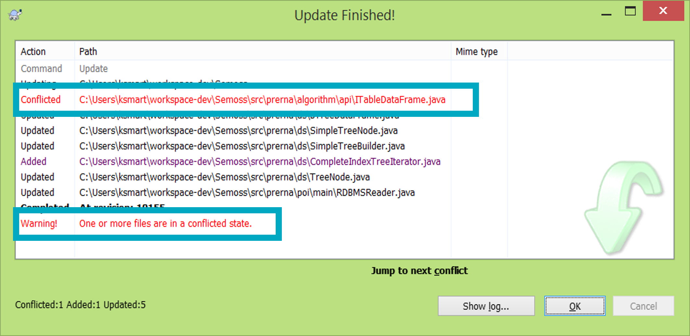

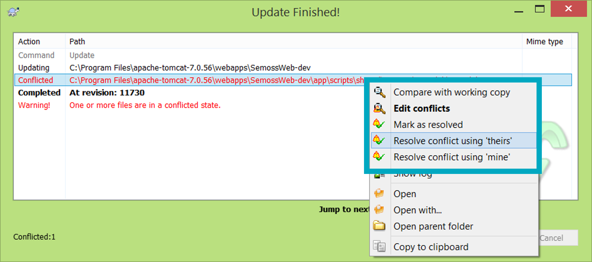
> Note:
> You might miss seeing the conflict warning when you update. You should always check your files for warnings:
	- Yellow triangles with “!” – conflicts
	- Red circles – you have made modifications
	- Green circles – no changes

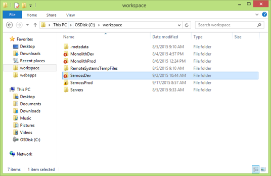


**Maven Dependency Issues**
- If Tomcat publishing fails with errors related to “The system cannot find the [.m2] file specified”, double check that you do not have any pre-installed security applications causing a firewall issue with Maven
- You will need to uninstall any security applications like Symantec
- To fix this, contact Deloitte IT via chat/phone in **MyTechnology** to suspend the service (this may take a day or two)
	- Open a ticket with IT and request for Symantec to be suspended for an installation through maven/eclipse
	- Once the IT personnel confirms Symantec has been disabled, they may prompt you confirm by doing steps 3-4
	- Verify Symantec is disabled: click the up caret in the bottom right corner of your desktop (right side of task bar) to reveal background application. Double-click on the yellow cloud with a green shield on it (this shows you security status with Symantec)
	- Inspect if Symantec has been suspended; the IT personnel will usually give you a window of time it will be disabled, or they will ask you to message them back immediately when you no longer need it suspended. (This will depend on the IT staff)
- Then in Eclipse, follow steps in slide 87, refresh your code, and clean your projects

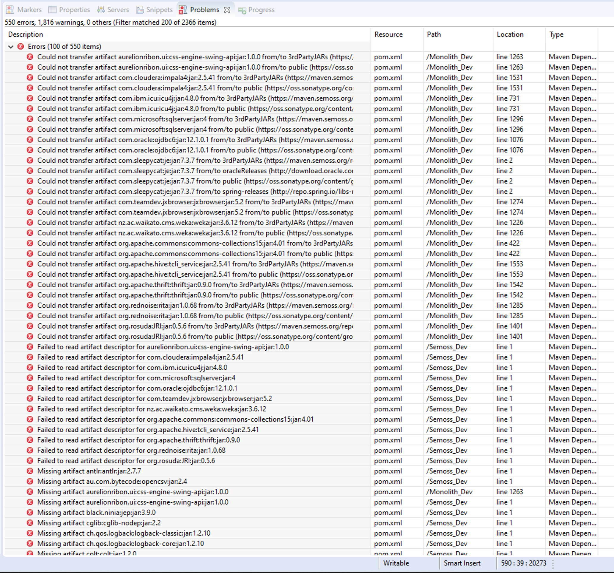


**If Maven doesn't download the dependencies correctly during your initial install**
- When you open the Problems view/tab (Window --> Show View --> Other --> Search Problems --> Select and Open), if any of the problems are categorized as ‘Maven Dependencies’ in the Type column (last column), then,
	- Download http://test.semoss.org/download/repository.zip
	- Close eclipse
	- Go to your .m2 folder in ‘C:\Users\USERNAME\.m2’
	- Delete the repository folder
	- Unzip the new repository folder in the zip you just downloaded in Step 1 and wait for it to finish
	- Make sure the repository folder is on the same level as the settings.xml file in the .m2 folder
	- Open eclipse
	- Select both Semoss and Monolith and right click --> Maven --> Update Project
	- Check Force Update
	- Press OK
	- Once this finishes, it should get rid of the ‘Maven Dependencies’ errors in the Problems tab

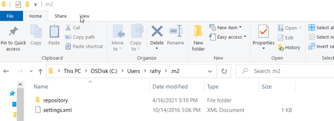

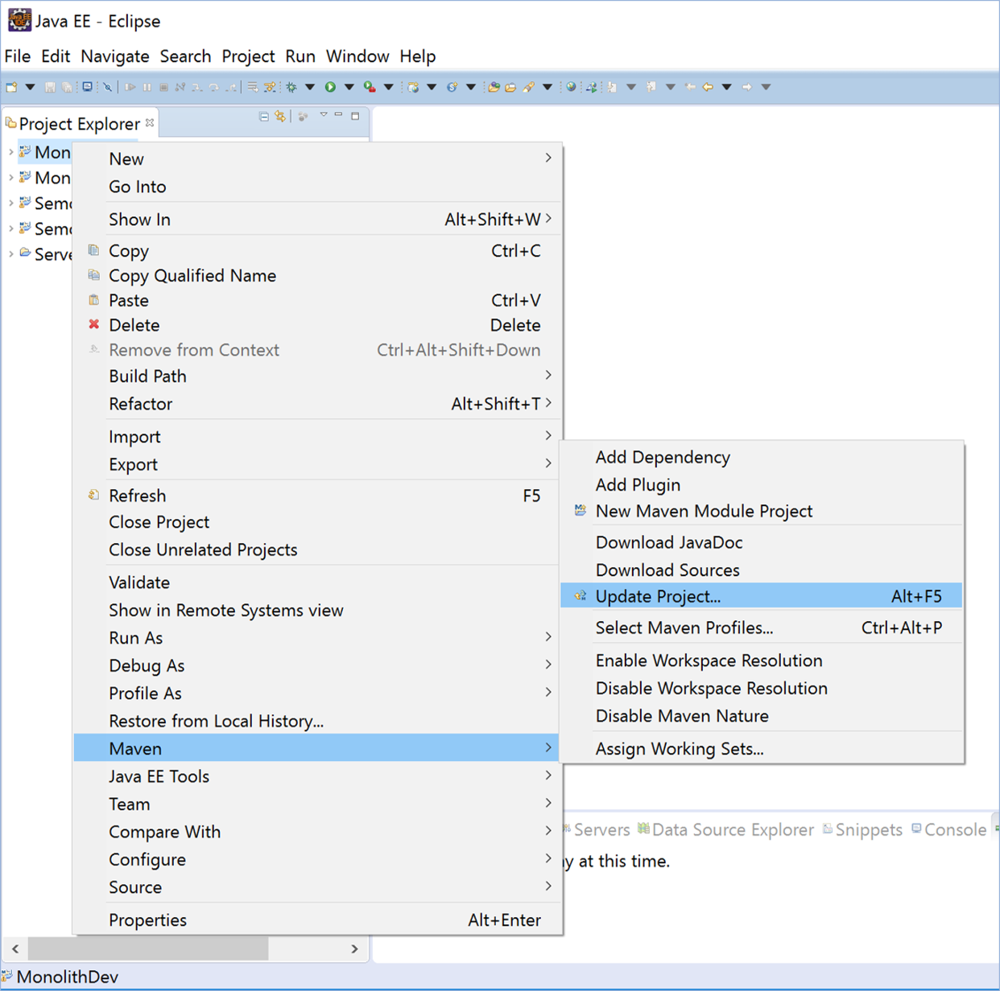
  
  **Errors in Eclipse projects**
- Sometimes you will see a red ! or X on your Semoss or Monolith projects within eclipse. This means that there is an error somewhere in your code.
- Generally, this happens because the project needs to be refreshed or cleaned in eclipse. Try Updating Maven and cleaning your projects first.

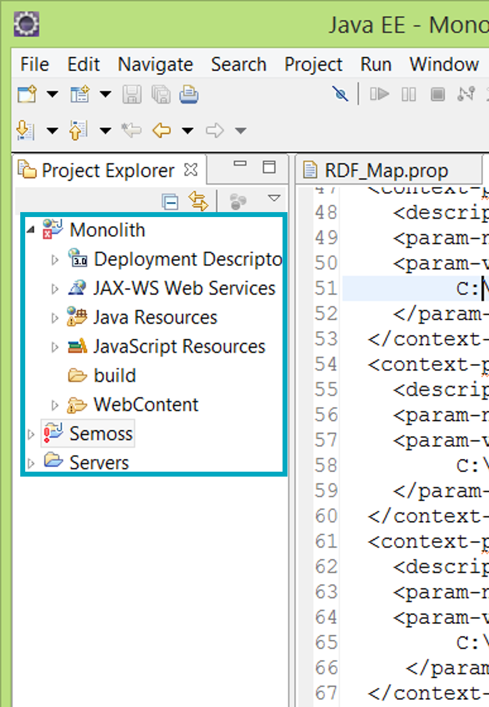


- After you update you should follow these steps within Eclipse in order to ensure your Semoss and Monolith projects are fully operational,
	- Update Maven
	- You usually only need to do this when the pom.xml is updated through SVN.
	- Right click on your Semoss and Monolith projects in the left hand panel of Eclipse and click Maven Update Project
	- Refresh your code
	- Right click on your Semoss and Monolith projects in the left hand panel of Eclipse and click Refresh to do this before starting SEMOSS
	- Clean your projects
	- From the top menu in Eclipse, select Project  Clean. Then select all your projects to clean.
	- Clean the Tomcat working directory
	- From the Java window, navigate to the Servers tab in the bottom section. Right click on Tomcat Server and select Clean.

- After you update you should follow these steps in order to ensure your front end changes take effect in Chrome
	- Empty Cache and Hard Reload: In Google Chrome, click F12. Then right click on the refresh button in the browser and select “Empty Cache and Hard Reload”

**If things go Wrong:**
- Here are a few important files to double check and make sure your paths are correct (http, port, and file paths):
	- RDF_MAP.prop (Semoss)
	- Web.xml (Monolith\WebContent\WEB-INF)
	- Config.js files in core, embed, and playsheet (SemossWeb)
	- Server.xml (Servers\Tomcat Server)

- Check your Monolith Build Path (it’s Users\Your username\workspace\Semoss\src) and the folder name is “Semosssrc”)
- If the path is incorrect, change it, click “Finish”. possible that the build path in Monolith pointing to Semoss has changed. To check this:
	- In Eclipse, right click on Monolith project and choose Build Path > Configure Build Path
	- Select Monolith/Semosssrc and choose “Edit” on the right-hand side
	- Make sure that the linked folder location is pointing to your Semoss src folder (probably C:\Us
	- If there are multiple Semosssrc links, remove all but the necessary one. Click “Finish”
	- Update, clean and refresh project
  
**Environment Variables**
- If your projects still have errors, you may need to delete your pom.xml file (Semoss) and re-SVN update.
- If you run into an issue in Eclipse that says it cannot find Local Master or Security:
	- Turn off Server
	- Delete databaseNewMaster.mv.db (C:\workspace\Semoss\db\LocalMasterDatabase) or database.mv.db (..\workspace\Semoss\db\security)
	- SVN Update
	- Restart Server

**Summary of If Things Go Wrong**
- Refresh your code
- Clean your projects
- Clean the Tomcat working directory
- Delete the databaseNewMaster.mv.db out of the Local Master Database folder
- Clear your cache
- Perform a hard refresh
- Restart your eclipse
- Restart your computer
- Talk to the dev team

**Eclipse won't open**
- If your Eclipse won’t open, it’s likely that your Java updated automatically by a Deloitte update.

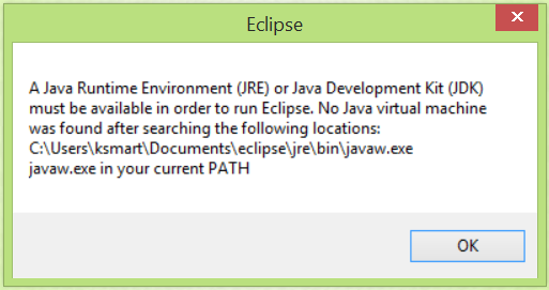

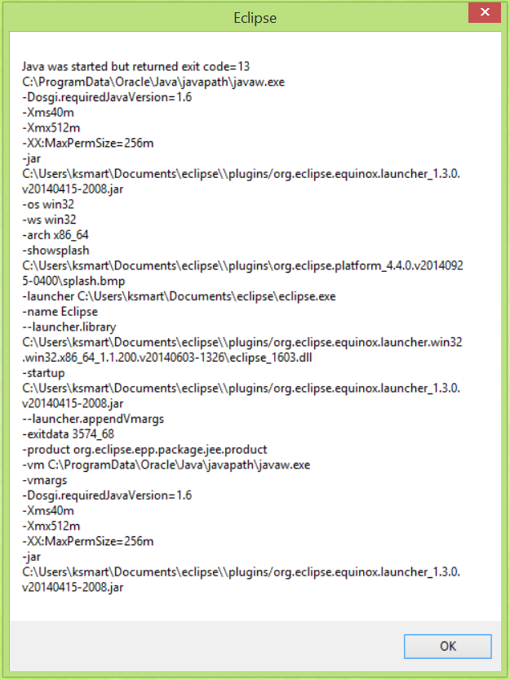

- To begin the fix, download the latest matching 64 bit JDK file from this website (http://www.oracle.com/technetwork/java/javase/downloads/index-jsp-138363.html)
	- Generally you want the Java SE 8uXXX version
- Navigate to this path:  C:\Programs Files\Java, and you should see a jdk and jre file
- Click within the JDK file and copy the file path at the top (ex. C:\Program Files\Java\jdk1.8.0_131)

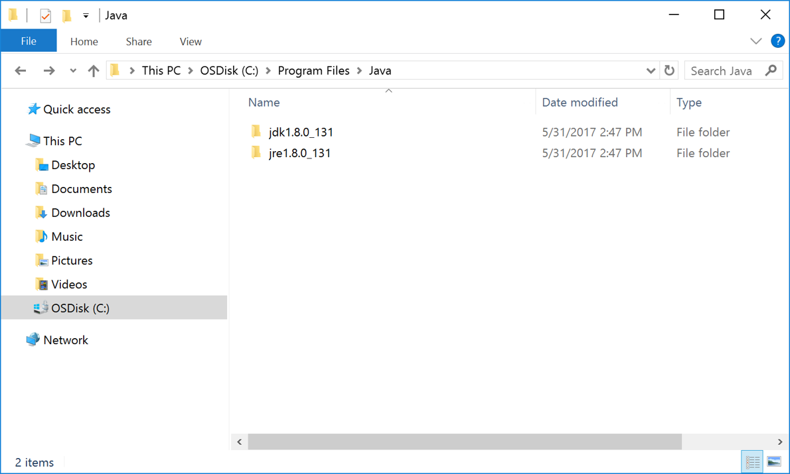

- Go to the start menu and type in “Edit the system environment variables”
- Click “Environment Variables” at the bottom
- In the bottom of the “System Variables” pane, look for  JDK_HOME, JRE_HOME, and PATH—these are the variables that you will edit

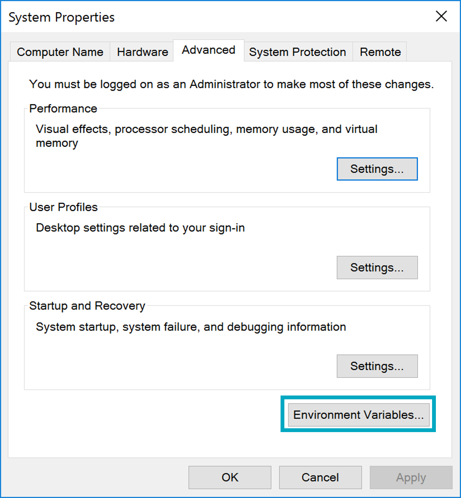

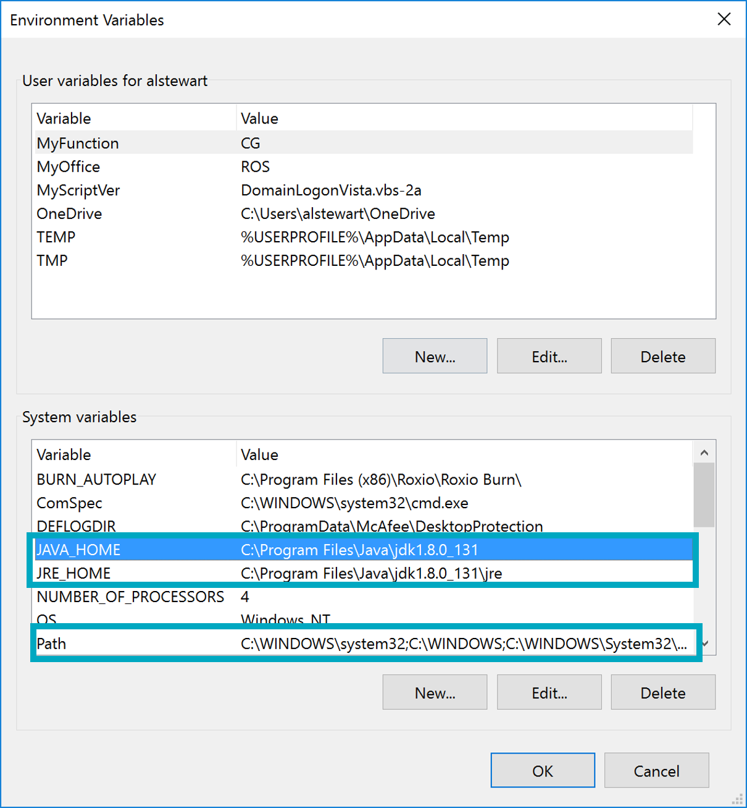


**Java Errors**
- Error: Cannot find the class file for javax.crypto.SecreKey
- Do the following to the Semoss build path:
	- Right click on Semoss
	- Under Build Path Select Configure Build Path
	- Click the Libraries tab
	- Select Add External JARs...
	- Add the jce.jar and the jsse.jar files located in your C:\Program Files\Java\jre1.8.0_281\lib
	- Apply
 
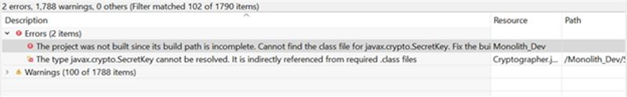

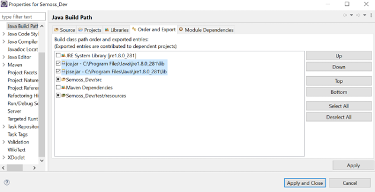
  
	 - In the Order and Export tab make sure the JRE System library is at the top and the jce.jar and jsse.jar are directly below
	- Check the jce.jar and jsse.jar boxes so that Monolith will inherit
	- You may need to go through the Refresh steps
 


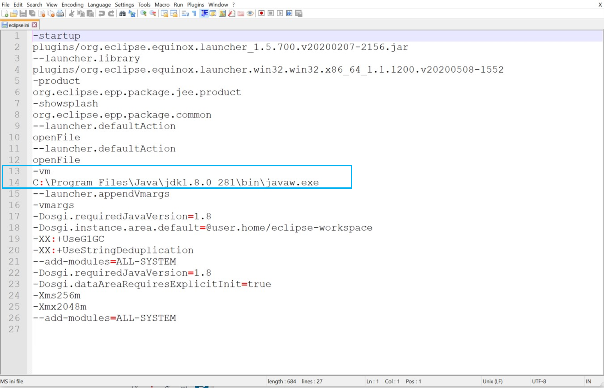

- Edit JAVA_HOME variable with the path you copied before

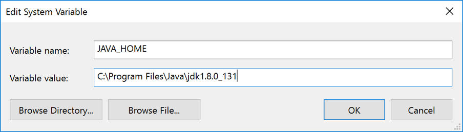

- Edit JRE_HOME with the path you copied before + \jre

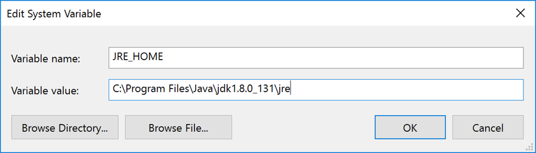

- Ensure the PATH variable uses your JAVA_HOME instead of being hardcoded
- Ensure your pom.xml does not contain a hardcoded java path

**Adding New Databases**
- The server should be off when adding new databases to Semoss
- Every database should also have a corresponding .smss file within the db folder.
- Copy and paste the folder and .smss file for the database into your Semoss/db folder
- Add the following line to the .smss file of the database you are adding if it is replacing one there before using the same name: RELOAD_INSIGHTS true
- If insights are not showing up after uploading a new database, try the following steps:
- In Insight Cache folder (Semoss) delete all files that are not called CSV_Insights
- Delete the databaseNewMaster.mv.db out of the Local Master Database folder and re-SVN update
- Go to Eclipse, clean the projects, run, and hard refresh in Chrome

**Helpful Tips**

**Server Configuration**
- If you are getting an error related to connection aborted, this is likely because your port is already in use. Deloitte has started using/blocking port 8080, so you will need to perform the following steps to correct,

	server.xml
	- Open your Windows File Explorer and navigate to the following path: C:\workspace\apache-tomcat-9.0.30\conf
	- Right click on server.xml and Open With Notepad++
	- Find the line that says <Connector and the port number (should be around line 63)
	- Change the port to 9090
	- Save and close the file

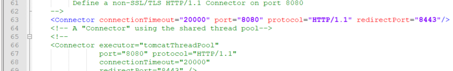

	Eclipse
	- Restart Eclipse
	- In the bottom panel area, on the Servers tab, double-click your new server (Tomcat v9.0 Server at localhost).
	- Under Ports, ensure the Port Number matches the port number you defined in your server.xml (likely 9090)
	- Save the file with changes

	Browser
	- Open Chrome and enter http://localhost:9090/SemossWeb/
	- “SemossWeb” = the name of your folder during the initial SVN upload
	- Notice the new port number

- If you are still having issues after going through these steps, check your server configuration. Double click on your server in the Servers tab to view the settings.
	Server Locations
	- “Use Tomcat Installation” should be checked
	
	Ports
	- Check that HTTP/1.1 points to the correct port number (probably 9090 or 443)
	
	Modules
	- “Path” and “Document Base” should have the same name as your Monolith project (ex. Monolith)

 **Server In Use**
-If you are getting a message that your server port is already in use, follow these steps:
	- Close Eclipse
	- Open Command prompt as an Administrator
	- Run the command: netstat -ano | findstr : <9090>
	- Replace <9090> with the port number that is in use if it is different
	- The output will specify the process identifier that is running (numbers to the right of ‘LISTENING’)
	- Run the command: taskkill /PID <PID> /F
	- Replace <PID> with the process identifier in step 4
	- Reopen Eclipse as an Administrator and start server

 **Missing R Packages**
- Open the R console
- Run install.packages("pacman")
- Run this script: https://github.com/SEMOSS/docker-r-packages/blob/R4.1.2-debian11/Packages.R

**Eclipse Network Problem**
- Disconnect from the Deloitte VPN
- Reinstall Eclipse from [Eclipse](https://www.eclipse.org/downloads/packages/release/2020-06/r)

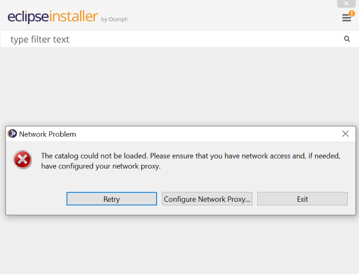

--------------------------------------
